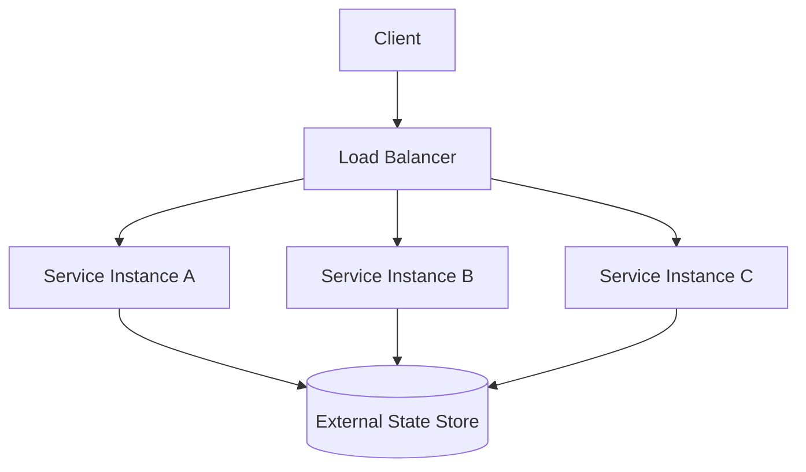
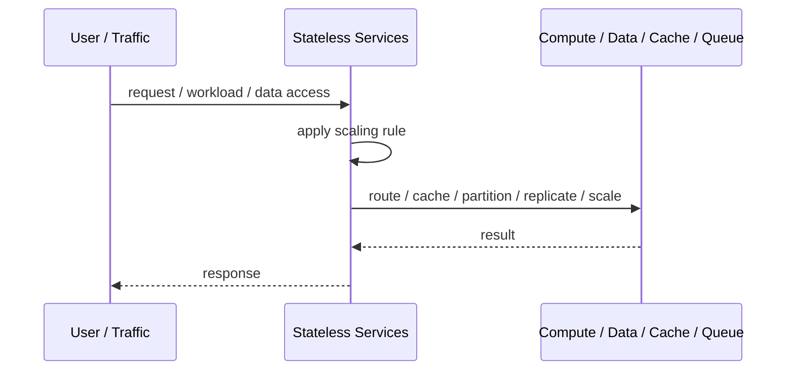
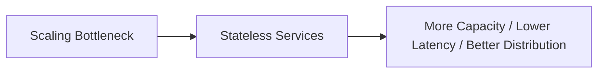

# Stateless Services

## Core Idea

Stateless Services avoid storing client/session-specific state inside service instances so any replica can handle any request.

---

## Problem It Solves

Services that store local session state are hard to scale horizontally, replace, restart, or load-balance safely.

---

## 3 Concrete Examples

### Example 1: API Replica Scaling

A backend API runs 20 replicas behind a load balancer because all user/session state lives in tokens or external storage.

### Example 2: Container Restart Safety

A crashed container can be replaced without losing workflow state because the service instance stores no durable state locally.

### Example 3: Serverless Request Handling

Each function invocation reads needed state from a database or object store instead of relying on local process memory.

---

## Architect Questions

- What state is currently stored inside the service instance?
- Where should session, workflow, cache, or user state live instead?
- Can any replica handle any request?
- Does the service need sticky sessions?
- What happens if an instance dies mid-request?
- Is local cache safe to lose?

---

## Main Diagram



---

## Runtime / Scaling Flow



---

## Implementation Shape

```txt
1. Identify the bottleneck: compute, reads, writes, data size, latency, traffic spikes, or global distance.
2. Define the scaling axis: replicas, partitions, shards, caches, queues, regions, or data locality.
3. Define routing rules: load balancing, cache keys, partition keys, shard keys, or region routing.
4. Define consistency expectations: fresh reads, eventual consistency, replication lag, stale cache tolerance, and conflict handling.
5. Define failure behavior: cache miss, shard failure, queue backlog, replica lag, or regional outage.
6. Add observability: latency, throughput, saturation, cache hit rate, queue depth, shard balance, replica lag, and cost.
7. Scale the bottleneck, not the diagram. Scaling the wrong layer just moves the problem.
```

---

## When to Use

- You need horizontal scaling.
- Instances should be replaceable and load-balanced.
- State can live in external stores or tokens.

---

## When Not to Use

- Local durable state is required.
- Externalizing state creates worse latency or complexity.
- Sticky sessions are unavoidable.

---

## Common Smell That Suggests This Pattern

```txt
The system is hitting limits in throughput,
latency,
data size,
read volume,
write volume,
regional distance,
or traffic spikes,
and one bigger box is no longer the clean answer.
```

---

## Common Mistakes

```txt
Scaling application replicas while the database is the real bottleneck.

Caching without invalidation rules.

Sharding before a single database is actually exhausted.

Ignoring hot keys and hot partitions.

Using replicas without understanding stale reads.

Adding queues without backlog monitoring.

Confusing more infrastructure with better architecture.
```

---

## Best Visual Summary



## Final Meaning

Stateless Services is useful when it addresses a real scaling bottleneck. If you do not know the bottleneck, measure first; otherwise you are just adding complexity.
