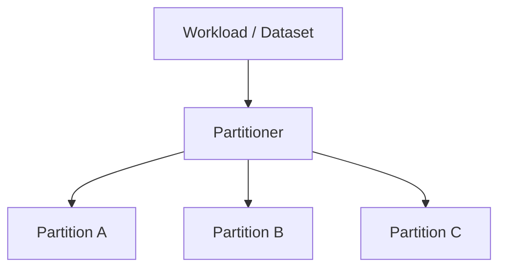
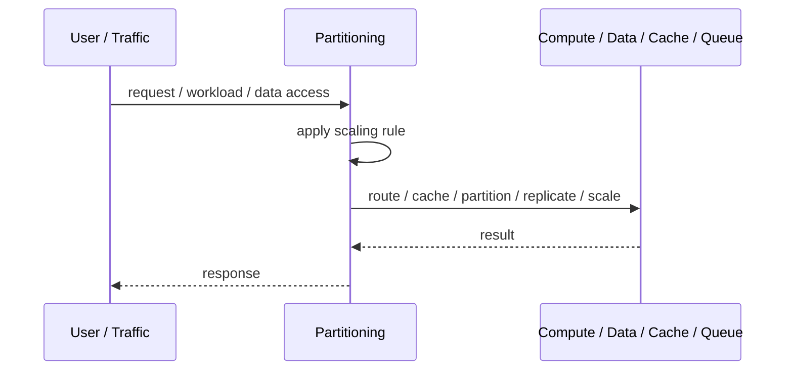
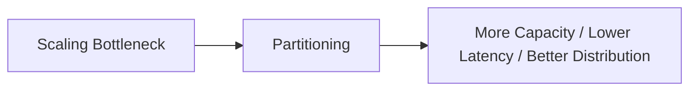

# Partitioning

## Core Idea

Partitioning divides data, traffic, or workload into smaller independent segments.

---

## Problem It Solves

One large dataset, queue, or workload becomes too large, slow, or contentious to manage as a single unit.

---

## 3 Concrete Examples

### Example 1: Customer Partitioning

Customers are partitioned by customer ID range so queries and processing operate on smaller groups.

### Example 2: Queue Partitioning

Events are partitioned by account ID so processing can scale while preserving order per account.

### Example 3: Regional Partitioning

Data and traffic are partitioned by geography to reduce latency and isolate workloads.

---

## Architect Questions

- What is being partitioned: data, traffic, tenants, queues, or compute?
- What partition key gives even distribution?
- Does ordering need to be preserved within a partition?
- How are hot partitions detected?
- Can partitions be moved or rebalanced?
- What operations need to cross partitions?

---

## Main Diagram



---

## Runtime / Scaling Flow



---

## Implementation Shape

```txt
1. Identify the bottleneck: compute, reads, writes, data size, latency, traffic spikes, or global distance.
2. Define the scaling axis: replicas, partitions, shards, caches, queues, regions, or data locality.
3. Define routing rules: load balancing, cache keys, partition keys, shard keys, or region routing.
4. Define consistency expectations: fresh reads, eventual consistency, replication lag, stale cache tolerance, and conflict handling.
5. Define failure behavior: cache miss, shard failure, queue backlog, replica lag, or regional outage.
6. Add observability: latency, throughput, saturation, cache hit rate, queue depth, shard balance, replica lag, and cost.
7. Scale the bottleneck, not the diagram. Scaling the wrong layer just moves the problem.
```

---

## When to Use

- The workload or dataset is too large as one unit.
- A useful partition key exists.
- Operations mostly stay within partitions.

---

## When Not to Use

- No stable partition key exists.
- Most operations need global coordination.
- Hot partitions would dominate traffic.

---

## Common Smell That Suggests This Pattern

```txt
The system is hitting limits in throughput,
latency,
data size,
read volume,
write volume,
regional distance,
or traffic spikes,
and one bigger box is no longer the clean answer.
```

---

## Common Mistakes

```txt
Scaling application replicas while the database is the real bottleneck.

Caching without invalidation rules.

Sharding before a single database is actually exhausted.

Ignoring hot keys and hot partitions.

Using replicas without understanding stale reads.

Adding queues without backlog monitoring.

Confusing more infrastructure with better architecture.
```

---

## Best Visual Summary



## Final Meaning

Partitioning is useful when it addresses a real scaling bottleneck. If you do not know the bottleneck, measure first; otherwise you are just adding complexity.
