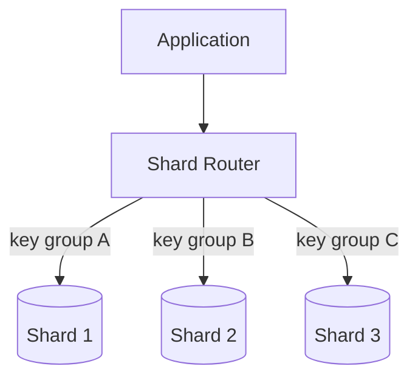
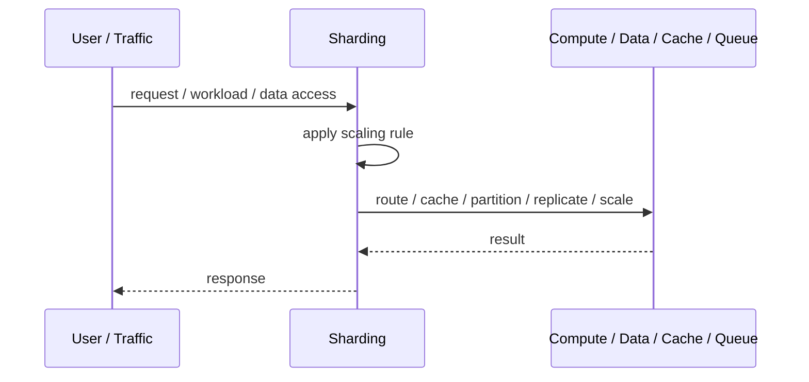
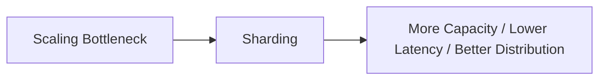

# Sharding

## Core Idea

Sharding splits a database or data store across multiple shards using a shard key.

---

## Problem It Solves

A single database cannot handle data size, throughput, or tenant volume.

---

## 3 Concrete Examples

### Example 1: User ID Sharding

Users are assigned to database shards based on user ID hash.

### Example 2: Tenant Sharding

SaaS tenants are distributed across shards, with large tenants placed on dedicated shards.

### Example 3: Geographic Sharding

EU data lives on EU shards and US data lives on US shards.

---

## Architect Questions

- What shard key distributes data evenly?
- How will the application route to the correct shard?
- How are hot shards avoided?
- How are cross-shard queries handled?
- How will resharding happen?
- Can transactions stay within one shard?

---

## Main Diagram



---

## Runtime / Scaling Flow



---

## Implementation Shape

```txt
1. Identify the bottleneck: compute, reads, writes, data size, latency, traffic spikes, or global distance.
2. Define the scaling axis: replicas, partitions, shards, caches, queues, regions, or data locality.
3. Define routing rules: load balancing, cache keys, partition keys, shard keys, or region routing.
4. Define consistency expectations: fresh reads, eventual consistency, replication lag, stale cache tolerance, and conflict handling.
5. Define failure behavior: cache miss, shard failure, queue backlog, replica lag, or regional outage.
6. Add observability: latency, throughput, saturation, cache hit rate, queue depth, shard balance, replica lag, and cost.
7. Scale the bottleneck, not the diagram. Scaling the wrong layer just moves the problem.
```

---

## When to Use

- One database cannot handle scale.
- Data can be routed by shard key.
- Cross-shard operations are rare or manageable.

---

## When Not to Use

- A single database can still scale.
- Frequent cross-shard joins or transactions are required.
- Resharding and routing are not designed.

---

## Common Smell That Suggests This Pattern

```txt
The system is hitting limits in throughput,
latency,
data size,
read volume,
write volume,
regional distance,
or traffic spikes,
and one bigger box is no longer the clean answer.
```

---

## Common Mistakes

```txt
Scaling application replicas while the database is the real bottleneck.

Caching without invalidation rules.

Sharding before a single database is actually exhausted.

Ignoring hot keys and hot partitions.

Using replicas without understanding stale reads.

Adding queues without backlog monitoring.

Confusing more infrastructure with better architecture.
```

---

## Best Visual Summary



## Final Meaning

Sharding is useful when it addresses a real scaling bottleneck. If you do not know the bottleneck, measure first; otherwise you are just adding complexity.
