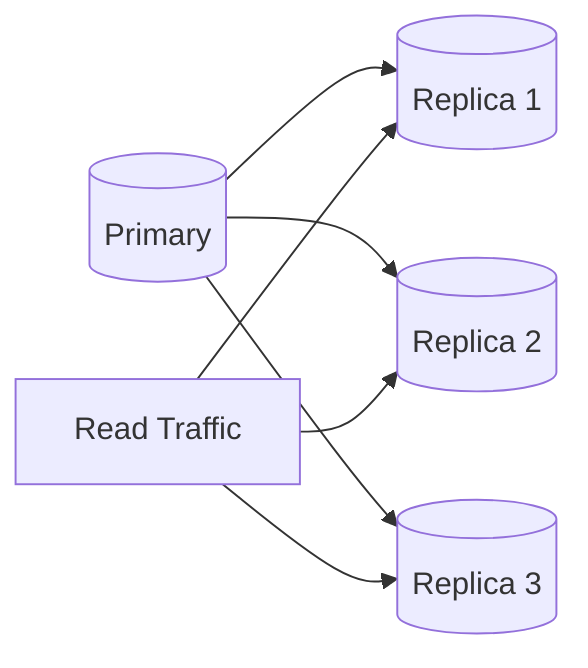
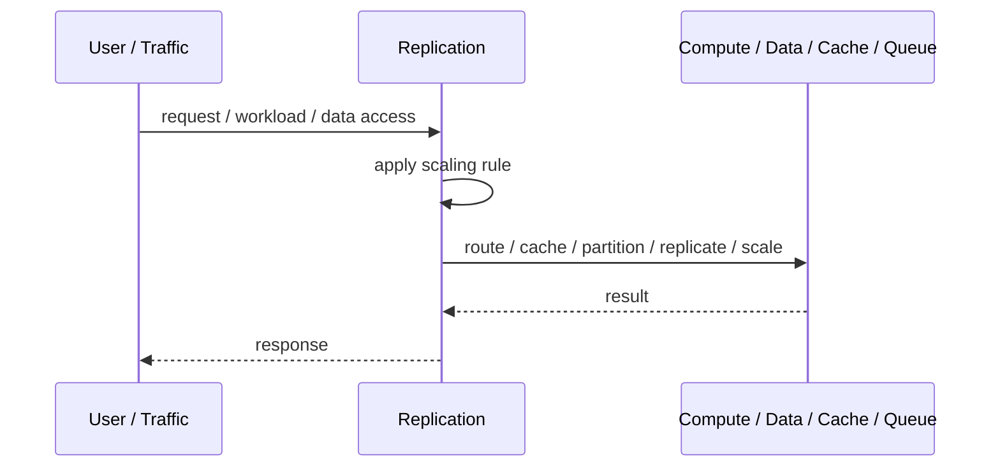
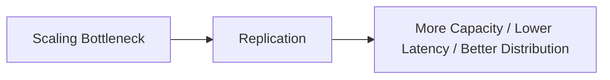

# Replication

## Core Idea

Replication copies data from one node to other nodes for availability, read scaling, disaster recovery, or locality.

---

## Problem It Solves

A single data copy is a bottleneck and a failure risk.

---

## 3 Concrete Examples

### Example 1: Primary-Replica Database

Writes go to primary while replicas serve read traffic.

### Example 2: Cross-Region Replication

Data is replicated to another region for disaster recovery.

### Example 3: Search Index Replication

Search index replicas allow many query nodes to serve the same data.

---

## Architect Questions

- Is replication synchronous or asynchronous?
- Can reads tolerate replication lag?
- What is the source of truth?
- How is failover handled?
- How are conflicts resolved?
- What data loss window is acceptable?

---

## Main Diagram



---

## Runtime / Scaling Flow



---

## Implementation Shape

```txt
1. Identify the bottleneck: compute, reads, writes, data size, latency, traffic spikes, or global distance.
2. Define the scaling axis: replicas, partitions, shards, caches, queues, regions, or data locality.
3. Define routing rules: load balancing, cache keys, partition keys, shard keys, or region routing.
4. Define consistency expectations: fresh reads, eventual consistency, replication lag, stale cache tolerance, and conflict handling.
5. Define failure behavior: cache miss, shard failure, queue backlog, replica lag, or regional outage.
6. Add observability: latency, throughput, saturation, cache hit rate, queue depth, shard balance, replica lag, and cost.
7. Scale the bottleneck, not the diagram. Scaling the wrong layer just moves the problem.
```

---

## When to Use

- Read scaling, availability, disaster recovery, or locality is needed.
- Replica lag can be managed.
- Failover and consistency rules are understood.

---

## When Not to Use

- Strictly fresh reads are required everywhere.
- Conflict resolution is unclear.
- Replication lag would break business expectations.

---

## Common Smell That Suggests This Pattern

```txt
The system is hitting limits in throughput,
latency,
data size,
read volume,
write volume,
regional distance,
or traffic spikes,
and one bigger box is no longer the clean answer.
```

---

## Common Mistakes

```txt
Scaling application replicas while the database is the real bottleneck.

Caching without invalidation rules.

Sharding before a single database is actually exhausted.

Ignoring hot keys and hot partitions.

Using replicas without understanding stale reads.

Adding queues without backlog monitoring.

Confusing more infrastructure with better architecture.
```

---

## Best Visual Summary



## Final Meaning

Replication is useful when it addresses a real scaling bottleneck. If you do not know the bottleneck, measure first; otherwise you are just adding complexity.
