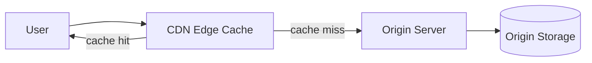
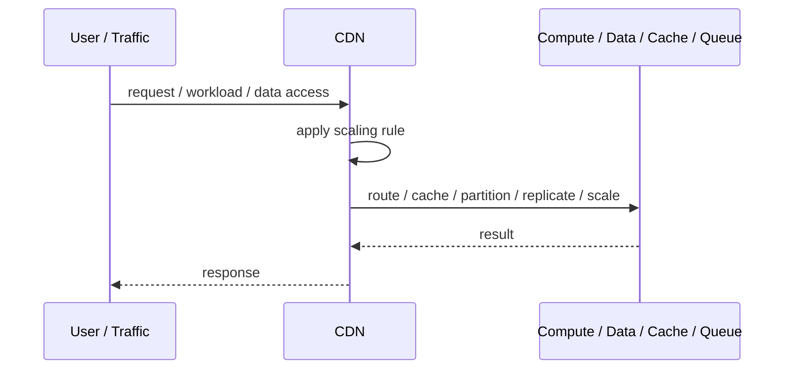
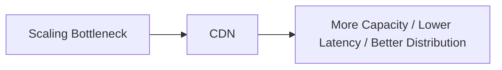

# CDN

## Core Idea

A CDN caches and serves content from edge locations near users.

---

## Problem It Solves

Serving content from the origin for every request increases latency, bandwidth cost, and origin load.

---

## 3 Concrete Examples

### Example 1: Static Asset Delivery

Images, CSS, JavaScript, and fonts are cached at edge locations.

### Example 2: Video Streaming

Video segments are cached near viewers to reduce buffering.

### Example 3: Cacheable API Responses

Public catalog or documentation API responses are cached at the CDN edge.

---

## Architect Questions

- What content is cacheable?
- What TTL should be used?
- What should the cache key include?
- How are stale objects invalidated?
- Does content vary by user, region, or language?
- How is private data kept out of the CDN cache?

---

## Main Diagram



---

## Runtime / Scaling Flow



---

## Implementation Shape

```txt
1. Identify the bottleneck: compute, reads, writes, data size, latency, traffic spikes, or global distance.
2. Define the scaling axis: replicas, partitions, shards, caches, queues, regions, or data locality.
3. Define routing rules: load balancing, cache keys, partition keys, shard keys, or region routing.
4. Define consistency expectations: fresh reads, eventual consistency, replication lag, stale cache tolerance, and conflict handling.
5. Define failure behavior: cache miss, shard failure, queue backlog, replica lag, or regional outage.
6. Add observability: latency, throughput, saturation, cache hit rate, queue depth, shard balance, replica lag, and cost.
7. Scale the bottleneck, not the diagram. Scaling the wrong layer just moves the problem.
```

---

## When to Use

- Content is cacheable.
- Global latency or origin load is a problem.
- Cache invalidation can be controlled.

---

## When Not to Use

- Content is highly personalized or sensitive.
- Cache invalidation must be immediate and exact.
- Caching could leak private data.

---

## Common Smell That Suggests This Pattern

```txt
The system is hitting limits in throughput,
latency,
data size,
read volume,
write volume,
regional distance,
or traffic spikes,
and one bigger box is no longer the clean answer.
```

---

## Common Mistakes

```txt
Scaling application replicas while the database is the real bottleneck.

Caching without invalidation rules.

Sharding before a single database is actually exhausted.

Ignoring hot keys and hot partitions.

Using replicas without understanding stale reads.

Adding queues without backlog monitoring.

Confusing more infrastructure with better architecture.
```

---

## Best Visual Summary



## Final Meaning

CDN is useful when it addresses a real scaling bottleneck. If you do not know the bottleneck, measure first; otherwise you are just adding complexity.
