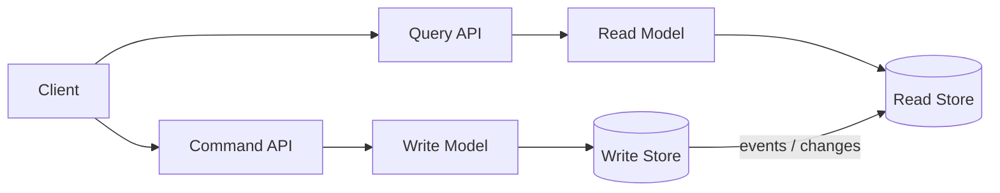
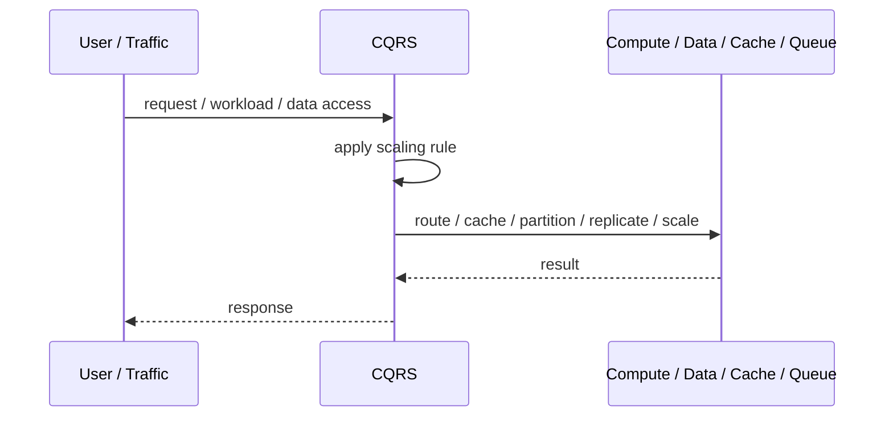
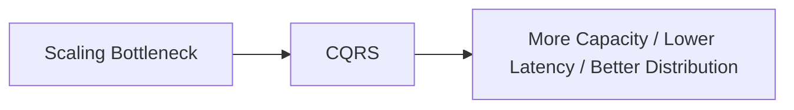

# CQRS

## Core Idea

CQRS separates commands that change state from queries that read state.

---

## Problem It Solves

One model struggles to support both complex writes and high-performance reads.

---

## 3 Concrete Examples

### Example 1: Order System

Commands create and update orders, while read models serve order dashboards.

### Example 2: Banking Ledger

Write side enforces transaction rules, read side serves statements and summaries.

### Example 3: Product Catalog

Write side manages product lifecycle, read side supports fast filtering and search.

---

## Architect Questions

- Are read and write needs different enough to justify separation?
- What commands change state?
- What read models are needed?
- Can reads be eventually consistent?
- How are read models updated?
- How are failures in projection handled?

---

## Main Diagram



---

## Runtime / Scaling Flow



---

## Implementation Shape

```txt
1. Identify the bottleneck: compute, reads, writes, data size, latency, traffic spikes, or global distance.
2. Define the scaling axis: replicas, partitions, shards, caches, queues, regions, or data locality.
3. Define routing rules: load balancing, cache keys, partition keys, shard keys, or region routing.
4. Define consistency expectations: fresh reads, eventual consistency, replication lag, stale cache tolerance, and conflict handling.
5. Define failure behavior: cache miss, shard failure, queue backlog, replica lag, or regional outage.
6. Add observability: latency, throughput, saturation, cache hit rate, queue depth, shard balance, replica lag, and cost.
7. Scale the bottleneck, not the diagram. Scaling the wrong layer just moves the problem.
```

---

## When to Use

- Read and write models have different needs.
- Read performance or query shape requires a separate model.
- Eventual consistency is acceptable.

---

## When Not to Use

- Simple CRUD is enough.
- Immediate consistency is required for reads.
- Projection complexity is not justified.

---

## Common Smell That Suggests This Pattern

```txt
The system is hitting limits in throughput,
latency,
data size,
read volume,
write volume,
regional distance,
or traffic spikes,
and one bigger box is no longer the clean answer.
```

---

## Common Mistakes

```txt
Scaling application replicas while the database is the real bottleneck.

Caching without invalidation rules.

Sharding before a single database is actually exhausted.

Ignoring hot keys and hot partitions.

Using replicas without understanding stale reads.

Adding queues without backlog monitoring.

Confusing more infrastructure with better architecture.
```

---

## Best Visual Summary



## Final Meaning

CQRS is useful when it addresses a real scaling bottleneck. If you do not know the bottleneck, measure first; otherwise you are just adding complexity.
