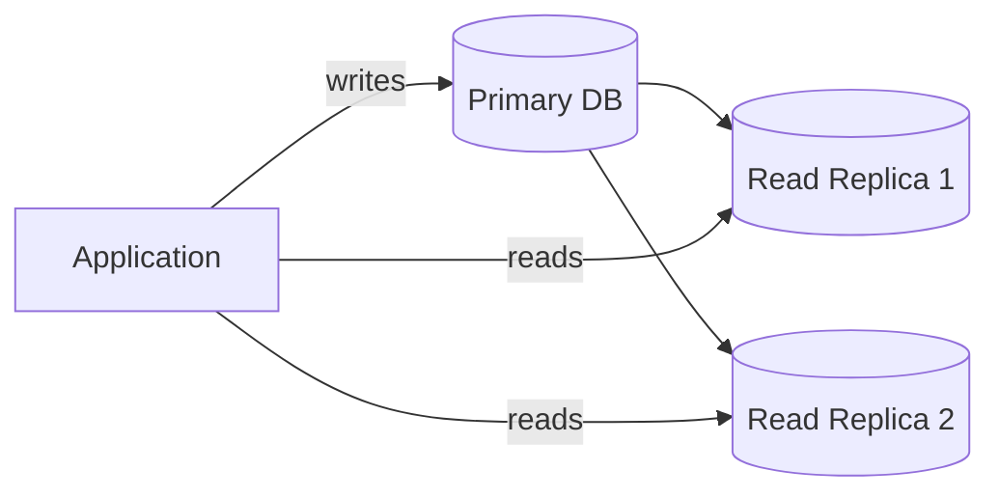
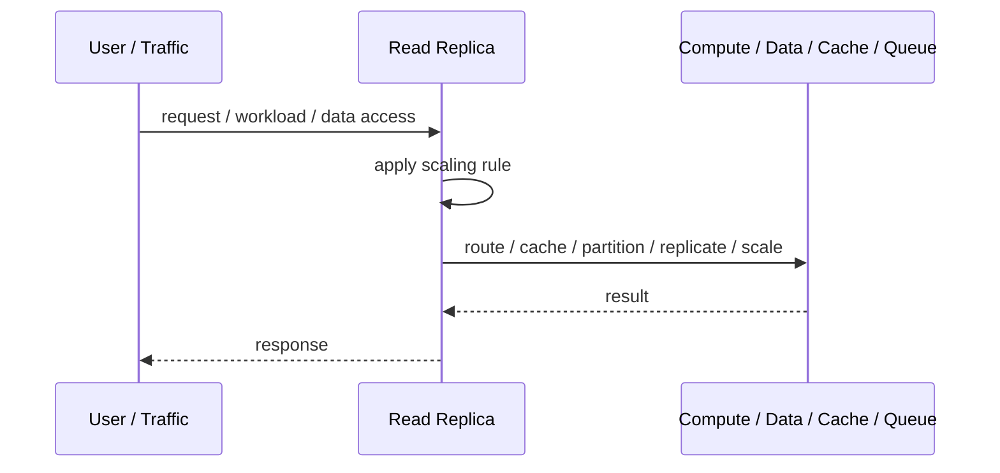
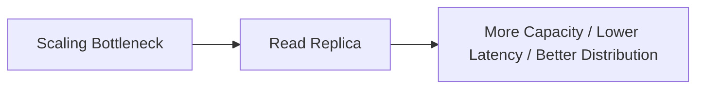

# Read Replica

## Core Idea

Read Replica copies data from a primary database to replicas that serve read traffic.

---

## Problem It Solves

Read workload overloads the primary database or needs lower-latency local reads.

---

## 3 Concrete Examples

### Example 1: Reporting Replica

Reports query a replica so operational writes are not slowed down.

### Example 2: Product Page Scaling

High-volume product reads go to replicas while writes go to primary.

### Example 3: Regional Replica

Users in another region read from a nearby replica.

---

## Architect Questions

- Which queries should use read replicas?
- Can those reads tolerate lag?
- How is read-after-write handled?
- How is replica health monitored?
- What happens if a replica falls behind?
- Can the primary still handle writes under load?

---

## Main Diagram



---

## Runtime / Scaling Flow



---

## Implementation Shape

```txt
1. Identify the bottleneck: compute, reads, writes, data size, latency, traffic spikes, or global distance.
2. Define the scaling axis: replicas, partitions, shards, caches, queues, regions, or data locality.
3. Define routing rules: load balancing, cache keys, partition keys, shard keys, or region routing.
4. Define consistency expectations: fresh reads, eventual consistency, replication lag, stale cache tolerance, and conflict handling.
5. Define failure behavior: cache miss, shard failure, queue backlog, replica lag, or regional outage.
6. Add observability: latency, throughput, saturation, cache hit rate, queue depth, shard balance, replica lag, and cost.
7. Scale the bottleneck, not the diagram. Scaling the wrong layer just moves the problem.
```

---

## When to Use

- Read traffic is high.
- Reads can tolerate replication lag.
- Reports or dashboards should not overload the primary.

---

## When Not to Use

- Read-after-write consistency is mandatory.
- Lag is unacceptable.
- The primary is bottlenecked by writes, not reads.

---

## Common Smell That Suggests This Pattern

```txt
The system is hitting limits in throughput,
latency,
data size,
read volume,
write volume,
regional distance,
or traffic spikes,
and one bigger box is no longer the clean answer.
```

---

## Common Mistakes

```txt
Scaling application replicas while the database is the real bottleneck.

Caching without invalidation rules.

Sharding before a single database is actually exhausted.

Ignoring hot keys and hot partitions.

Using replicas without understanding stale reads.

Adding queues without backlog monitoring.

Confusing more infrastructure with better architecture.
```

---

## Best Visual Summary



## Final Meaning

Read Replica is useful when it addresses a real scaling bottleneck. If you do not know the bottleneck, measure first; otherwise you are just adding complexity.
