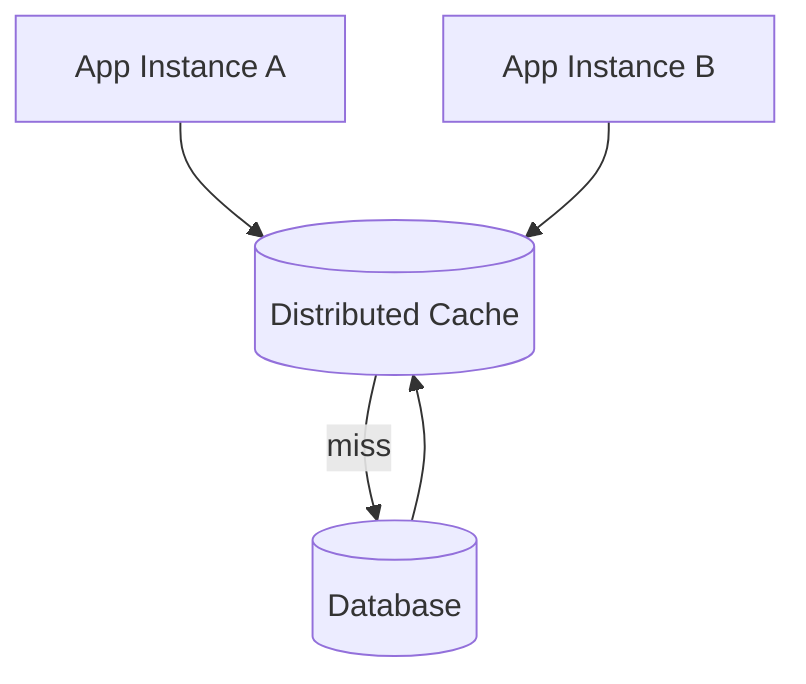
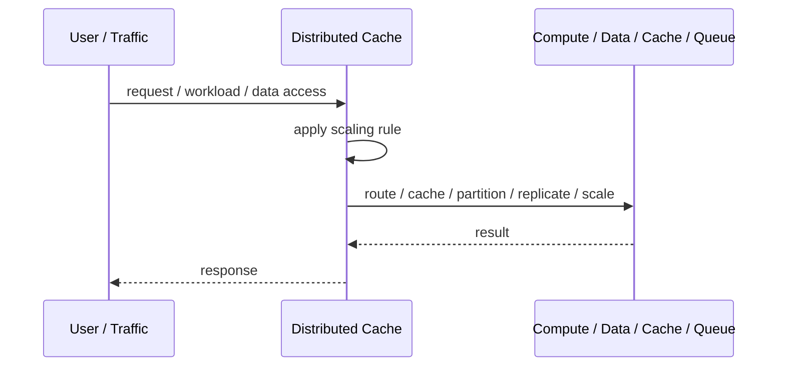
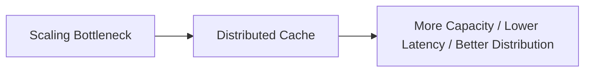

# Distributed Cache

## Core Idea

Distributed Cache stores frequently used data in a shared cache cluster accessible by multiple service instances.

---

## Problem It Solves

Repeated expensive reads or computations overload databases and downstream services.

---

## 3 Concrete Examples

### Example 1: Session Cache

User sessions are stored in Redis so many app instances can access them.

### Example 2: Product Data Cache

Hot product details are cached to reduce database reads.

### Example 3: Computed Summary Cache

Expensive dashboard summaries are cached for fast repeated access.

---

## Architect Questions

- What data should be cached?
- How stale can the data be?
- What TTL should be used?
- How is invalidation handled?
- What happens if the cache is unavailable?
- How do we prevent cache stampedes?

---

## Main Diagram



---

## Runtime / Scaling Flow



---

## Implementation Shape

```txt
1. Identify the bottleneck: compute, reads, writes, data size, latency, traffic spikes, or global distance.
2. Define the scaling axis: replicas, partitions, shards, caches, queues, regions, or data locality.
3. Define routing rules: load balancing, cache keys, partition keys, shard keys, or region routing.
4. Define consistency expectations: fresh reads, eventual consistency, replication lag, stale cache tolerance, and conflict handling.
5. Define failure behavior: cache miss, shard failure, queue backlog, replica lag, or regional outage.
6. Add observability: latency, throughput, saturation, cache hit rate, queue depth, shard balance, replica lag, and cost.
7. Scale the bottleneck, not the diagram. Scaling the wrong layer just moves the problem.
```

---

## When to Use

- Repeated reads or computations are expensive.
- Shared cache access is needed across instances.
- Stale data can be tolerated within limits.

---

## When Not to Use

- Data changes constantly and must be fresh.
- Invalidation rules are unclear.
- The cache could accidentally become the source of truth.

---

## Common Smell That Suggests This Pattern

```txt
The system is hitting limits in throughput,
latency,
data size,
read volume,
write volume,
regional distance,
or traffic spikes,
and one bigger box is no longer the clean answer.
```

---

## Common Mistakes

```txt
Scaling application replicas while the database is the real bottleneck.

Caching without invalidation rules.

Sharding before a single database is actually exhausted.

Ignoring hot keys and hot partitions.

Using replicas without understanding stale reads.

Adding queues without backlog monitoring.

Confusing more infrastructure with better architecture.
```

---

## Best Visual Summary



## Final Meaning

Distributed Cache is useful when it addresses a real scaling bottleneck. If you do not know the bottleneck, measure first; otherwise you are just adding complexity.
