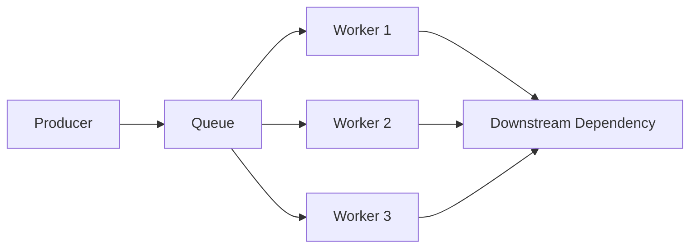
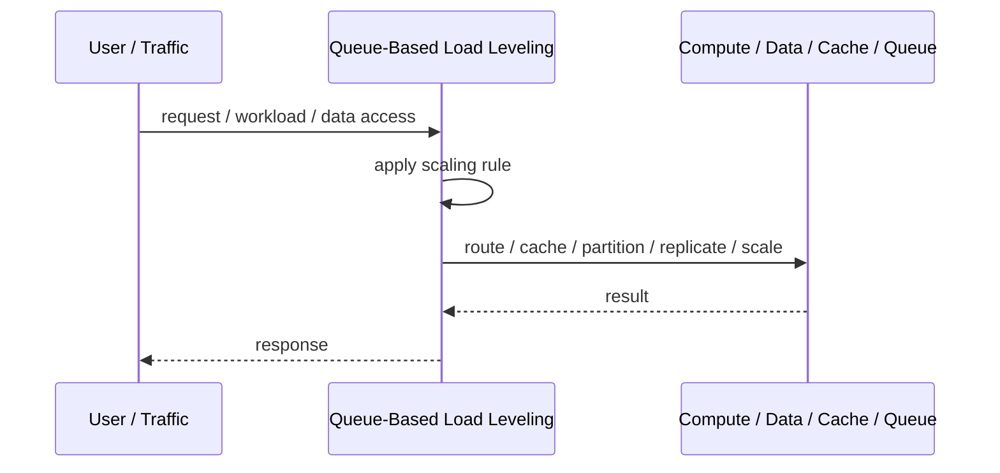
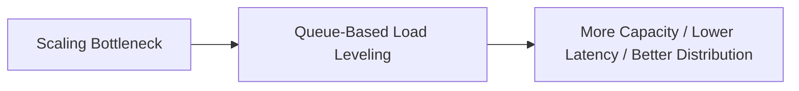

# Queue-Based Load Leveling

## Core Idea

Queue-Based Load Leveling places a queue between producers and consumers to absorb spikes and let workers process at a controlled rate.

---

## Problem It Solves

Traffic spikes overwhelm downstream workers or dependencies when work is processed immediately.

---

## 3 Concrete Examples

### Example 1: Order Processing Queue

Checkout enqueues fulfillment work so warehouse processing can run at a stable pace.

### Example 2: Email Sending Queue

A campaign creates many email jobs, but workers send them gradually.

### Example 3: Image Processing Queue

Upload bursts are buffered while workers resize images at controlled throughput.

---

## Architect Questions

- What workload should be buffered?
- How large can the queue grow?
- What is acceptable processing delay?
- How many workers are needed?
- What happens when the queue is full?
- How are retries and poison messages handled?

---

## Main Diagram



---

## Runtime / Scaling Flow



---

## Implementation Shape

```txt
1. Identify the bottleneck: compute, reads, writes, data size, latency, traffic spikes, or global distance.
2. Define the scaling axis: replicas, partitions, shards, caches, queues, regions, or data locality.
3. Define routing rules: load balancing, cache keys, partition keys, shard keys, or region routing.
4. Define consistency expectations: fresh reads, eventual consistency, replication lag, stale cache tolerance, and conflict handling.
5. Define failure behavior: cache miss, shard failure, queue backlog, replica lag, or regional outage.
6. Add observability: latency, throughput, saturation, cache hit rate, queue depth, shard balance, replica lag, and cost.
7. Scale the bottleneck, not the diagram. Scaling the wrong layer just moves the problem.
```

---

## When to Use

- Producers create bursts of work.
- Consumers need controlled throughput.
- Delayed processing is acceptable.

---

## When Not to Use

- Work must complete synchronously.
- Queue delay is unacceptable.
- Backlog growth would hide system failure.

---

## Common Smell That Suggests This Pattern

```txt
The system is hitting limits in throughput,
latency,
data size,
read volume,
write volume,
regional distance,
or traffic spikes,
and one bigger box is no longer the clean answer.
```

---

## Common Mistakes

```txt
Scaling application replicas while the database is the real bottleneck.

Caching without invalidation rules.

Sharding before a single database is actually exhausted.

Ignoring hot keys and hot partitions.

Using replicas without understanding stale reads.

Adding queues without backlog monitoring.

Confusing more infrastructure with better architecture.
```

---

## Best Visual Summary



## Final Meaning

Queue-Based Load Leveling is useful when it addresses a real scaling bottleneck. If you do not know the bottleneck, measure first; otherwise you are just adding complexity.
