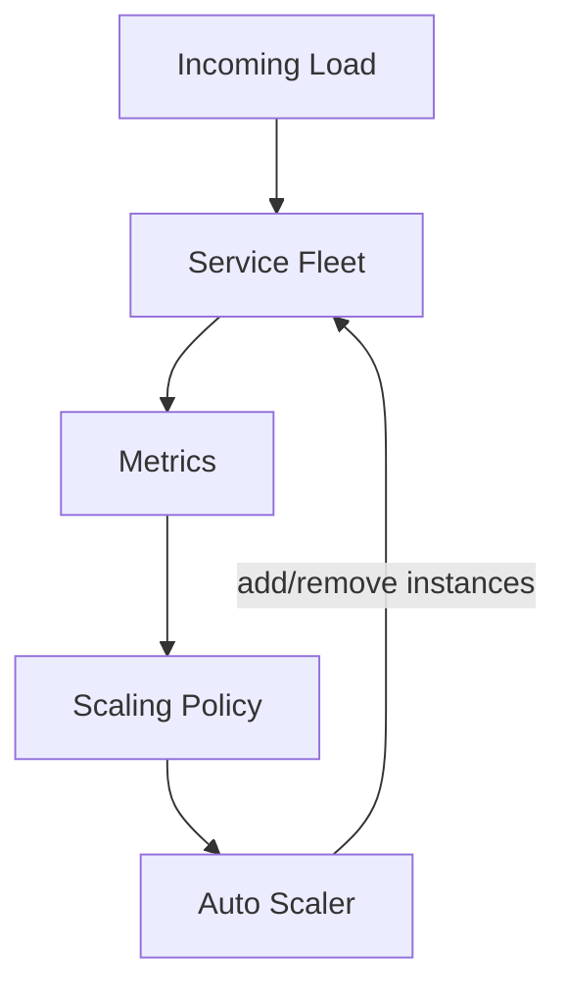
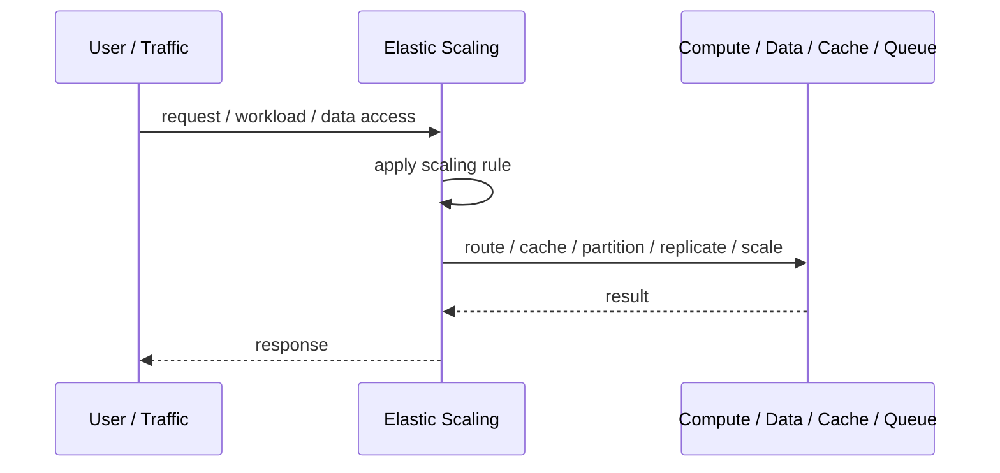
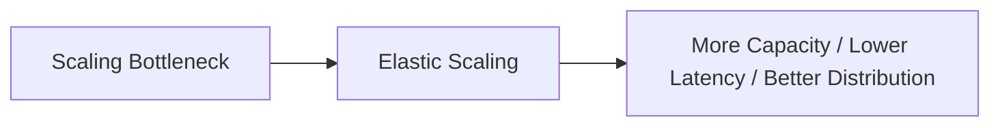

# Elastic Scaling

## Core Idea

Elastic Scaling automatically adds or removes capacity based on demand.

---

## Problem It Solves

Static capacity either wastes money during low traffic or fails during high traffic.

---

## 3 Concrete Examples

### Example 1: CPU-Based API Scaling

API replicas increase when CPU stays high and decrease when load drops.

### Example 2: Queue-Depth Worker Scaling

Worker count grows when message backlog increases.

### Example 3: Scheduled Capacity

Capacity increases before predictable daily traffic peaks.

---

## Architect Questions

- What metric best represents demand?
- How fast can new capacity start?
- What prevents scale flapping?
- What is the minimum and maximum capacity?
- Can downstream systems scale too?
- What is the cost impact?

---

## Main Diagram



---

## Runtime / Scaling Flow



---

## Implementation Shape

```txt
1. Identify the bottleneck: compute, reads, writes, data size, latency, traffic spikes, or global distance.
2. Define the scaling axis: replicas, partitions, shards, caches, queues, regions, or data locality.
3. Define routing rules: load balancing, cache keys, partition keys, shard keys, or region routing.
4. Define consistency expectations: fresh reads, eventual consistency, replication lag, stale cache tolerance, and conflict handling.
5. Define failure behavior: cache miss, shard failure, queue backlog, replica lag, or regional outage.
6. Add observability: latency, throughput, saturation, cache hit rate, queue depth, shard balance, replica lag, and cost.
7. Scale the bottleneck, not the diagram. Scaling the wrong layer just moves the problem.
```

---

## When to Use

- Load changes over time.
- Metrics can drive scaling safely.
- Capacity can be added and removed automatically.

---

## When Not to Use

- Startup time is too slow for spikes.
- Metrics do not reflect demand.
- Downstream dependencies cannot scale too.

---

## Common Smell That Suggests This Pattern

```txt
The system is hitting limits in throughput,
latency,
data size,
read volume,
write volume,
regional distance,
or traffic spikes,
and one bigger box is no longer the clean answer.
```

---

## Common Mistakes

```txt
Scaling application replicas while the database is the real bottleneck.

Caching without invalidation rules.

Sharding before a single database is actually exhausted.

Ignoring hot keys and hot partitions.

Using replicas without understanding stale reads.

Adding queues without backlog monitoring.

Confusing more infrastructure with better architecture.
```

---

## Best Visual Summary



## Final Meaning

Elastic Scaling is useful when it addresses a real scaling bottleneck. If you do not know the bottleneck, measure first; otherwise you are just adding complexity.
