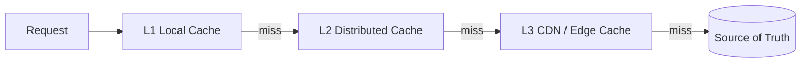
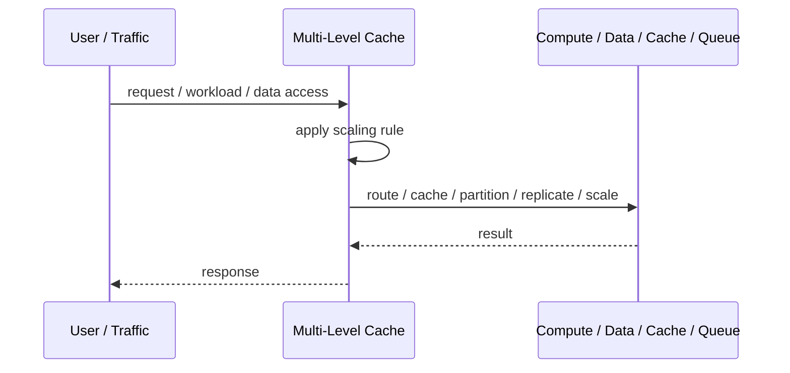
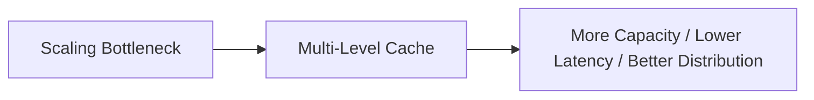

# Multi-Level Cache

## Core Idea

Multi-Level Cache uses multiple cache layers, often from fastest/local to slower/shared, before reaching the source of truth.

---

## Problem It Solves

One cache layer is not enough to balance speed, cost, consistency, and shared availability.

---

## 3 Concrete Examples

### Example 1: Browser-CDN-Origin Cache

Browser cache, CDN cache, and origin cache reduce repeated asset requests.

### Example 2: In-Memory plus Redis

A service checks local memory first, then Redis, then database.

### Example 3: CPU/Memory Style Application Cache

Hot values sit in process memory while broader shared values live in distributed cache.

---

## Architect Questions

- What cache layers exist?
- What data belongs in each layer?
- How are TTLs coordinated?
- How is invalidation propagated?
- How are stale values detected?
- What is the fallback path on cache miss?

---

## Main Diagram



---

## Runtime / Scaling Flow



---

## Implementation Shape

```txt
1. Identify the bottleneck: compute, reads, writes, data size, latency, traffic spikes, or global distance.
2. Define the scaling axis: replicas, partitions, shards, caches, queues, regions, or data locality.
3. Define routing rules: load balancing, cache keys, partition keys, shard keys, or region routing.
4. Define consistency expectations: fresh reads, eventual consistency, replication lag, stale cache tolerance, and conflict handling.
5. Define failure behavior: cache miss, shard failure, queue backlog, replica lag, or regional outage.
6. Add observability: latency, throughput, saturation, cache hit rate, queue depth, shard balance, replica lag, and cost.
7. Scale the bottleneck, not the diagram. Scaling the wrong layer just moves the problem.
```

---

## When to Use

- Different cache layers provide different latency/cost tradeoffs.
- Hot data benefits from local caching.
- A miss chain can be designed clearly.

---

## When Not to Use

- One simple cache layer is enough.
- Invalidation across layers cannot be managed.
- Stale data risks are unacceptable.

---

## Common Smell That Suggests This Pattern

```txt
The system is hitting limits in throughput,
latency,
data size,
read volume,
write volume,
regional distance,
or traffic spikes,
and one bigger box is no longer the clean answer.
```

---

## Common Mistakes

```txt
Scaling application replicas while the database is the real bottleneck.

Caching without invalidation rules.

Sharding before a single database is actually exhausted.

Ignoring hot keys and hot partitions.

Using replicas without understanding stale reads.

Adding queues without backlog monitoring.

Confusing more infrastructure with better architecture.
```

---

## Best Visual Summary



## Final Meaning

Multi-Level Cache is useful when it addresses a real scaling bottleneck. If you do not know the bottleneck, measure first; otherwise you are just adding complexity.
