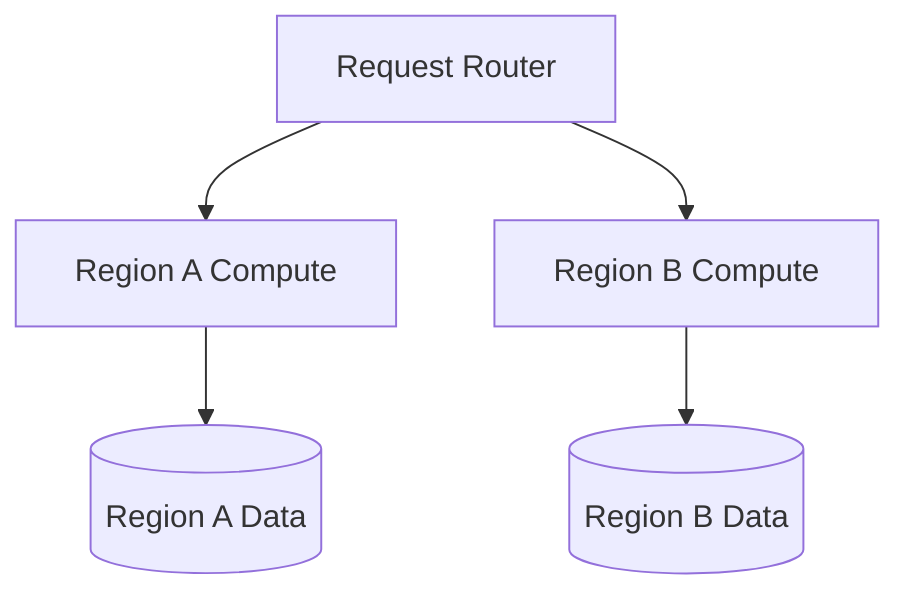
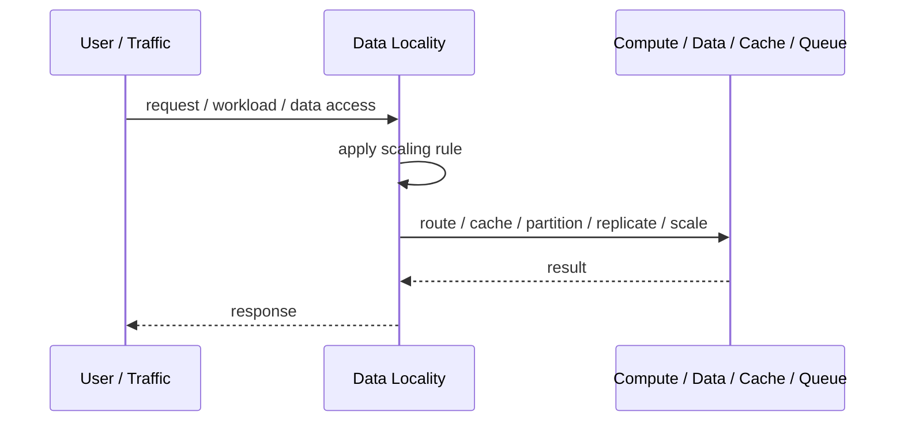
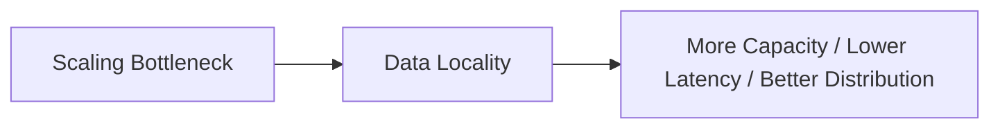

# Data Locality

## Core Idea

Data Locality places computation close to the data it needs to reduce latency, bandwidth, and cross-region/cross-node traffic.

---

## Problem It Solves

Moving large data across networks is slower and more expensive than processing near where the data already lives.

---

## 3 Concrete Examples

### Example 1: Regional Processing

EU user requests are served in the EU region where their data resides.

### Example 2: MapReduce-Style Processing

Workers process data blocks on or near the nodes where blocks are stored.

### Example 3: Edge Data Processing

IoT gateways aggregate data locally before sending summaries to the cloud.

---

## Architect Questions

- Where does the data live?
- Where does computation run?
- How expensive is moving data?
- Can requests be routed to the data's location?
- Does locality conflict with availability?
- How are data movement and replication managed?

---

## Main Diagram



---

## Runtime / Scaling Flow



---

## Implementation Shape

```txt
1. Identify the bottleneck: compute, reads, writes, data size, latency, traffic spikes, or global distance.
2. Define the scaling axis: replicas, partitions, shards, caches, queues, regions, or data locality.
3. Define routing rules: load balancing, cache keys, partition keys, shard keys, or region routing.
4. Define consistency expectations: fresh reads, eventual consistency, replication lag, stale cache tolerance, and conflict handling.
5. Define failure behavior: cache miss, shard failure, queue backlog, replica lag, or regional outage.
6. Add observability: latency, throughput, saturation, cache hit rate, queue depth, shard balance, replica lag, and cost.
7. Scale the bottleneck, not the diagram. Scaling the wrong layer just moves the problem.
```

---

## When to Use

- Data movement is expensive.
- Latency matters.
- Requests or compute can be routed near relevant data.

---

## When Not to Use

- Data must be globally consistent immediately.
- Routing to data location is impossible.
- Replication/movement costs exceed locality benefits.

---

## Common Smell That Suggests This Pattern

```txt
The system is hitting limits in throughput,
latency,
data size,
read volume,
write volume,
regional distance,
or traffic spikes,
and one bigger box is no longer the clean answer.
```

---

## Common Mistakes

```txt
Scaling application replicas while the database is the real bottleneck.

Caching without invalidation rules.

Sharding before a single database is actually exhausted.

Ignoring hot keys and hot partitions.

Using replicas without understanding stale reads.

Adding queues without backlog monitoring.

Confusing more infrastructure with better architecture.
```

---

## Best Visual Summary



## Final Meaning

Data Locality is useful when it addresses a real scaling bottleneck. If you do not know the bottleneck, measure first; otherwise you are just adding complexity.
