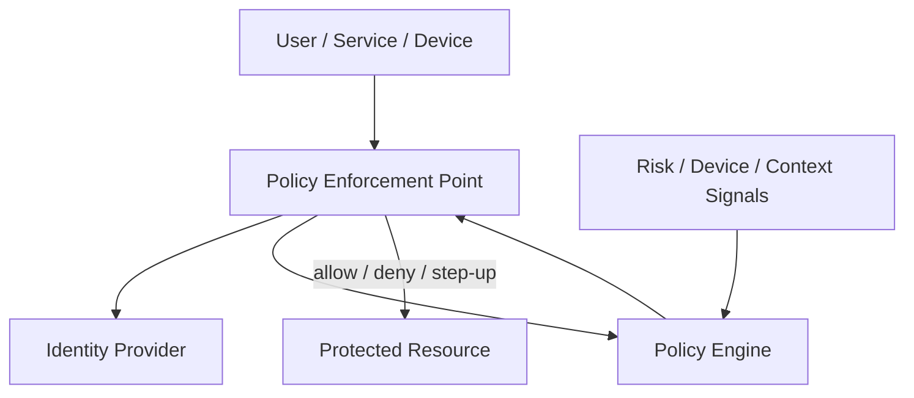
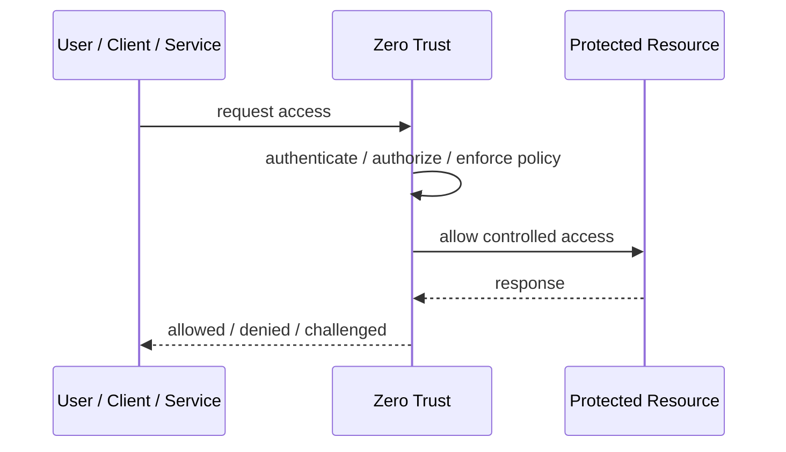
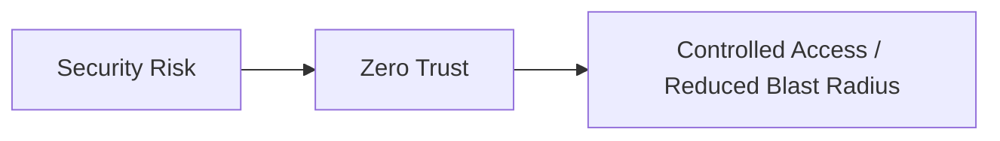

# Zero Trust

## Core Idea

Zero Trust assumes no network, device, user, or service is trusted by default, even inside the internal network.

---

## Problem It Solves

Traditional perimeter security fails when attackers, compromised devices, or malicious insiders operate inside the network.

---

## 3 Concrete Examples

### Example 1: Internal API Access

A backend service must authenticate, authorize, and be policy-checked before calling another internal service.

### Example 2: Employee SaaS Access

Employees access apps based on identity, device posture, location risk, and session context.

### Example 3: Production Admin Access

Engineers must use strong identity, device trust, and just-in-time access to reach production systems.

---

## Architect Questions

- What identities need access: users, services, devices, workloads?
- What signals decide trust: MFA, device health, location, risk, role, policy?
- Where are policies evaluated and enforced?
- How is least privilege applied?
- How is lateral movement limited?
- How are access decisions logged and audited?

---

## Main Diagram



---

## Runtime / Security Flow



---

## Implementation Shape

```txt
1. Identify the protected asset, identity, trust boundary, or access path.
2. Define who or what is requesting access.
3. Define authentication, authorization, encryption, policy, and audit requirements.
4. Define enforcement points and bypass prevention.
5. Define key, token, certificate, secret, or policy lifecycle.
6. Add observability: audit logs, denied requests, anomalous access, key usage, and policy decisions.
7. Test failure and attack scenarios, not only the happy path.
```

---

## When to Use

- You need to reduce implicit trust inside networks.
- Users, devices, and workloads require continuous verification.
- Lateral movement risk is a concern.

---

## When Not to Use

- You cannot collect reliable identity/context signals.
- Policies are undefined.
- The organization treats Zero Trust as a slogan instead of controls.

---

## Common Smell That Suggests This Pattern

```txt
Access decisions are inconsistent,
credentials are spreading,
systems trust the network too much,
or one security control failure would expose too much.
```

---

## Common Mistakes

```txt
Treating authentication as authorization.

Trusting internal networks blindly.

Putting secrets in code or config files.

Using tokens without validating issuer, audience, expiry, and signature.

Adding a gateway but allowing bypass paths.

Creating policies nobody can understand or audit.

Deploying controls without monitoring and incident response.
```

---

## Best Visual Summary



## Final Meaning

Zero Trust is useful when it reduces a real security risk with enforceable controls. If it is only a label without enforcement, monitoring, and ownership, it is security theater.
