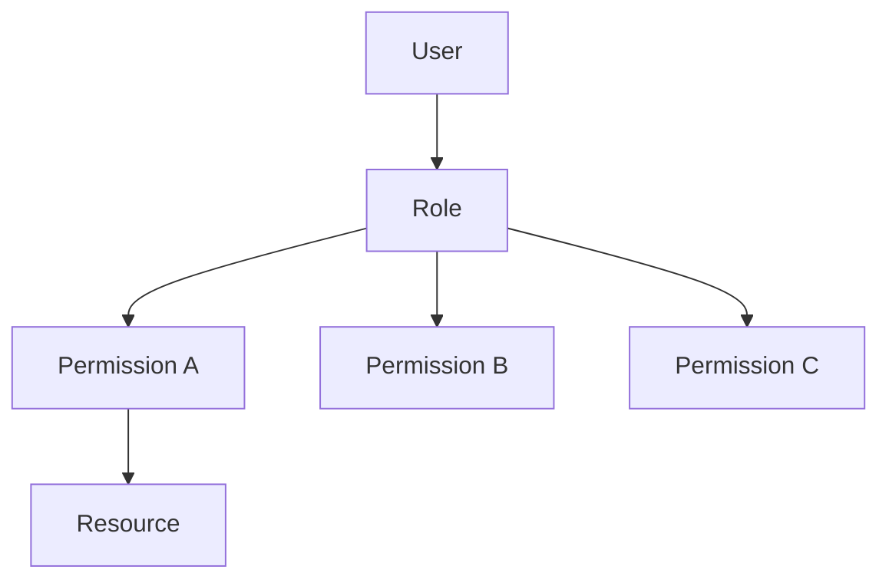
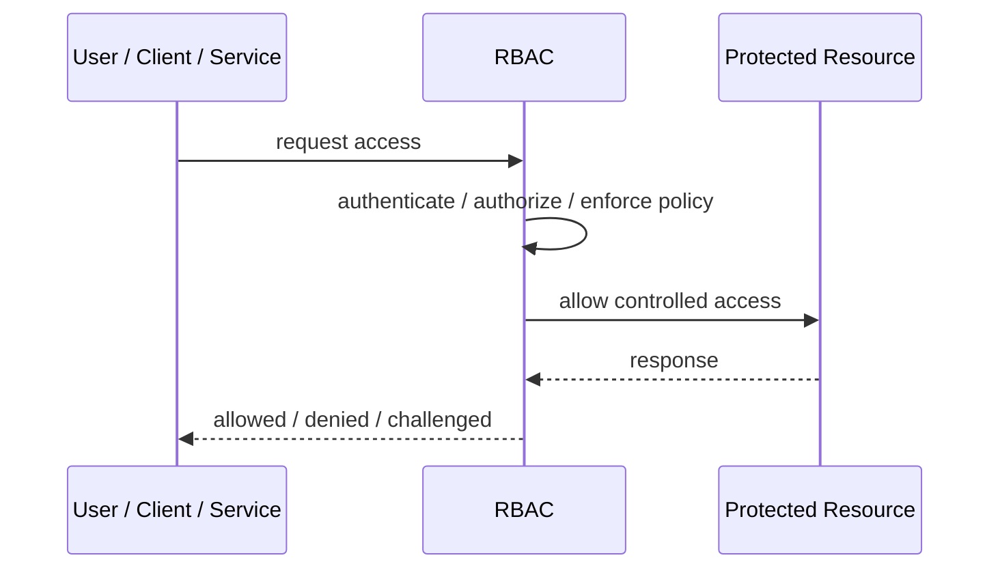
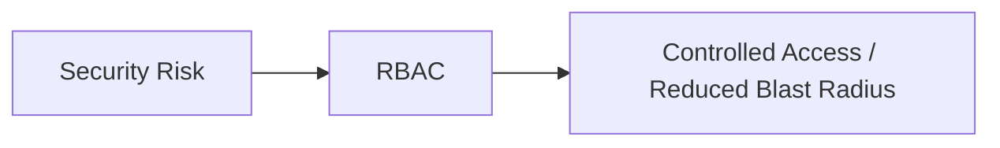

# RBAC

## Core Idea

Role-Based Access Control grants permissions based on assigned roles.

---

## Problem It Solves

Managing permissions per user becomes unmanageable as users and permissions grow.

---

## 3 Concrete Examples

### Example 1: Admin Dashboard

Users with Admin role can manage users; Support role can view tickets only.

### Example 2: Hospital System

Doctor, nurse, billing, and receptionist roles grant different capabilities.

### Example 3: Internal Tooling

Developer, operator, auditor, and manager roles define system access.

---

## Architect Questions

- What roles exist in the business?
- What permissions belong to each role?
- Can users have multiple roles?
- How are role assignments approved and audited?
- How is least privilege maintained?
- When does RBAC become too coarse?

---

## Main Diagram



---

## Runtime / Security Flow



---

## Implementation Shape

```txt
1. Identify the protected asset, identity, trust boundary, or access path.
2. Define who or what is requesting access.
3. Define authentication, authorization, encryption, policy, and audit requirements.
4. Define enforcement points and bypass prevention.
5. Define key, token, certificate, secret, or policy lifecycle.
6. Add observability: audit logs, denied requests, anomalous access, key usage, and policy decisions.
7. Test failure and attack scenarios, not only the happy path.
```

---

## When to Use

- Permissions map cleanly to business roles.
- You need simple and understandable access control.
- Role assignments can be governed and audited.

---

## When Not to Use

- Access depends heavily on context.
- Role explosion is happening.
- Roles no longer map to real responsibilities.

---

## Common Smell That Suggests This Pattern

```txt
Access decisions are inconsistent,
credentials are spreading,
systems trust the network too much,
or one security control failure would expose too much.
```

---

## Common Mistakes

```txt
Treating authentication as authorization.

Trusting internal networks blindly.

Putting secrets in code or config files.

Using tokens without validating issuer, audience, expiry, and signature.

Adding a gateway but allowing bypass paths.

Creating policies nobody can understand or audit.

Deploying controls without monitoring and incident response.
```

---

## Best Visual Summary



## Final Meaning

RBAC is useful when it reduces a real security risk with enforceable controls. If it is only a label without enforcement, monitoring, and ownership, it is security theater.
