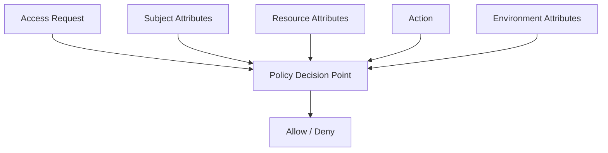
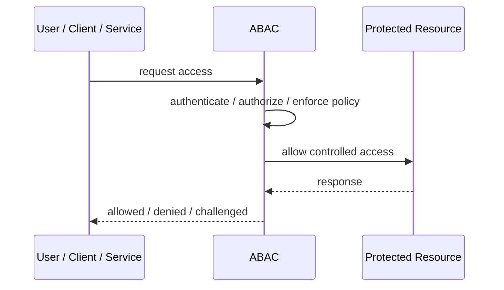
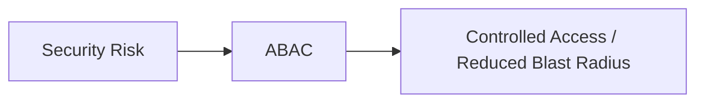

# ABAC

## Core Idea

Attribute-Based Access Control makes authorization decisions using attributes of the subject, resource, action, and environment.

---

## Problem It Solves

Role-based permissions are too coarse for contextual or fine-grained authorization needs.

---

## 3 Concrete Examples

### Example 1: Document Access

A user can view a document only if department matches and classification allows it.

### Example 2: Banking Operations

A transfer approval depends on user level, amount, region, and time of day.

### Example 3: Healthcare Access

A clinician can view records only for assigned patients and active treatment context.

---

## Architect Questions

- Which attributes matter for access decisions?
- Where do attributes come from?
- Are attributes trustworthy and fresh?
- How are policies written and tested?
- How are policy decisions audited?
- Can policy complexity become unmanageable?

---

## Main Diagram



---

## Runtime / Security Flow



---

## Implementation Shape

```txt
1. Identify the protected asset, identity, trust boundary, or access path.
2. Define who or what is requesting access.
3. Define authentication, authorization, encryption, policy, and audit requirements.
4. Define enforcement points and bypass prevention.
5. Define key, token, certificate, secret, or policy lifecycle.
6. Add observability: audit logs, denied requests, anomalous access, key usage, and policy decisions.
7. Test failure and attack scenarios, not only the happy path.
```

---

## When to Use

- Access depends on context or attributes.
- RBAC roles are too coarse.
- Fine-grained policy decisions are required.

---

## When Not to Use

- Attributes are unreliable or stale.
- Policy complexity cannot be governed.
- Simple RBAC is enough.

---

## Common Smell That Suggests This Pattern

```txt
Access decisions are inconsistent,
credentials are spreading,
systems trust the network too much,
or one security control failure would expose too much.
```

---

## Common Mistakes

```txt
Treating authentication as authorization.

Trusting internal networks blindly.

Putting secrets in code or config files.

Using tokens without validating issuer, audience, expiry, and signature.

Adding a gateway but allowing bypass paths.

Creating policies nobody can understand or audit.

Deploying controls without monitoring and incident response.
```

---

## Best Visual Summary



## Final Meaning

ABAC is useful when it reduces a real security risk with enforceable controls. If it is only a label without enforcement, monitoring, and ownership, it is security theater.
