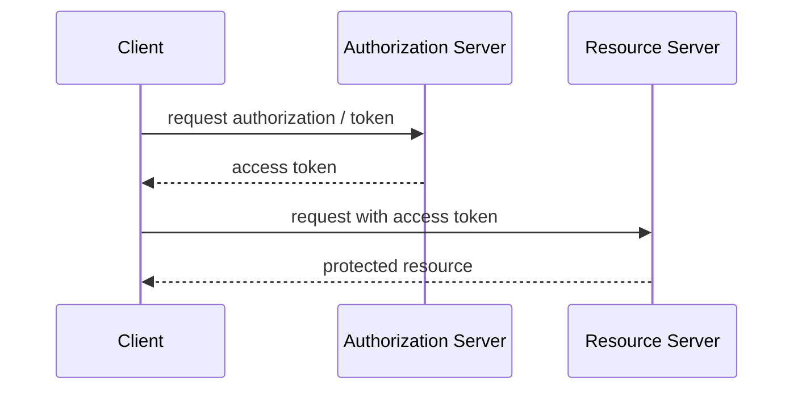
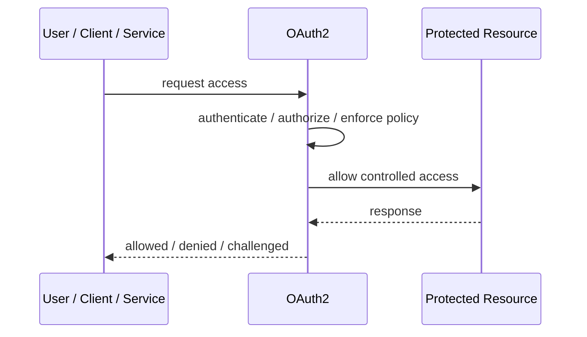
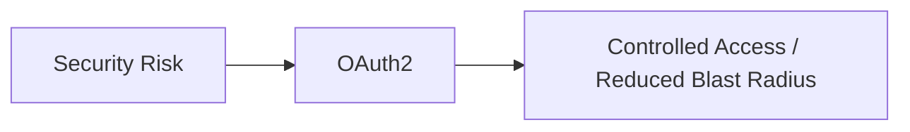

# OAuth2

## Core Idea

OAuth2 is an authorization framework that lets a client obtain limited access to protected resources using access tokens.

---

## Problem It Solves

Applications need delegated access without sharing user passwords with every client application.

---

## 3 Concrete Examples

### Example 1: Third-Party Calendar App

A calendar app gets permission to read events without knowing the user's password.

### Example 2: Mobile App API Access

A mobile app obtains an access token to call backend APIs.

### Example 3: Machine-to-Machine Access

A service uses client credentials to call another API.

---

## Architect Questions

- Which OAuth2 flow is appropriate?
- Who is the resource owner?
- What scopes are needed?
- How long should access tokens live?
- Are refresh tokens required?
- How are tokens validated and revoked?

---

## Main Diagram



---

## Runtime / Security Flow



---

## Implementation Shape

```txt
1. Identify the protected asset, identity, trust boundary, or access path.
2. Define who or what is requesting access.
3. Define authentication, authorization, encryption, policy, and audit requirements.
4. Define enforcement points and bypass prevention.
5. Define key, token, certificate, secret, or policy lifecycle.
6. Add observability: audit logs, denied requests, anomalous access, key usage, and policy decisions.
7. Test failure and attack scenarios, not only the happy path.
```

---

## When to Use

- A client needs delegated API access.
- Users should not share passwords with clients.
- Scopes and access tokens fit the problem.

---

## When Not to Use

- You only need local username/password login.
- The team confuses OAuth2 authorization with authentication.
- Token storage and validation are not designed.

---

## Common Smell That Suggests This Pattern

```txt
Access decisions are inconsistent,
credentials are spreading,
systems trust the network too much,
or one security control failure would expose too much.
```

---

## Common Mistakes

```txt
Treating authentication as authorization.

Trusting internal networks blindly.

Putting secrets in code or config files.

Using tokens without validating issuer, audience, expiry, and signature.

Adding a gateway but allowing bypass paths.

Creating policies nobody can understand or audit.

Deploying controls without monitoring and incident response.
```

---

## Best Visual Summary



## Final Meaning

OAuth2 is useful when it reduces a real security risk with enforceable controls. If it is only a label without enforcement, monitoring, and ownership, it is security theater.
