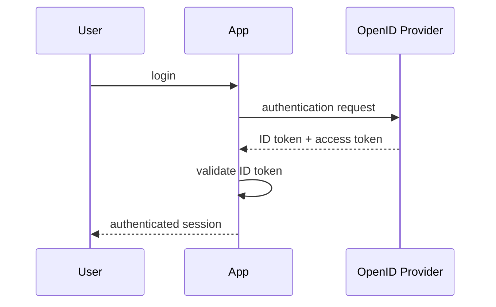
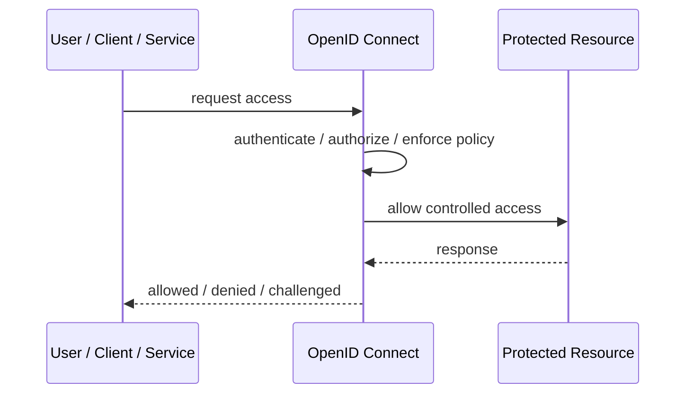
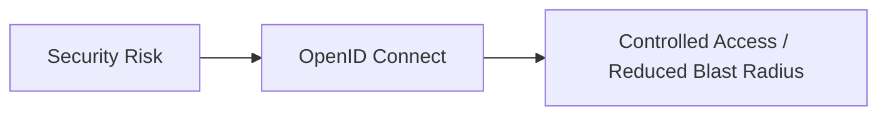

# OpenID Connect

## Core Idea

OpenID Connect adds identity authentication on top of OAuth2 using ID tokens.

---

## Problem It Solves

Applications need to know who the user is, not just whether the client has access to an API.

---

## 3 Concrete Examples

### Example 1: Single Sign-On

A web app logs users in through an identity provider and receives an ID token.

### Example 2: Mobile Login

A mobile app authenticates the user and receives identity claims.

### Example 3: Enterprise App Access

Internal apps rely on OIDC for standardized user authentication.

---

## Architect Questions

- Which identity provider is trusted?
- Which claims are required?
- How are ID tokens validated?
- How are sessions managed?
- What is the difference between ID token and access token?
- How is logout handled?

---

## Main Diagram



---

## Runtime / Security Flow



---

## Implementation Shape

```txt
1. Identify the protected asset, identity, trust boundary, or access path.
2. Define who or what is requesting access.
3. Define authentication, authorization, encryption, policy, and audit requirements.
4. Define enforcement points and bypass prevention.
5. Define key, token, certificate, secret, or policy lifecycle.
6. Add observability: audit logs, denied requests, anomalous access, key usage, and policy decisions.
7. Test failure and attack scenarios, not only the happy path.
```

---

## When to Use

- Applications need standardized user authentication.
- SSO is needed.
- Identity claims should come from a trusted provider.

---

## When Not to Use

- You do not need user authentication.
- The identity provider cannot be trusted or integrated.
- ID token validation is not understood.

---

## Common Smell That Suggests This Pattern

```txt
Access decisions are inconsistent,
credentials are spreading,
systems trust the network too much,
or one security control failure would expose too much.
```

---

## Common Mistakes

```txt
Treating authentication as authorization.

Trusting internal networks blindly.

Putting secrets in code or config files.

Using tokens without validating issuer, audience, expiry, and signature.

Adding a gateway but allowing bypass paths.

Creating policies nobody can understand or audit.

Deploying controls without monitoring and incident response.
```

---

## Best Visual Summary



## Final Meaning

OpenID Connect is useful when it reduces a real security risk with enforceable controls. If it is only a label without enforcement, monitoring, and ownership, it is security theater.
