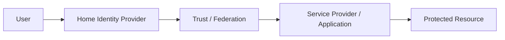
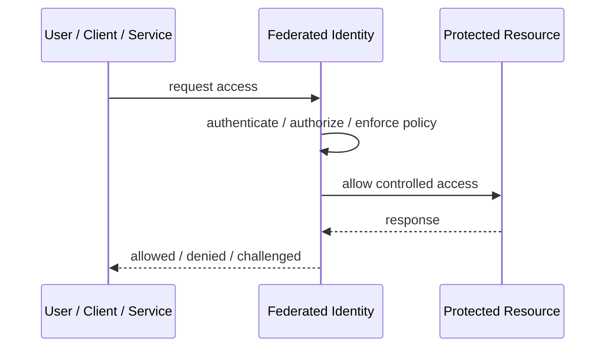

# Federated Identity

## Core Idea

Federated Identity allows users from one identity domain to access resources in another domain using trusted identity relationships.

---

## Problem It Solves

Organizations need users to authenticate with their home identity provider instead of creating separate credentials everywhere.

---

## 3 Concrete Examples

### Example 1: Enterprise SSO

Employees use corporate identity to access SaaS apps.

### Example 2: Partner Portal

Partners log in with their organization's identity provider.

### Example 3: Cloud Role Federation

Corporate users assume cloud roles without long-lived cloud passwords.

---

## Architect Questions

- Which identity providers are trusted?
- What protocol is used: SAML, OIDC, or another federation method?
- How are external claims mapped to local roles or attributes?
- How is trust established and rotated?
- How are users deprovisioned?
- How are audit trails correlated across identity domains?

---

## Main Diagram



---

## Runtime / Security Flow



---

## Implementation Shape

```txt
1. Identify the protected asset, identity, trust boundary, or access path.
2. Define who or what is requesting access.
3. Define authentication, authorization, encryption, policy, and audit requirements.
4. Define enforcement points and bypass prevention.
5. Define key, token, certificate, secret, or policy lifecycle.
6. Add observability: audit logs, denied requests, anomalous access, key usage, and policy decisions.
7. Test failure and attack scenarios, not only the happy path.
```

---

## When to Use

- External or enterprise identities should be reused.
- Separate local credentials are undesirable.
- Trust relationships can be managed.

---

## When Not to Use

- Trust boundaries are unclear.
- External identity claims cannot be governed.
- Local accounts are simpler and sufficient.

---

## Common Smell That Suggests This Pattern

```txt
Access decisions are inconsistent,
credentials are spreading,
systems trust the network too much,
or one security control failure would expose too much.
```

---

## Common Mistakes

```txt
Treating authentication as authorization.

Trusting internal networks blindly.

Putting secrets in code or config files.

Using tokens without validating issuer, audience, expiry, and signature.

Adding a gateway but allowing bypass paths.

Creating policies nobody can understand or audit.

Deploying controls without monitoring and incident response.
```

---

## Best Visual Summary


## Final Meaning

Federated Identity is useful when it reduces a real security risk with enforceable controls. If it is only a label without enforcement, monitoring, and ownership, it is security theater.
