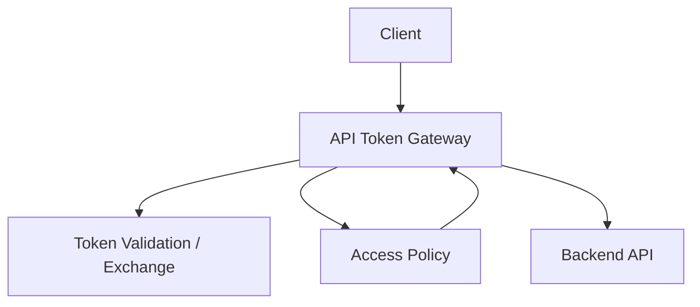
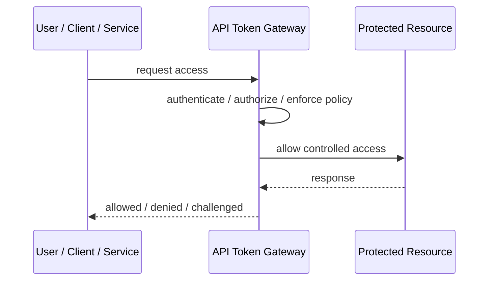
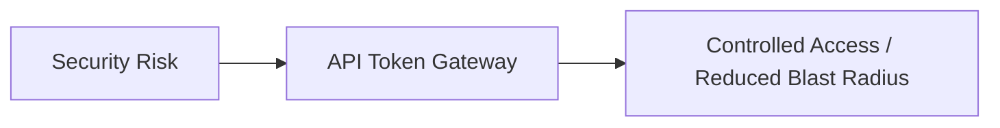

# API Token Gateway

## Core Idea

API Token Gateway validates, exchanges, scopes, or enriches tokens before requests reach backend APIs.

---

## Problem It Solves

Backend services should not all implement inconsistent token validation, token exchange, and API access policy.

---

## 3 Concrete Examples

### Example 1: Partner API Gateway

The gateway validates partner API tokens and forwards authenticated context to services.

### Example 2: Token Exchange

The gateway exchanges an external token for an internal service token.

### Example 3: Central Scope Enforcement

The gateway blocks requests missing required scopes before they hit backend APIs.

---

## Architect Questions

- What token types are accepted?
- Does the gateway validate, exchange, or mint tokens?
- What context is forwarded downstream?
- Are backend services still responsible for authorization?
- How are tokens revoked or rotated?
- Can the gateway become a single security bottleneck?

---

## Main Diagram



---

## Runtime / Security Flow



---

## Implementation Shape

```txt
1. Identify the protected asset, identity, trust boundary, or access path.
2. Define who or what is requesting access.
3. Define authentication, authorization, encryption, policy, and audit requirements.
4. Define enforcement points and bypass prevention.
5. Define key, token, certificate, secret, or policy lifecycle.
6. Add observability: audit logs, denied requests, anomalous access, key usage, and policy decisions.
7. Test failure and attack scenarios, not only the happy path.
```

---

## When to Use

- Token handling should be centralized at the API edge.
- Multiple backend services need consistent token validation.
- Token exchange or scope enforcement is needed.

---

## When Not to Use

- Backend services need resource-specific authorization anyway and gateway checks are superficial.
- The gateway becomes a god security layer.
- Token logic is simple and already consistent.

---

## Common Smell That Suggests This Pattern

```txt
Access decisions are inconsistent,
credentials are spreading,
systems trust the network too much,
or one security control failure would expose too much.
```

---

## Common Mistakes

```txt
Treating authentication as authorization.

Trusting internal networks blindly.

Putting secrets in code or config files.

Using tokens without validating issuer, audience, expiry, and signature.

Adding a gateway but allowing bypass paths.

Creating policies nobody can understand or audit.

Deploying controls without monitoring and incident response.
```

---

## Best Visual Summary



## Final Meaning

API Token Gateway is useful when it reduces a real security risk with enforceable controls. If it is only a label without enforcement, monitoring, and ownership, it is security theater.
