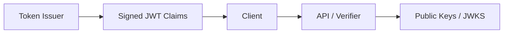
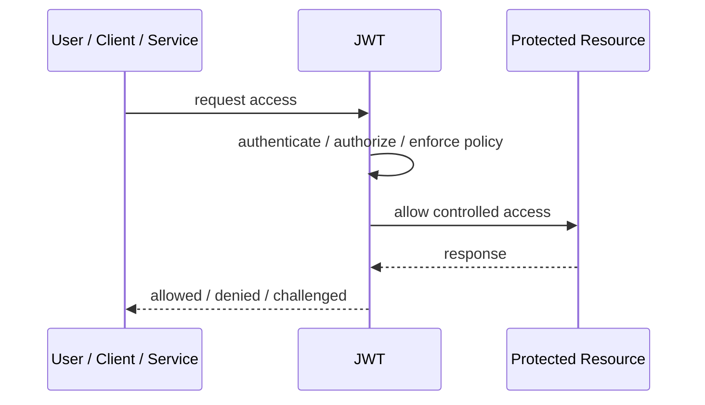
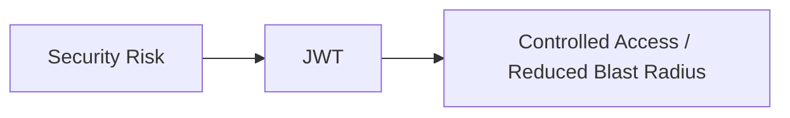

# JWT

## Core Idea

JWT is a signed token format that carries claims between parties, commonly used for authentication and authorization context.

---

## Problem It Solves

Systems need portable, verifiable claims without querying a central session store on every request.

---

## 3 Concrete Examples

### Example 1: Access Token

An API receives a JWT containing subject, scopes, issuer, audience, and expiration.

### Example 2: ID Token

An OIDC provider issues a JWT with user identity claims.

### Example 3: Service Token

A workload presents a signed JWT to call another service.

---

## Architect Questions

- Who issues the JWT?
- Who validates it?
- What claims belong inside?
- What signing algorithm and key rotation are used?
- How short should token lifetime be?
- How is revocation handled?

---

## Main Diagram



---

## Runtime / Security Flow



---

## Implementation Shape

```txt
1. Identify the protected asset, identity, trust boundary, or access path.
2. Define who or what is requesting access.
3. Define authentication, authorization, encryption, policy, and audit requirements.
4. Define enforcement points and bypass prevention.
5. Define key, token, certificate, secret, or policy lifecycle.
6. Add observability: audit logs, denied requests, anomalous access, key usage, and policy decisions.
7. Test failure and attack scenarios, not only the happy path.
```

---

## When to Use

- Portable signed claims are useful.
- APIs can validate tokens without central session lookup.
- Token lifetimes and key rotation are controlled.

---

## When Not to Use

- Immediate revocation is required but not designed.
- Tokens are stuffed with sensitive or bloated claims.
- Key rotation and audience validation are ignored.

---

## Common Smell That Suggests This Pattern

```txt
Access decisions are inconsistent,
credentials are spreading,
systems trust the network too much,
or one security control failure would expose too much.
```

---

## Common Mistakes

```txt
Treating authentication as authorization.

Trusting internal networks blindly.

Putting secrets in code or config files.

Using tokens without validating issuer, audience, expiry, and signature.

Adding a gateway but allowing bypass paths.

Creating policies nobody can understand or audit.

Deploying controls without monitoring and incident response.
```

---

## Best Visual Summary



## Final Meaning

JWT is useful when it reduces a real security risk with enforceable controls. If it is only a label without enforcement, monitoring, and ownership, it is security theater.
