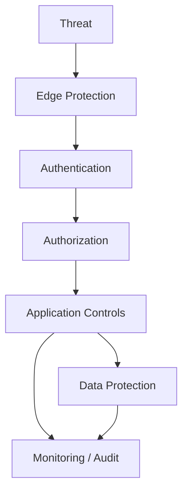
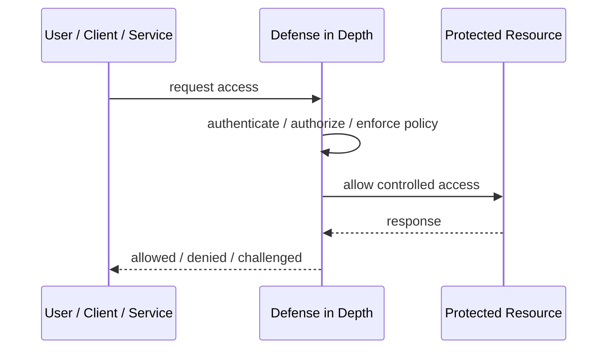
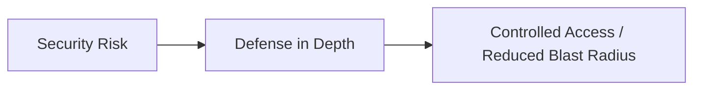

# Defense in Depth

## Core Idea

Defense in Depth uses multiple independent security layers so one control failure does not expose the whole system.

---

## Problem It Solves

A single security control can fail, be bypassed, misconfigured, or compromised.

---

## 3 Concrete Examples

### Example 1: Web Application Security

WAF, authentication, authorization, input validation, encryption, and audit logging all protect the app.

### Example 2: Cloud Account Protection

IAM least privilege, network segmentation, secrets vault, logging, and monitoring are layered.

### Example 3: Database Protection

Private networking, strong auth, encryption, backups, and query auditing protect data.

---

## Architect Questions

- What assets are most valuable?
- What security controls protect each layer?
- What happens if one control fails?
- Are controls independent or redundant in name only?
- How are detections and responses layered?
- Where are the gaps?

---

## Main Diagram



---

## Runtime / Security Flow



---

## Implementation Shape

```txt
1. Identify the protected asset, identity, trust boundary, or access path.
2. Define who or what is requesting access.
3. Define authentication, authorization, encryption, policy, and audit requirements.
4. Define enforcement points and bypass prevention.
5. Define key, token, certificate, secret, or policy lifecycle.
6. Add observability: audit logs, denied requests, anomalous access, key usage, and policy decisions.
7. Test failure and attack scenarios, not only the happy path.
```

---

## When to Use

- Assets are important enough for layered controls.
- One control failure must not expose everything.
- Detection and prevention should work together.

---

## When Not to Use

- Layers are redundant theater, not independent controls.
- No one monitors detections.
- Controls break usability without reducing real risk.

---

## Common Smell That Suggests This Pattern

```txt
Access decisions are inconsistent,
credentials are spreading,
systems trust the network too much,
or one security control failure would expose too much.
```

---

## Common Mistakes

```txt
Treating authentication as authorization.

Trusting internal networks blindly.

Putting secrets in code or config files.

Using tokens without validating issuer, audience, expiry, and signature.

Adding a gateway but allowing bypass paths.

Creating policies nobody can understand or audit.

Deploying controls without monitoring and incident response.
```

---

## Best Visual Summary



## Final Meaning

Defense in Depth is useful when it reduces a real security risk with enforceable controls. If it is only a label without enforcement, monitoring, and ownership, it is security theater.
