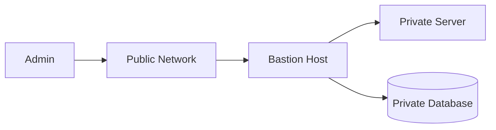
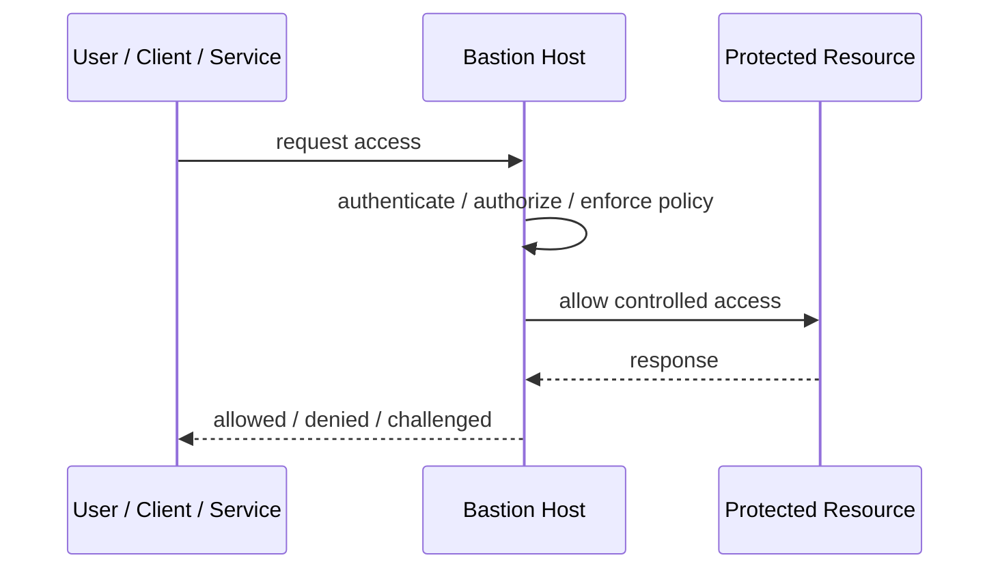
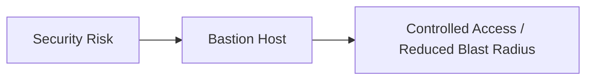

# Bastion Host

## Core Idea

A Bastion Host is a hardened jump point used to access private systems from a controlled entry point.

---

## Problem It Solves

Private servers should not be directly exposed to the internet or broad networks.

---

## 3 Concrete Examples

### Example 1: SSH Jump Host

Admins SSH into a bastion, then reach private servers.

### Example 2: Database Admin Access

DB tools connect through a bastion instead of exposing the database publicly.

### Example 3: Emergency Operations Access

A locked-down bastion provides audited break-glass access.

---

## Architect Questions

- What private resources require admin access?
- Who can access the bastion?
- Is MFA required?
- How are sessions logged?
- How is the bastion hardened and patched?
- Can just-in-time access replace always-on access?

---

## Main Diagram



---

## Runtime / Security Flow



---

## Implementation Shape

```txt
1. Identify the protected asset, identity, trust boundary, or access path.
2. Define who or what is requesting access.
3. Define authentication, authorization, encryption, policy, and audit requirements.
4. Define enforcement points and bypass prevention.
5. Define key, token, certificate, secret, or policy lifecycle.
6. Add observability: audit logs, denied requests, anomalous access, key usage, and policy decisions.
7. Test failure and attack scenarios, not only the happy path.
```

---

## When to Use

- Private resources need controlled admin access.
- Direct public access is unsafe.
- Session auditing and hardened access are required.

---

## When Not to Use

- Modern identity-aware access removes the need.
- The bastion becomes a shared unmanaged backdoor.
- Sessions are not logged or controlled.

---

## Common Smell That Suggests This Pattern

```txt
Access decisions are inconsistent,
credentials are spreading,
systems trust the network too much,
or one security control failure would expose too much.
```

---

## Common Mistakes

```txt
Treating authentication as authorization.

Trusting internal networks blindly.

Putting secrets in code or config files.

Using tokens without validating issuer, audience, expiry, and signature.

Adding a gateway but allowing bypass paths.

Creating policies nobody can understand or audit.

Deploying controls without monitoring and incident response.
```

---

## Best Visual Summary



## Final Meaning

Bastion Host is useful when it reduces a real security risk with enforceable controls. If it is only a label without enforcement, monitoring, and ownership, it is security theater.
