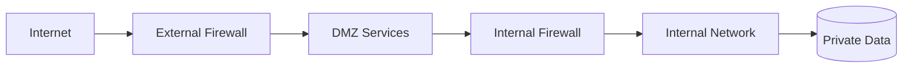
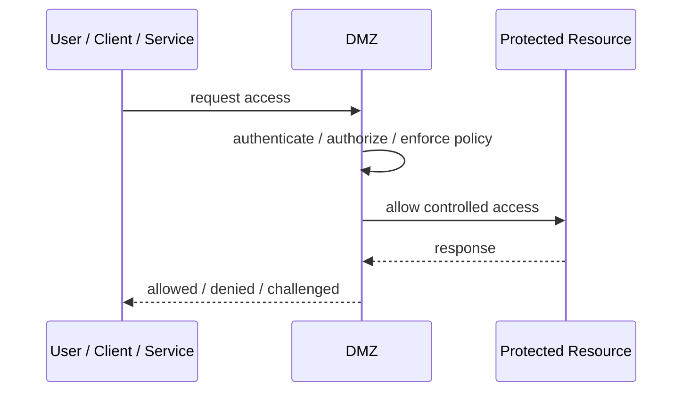
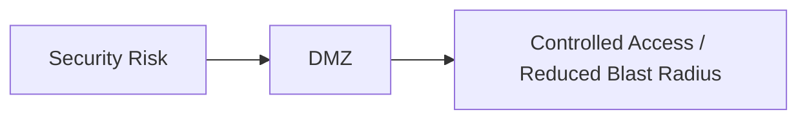

# DMZ

## Core Idea

A DMZ is a network segment that exposes public-facing services while separating them from private internal systems.

---

## Problem It Solves

Internet-facing systems need exposure, but compromise of those systems should not directly expose the internal network.

---

## 3 Concrete Examples

### Example 1: Public Web Tier

Web servers run in the DMZ and call internal app services through restricted rules.

### Example 2: Email Gateway

Mail gateways sit in the DMZ before forwarding to internal mail systems.

### Example 3: Partner File Transfer

SFTP servers are placed in a DMZ away from core databases.

---

## Architect Questions

- Which systems must be publicly reachable?
- What traffic is allowed from internet to DMZ?
- What traffic is allowed from DMZ to internal network?
- How are DMZ hosts monitored and patched?
- What happens if a DMZ host is compromised?
- Are secrets and databases kept out of the DMZ?

---

## Main Diagram



---

## Runtime / Security Flow



---

## Implementation Shape

```txt
1. Identify the protected asset, identity, trust boundary, or access path.
2. Define who or what is requesting access.
3. Define authentication, authorization, encryption, policy, and audit requirements.
4. Define enforcement points and bypass prevention.
5. Define key, token, certificate, secret, or policy lifecycle.
6. Add observability: audit logs, denied requests, anomalous access, key usage, and policy decisions.
7. Test failure and attack scenarios, not only the happy path.
```

---

## When to Use

- Public-facing systems must be separated from internal systems.
- Network segmentation reduces blast radius.
- Internet ingress needs controlled exposure.

---

## When Not to Use

- Network segmentation is fake because DMZ can freely reach everything.
- Workloads are cloud-native and identity-based controls fit better.
- Secrets or databases are placed in the DMZ.

---

## Common Smell That Suggests This Pattern

```txt
Access decisions are inconsistent,
credentials are spreading,
systems trust the network too much,
or one security control failure would expose too much.
```

---

## Common Mistakes

```txt
Treating authentication as authorization.

Trusting internal networks blindly.

Putting secrets in code or config files.

Using tokens without validating issuer, audience, expiry, and signature.

Adding a gateway but allowing bypass paths.

Creating policies nobody can understand or audit.

Deploying controls without monitoring and incident response.
```

---

## Best Visual Summary



## Final Meaning

DMZ is useful when it reduces a real security risk with enforceable controls. If it is only a label without enforcement, monitoring, and ownership, it is security theater.
