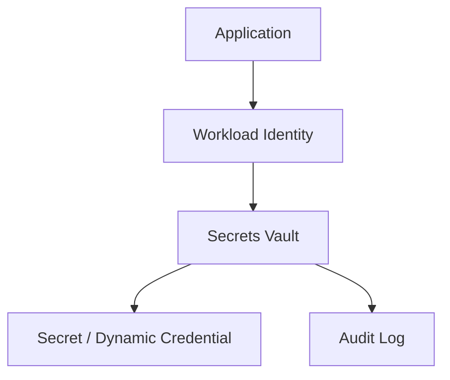
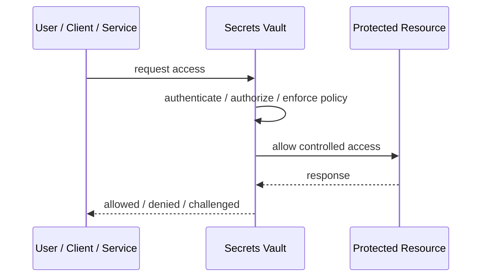
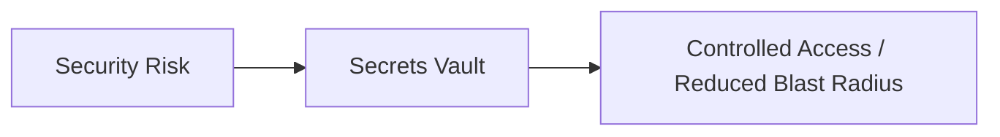

# Secrets Vault

## Core Idea

Secrets Vault centrally stores, controls, rotates, and audits access to secrets such as passwords, API keys, certificates, and tokens.

---

## Problem It Solves

Secrets spread across code, config files, developer machines, and CI/CD pipelines create leakage and rotation risk.

---

## 3 Concrete Examples

### Example 1: Database Credentials

Applications retrieve short-lived DB credentials from the vault.

### Example 2: API Key Storage

Third-party API keys are stored centrally and injected at runtime.

### Example 3: Certificate Management

TLS certificates are issued and rotated through the vault.

---

## Architect Questions

- What secrets exist and who owns them?
- Who or what can read each secret?
- Are secrets static or dynamic?
- How is access audited?
- How are secrets rotated?
- What happens if the vault is unavailable?

---

## Main Diagram



---

## Runtime / Security Flow



---

## Implementation Shape

```txt
1. Identify the protected asset, identity, trust boundary, or access path.
2. Define who or what is requesting access.
3. Define authentication, authorization, encryption, policy, and audit requirements.
4. Define enforcement points and bypass prevention.
5. Define key, token, certificate, secret, or policy lifecycle.
6. Add observability: audit logs, denied requests, anomalous access, key usage, and policy decisions.
7. Test failure and attack scenarios, not only the happy path.
```

---

## When to Use

- Secrets are spread across code/config/pipelines.
- Rotation and audit are required.
- Applications can authenticate to retrieve secrets safely.

---

## When Not to Use

- Apps cannot authenticate safely to the vault.
- Vault availability and recovery are not designed.
- Static secrets in vault are never rotated.

---

## Common Smell That Suggests This Pattern

```txt
Access decisions are inconsistent,
credentials are spreading,
systems trust the network too much,
or one security control failure would expose too much.
```

---

## Common Mistakes

```txt
Treating authentication as authorization.

Trusting internal networks blindly.

Putting secrets in code or config files.

Using tokens without validating issuer, audience, expiry, and signature.

Adding a gateway but allowing bypass paths.

Creating policies nobody can understand or audit.

Deploying controls without monitoring and incident response.
```

---

## Best Visual Summary



## Final Meaning

Secrets Vault is useful when it reduces a real security risk with enforceable controls. If it is only a label without enforcement, monitoring, and ownership, it is security theater.
