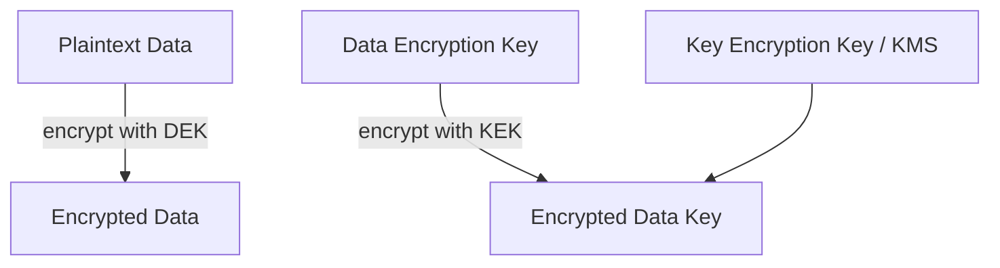
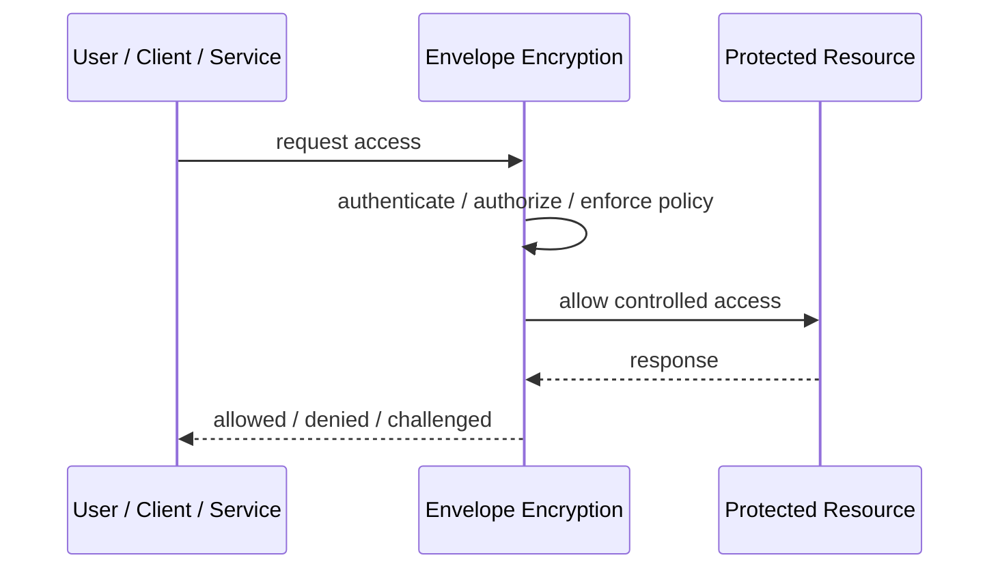
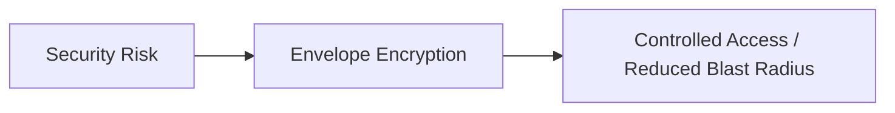

# Envelope Encryption

## Core Idea

Envelope Encryption encrypts data with a data encryption key, then encrypts that key with a master/key-encryption key.

---

## Problem It Solves

Large data needs efficient encryption while central key management and rotation remain practical.

---

## 3 Concrete Examples

### Example 1: Object Storage Encryption

Each file is encrypted with a data key; the data key is encrypted by KMS.

### Example 2: Database Field Encryption

Sensitive fields are encrypted with per-record keys wrapped by a master key.

### Example 3: Tenant Key Wrapping

Tenant data keys are wrapped by tenant-specific or KMS-managed keys.

---

## Architect Questions

- What data needs encryption?
- Where are data keys generated?
- What key encrypts the data key?
- How are keys rotated?
- Where are encrypted data keys stored?
- Who can decrypt and under what policy?

---

## Main Diagram



---

## Runtime / Security Flow



---

## Implementation Shape

```txt
1. Identify the protected asset, identity, trust boundary, or access path.
2. Define who or what is requesting access.
3. Define authentication, authorization, encryption, policy, and audit requirements.
4. Define enforcement points and bypass prevention.
5. Define key, token, certificate, secret, or policy lifecycle.
6. Add observability: audit logs, denied requests, anomalous access, key usage, and policy decisions.
7. Test failure and attack scenarios, not only the happy path.
```

---

## When to Use

- Large data needs encryption with manageable key rotation.
- Central key management is required.
- Per-object or per-tenant data keys are useful.

---

## When Not to Use

- Simple managed encryption is enough.
- Key hierarchy is not understood.
- Losing wrapped keys would make data unrecoverable.

---

## Common Smell That Suggests This Pattern

```txt
Access decisions are inconsistent,
credentials are spreading,
systems trust the network too much,
or one security control failure would expose too much.
```

---

## Common Mistakes

```txt
Treating authentication as authorization.

Trusting internal networks blindly.

Putting secrets in code or config files.

Using tokens without validating issuer, audience, expiry, and signature.

Adding a gateway but allowing bypass paths.

Creating policies nobody can understand or audit.

Deploying controls without monitoring and incident response.
```

---

## Best Visual Summary



## Final Meaning

Envelope Encryption is useful when it reduces a real security risk with enforceable controls. If it is only a label without enforcement, monitoring, and ownership, it is security theater.
