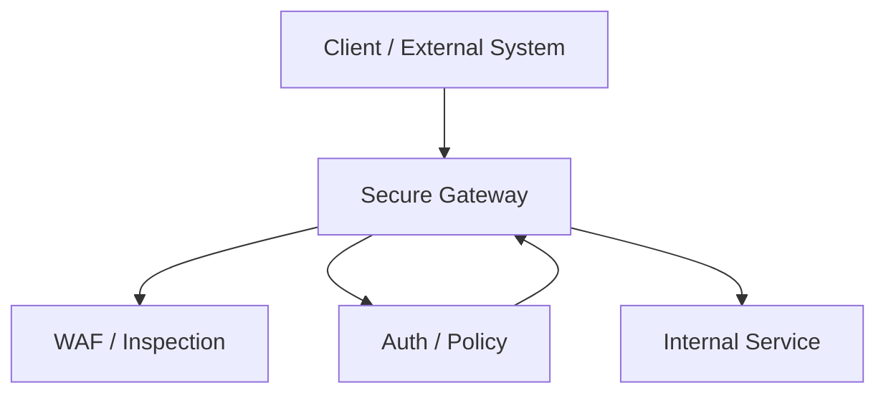
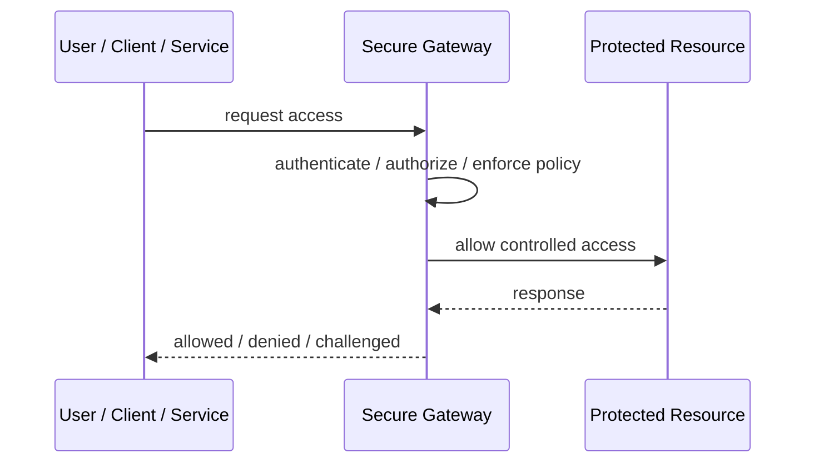
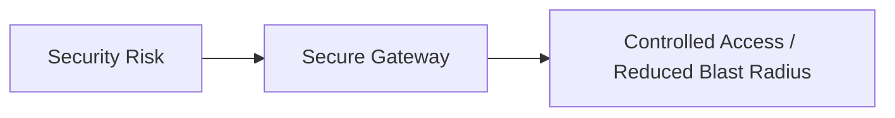

# Secure Gateway

## Core Idea

Secure Gateway centralizes secure ingress or egress controls such as authentication, TLS termination, inspection, policy enforcement, and routing.

---

## Problem It Solves

Traffic entering or leaving a system needs consistent security controls before reaching internal services.

---

## 3 Concrete Examples

### Example 1: API Ingress Gateway

External API requests pass through authentication, WAF, TLS, and policy checks.

### Example 2: Egress Gateway

Outbound calls to the internet are inspected and restricted through a controlled gateway.

### Example 3: Partner Gateway

Partner traffic is authenticated, logged, and routed through a dedicated gateway.

---

## Architect Questions

- Is this ingress, egress, or partner traffic?
- What security controls happen at the gateway?
- What traffic is blocked?
- What identity is forwarded downstream?
- How are policies updated?
- Can the gateway become a bottleneck or single point of failure?

---

## Main Diagram



---

## Runtime / Security Flow



---

## Implementation Shape

```txt
1. Identify the protected asset, identity, trust boundary, or access path.
2. Define who or what is requesting access.
3. Define authentication, authorization, encryption, policy, and audit requirements.
4. Define enforcement points and bypass prevention.
5. Define key, token, certificate, secret, or policy lifecycle.
6. Add observability: audit logs, denied requests, anomalous access, key usage, and policy decisions.
7. Test failure and attack scenarios, not only the happy path.
```

---

## When to Use

- Ingress or egress traffic needs centralized controls.
- Internal services should not be directly exposed.
- Inspection, auth, routing, and policy belong at a boundary.

---

## When Not to Use

- It only forwards traffic without meaningful controls.
- It becomes a bottleneck or single point of failure.
- Security logic hides core authorization responsibilities.

---

## Common Smell That Suggests This Pattern

```txt
Access decisions are inconsistent,
credentials are spreading,
systems trust the network too much,
or one security control failure would expose too much.
```

---

## Common Mistakes

```txt
Treating authentication as authorization.

Trusting internal networks blindly.

Putting secrets in code or config files.

Using tokens without validating issuer, audience, expiry, and signature.

Adding a gateway but allowing bypass paths.

Creating policies nobody can understand or audit.

Deploying controls without monitoring and incident response.
```

---

## Best Visual Summary



## Final Meaning

Secure Gateway is useful when it reduces a real security risk with enforceable controls. If it is only a label without enforcement, monitoring, and ownership, it is security theater.
