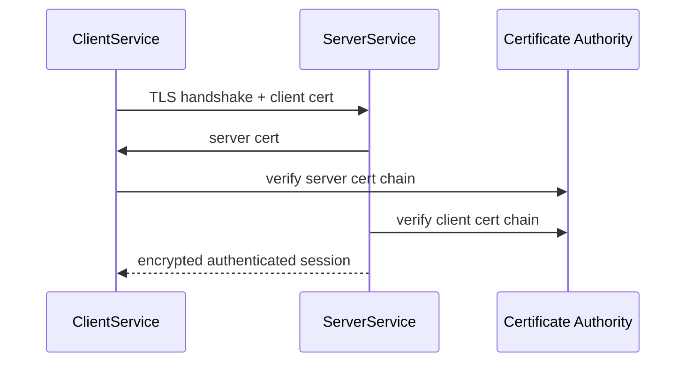
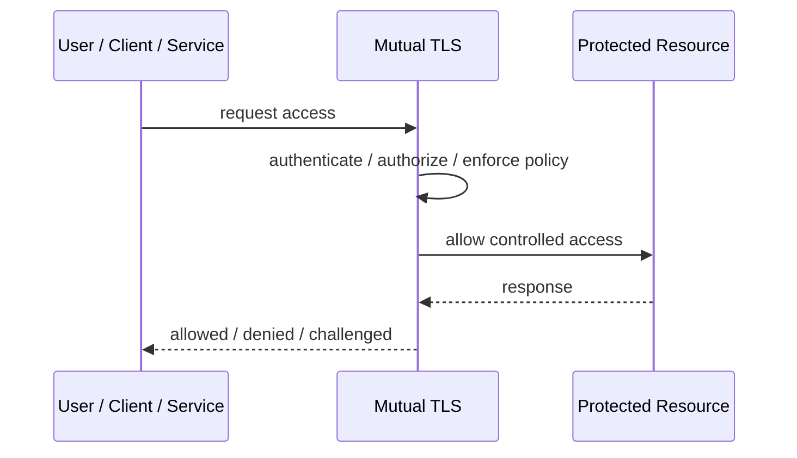
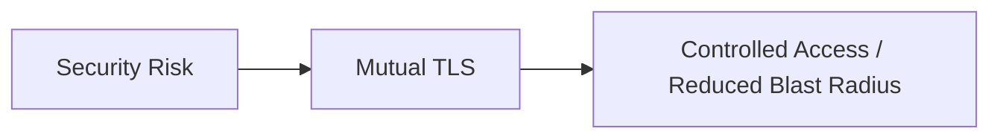

# Mutual TLS

## Core Idea

Mutual TLS authenticates both client and server using certificates while encrypting the connection.

---

## Problem It Solves

Services need strong service-to-service authentication, not just encrypted transport.

---

## 3 Concrete Examples

### Example 1: Service-to-Service Auth

Order service and Payment service verify each other's certificates.

### Example 2: Partner API Access

A partner system must present a client certificate to call APIs.

### Example 3: Internal Mesh Security

A service mesh uses mTLS for every internal request.

---

## Architect Questions

- Who issues certificates?
- How are certificate identities mapped to services?
- How are certificates rotated?
- How is trust anchored?
- What happens on certificate expiry?
- Is mTLS enough, or is application authorization still needed?

---

## Main Diagram



---

## Runtime / Security Flow



---

## Implementation Shape

```txt
1. Identify the protected asset, identity, trust boundary, or access path.
2. Define who or what is requesting access.
3. Define authentication, authorization, encryption, policy, and audit requirements.
4. Define enforcement points and bypass prevention.
5. Define key, token, certificate, secret, or policy lifecycle.
6. Add observability: audit logs, denied requests, anomalous access, key usage, and policy decisions.
7. Test failure and attack scenarios, not only the happy path.
```

---

## When to Use

- Both sides of a connection must authenticate.
- Service-to-service identity matters.
- Encrypted transport alone is insufficient.

---

## When Not to Use

- Certificate lifecycle cannot be managed.
- Application authorization is ignored because mTLS exists.
- Only server authentication is needed.

---

## Common Smell That Suggests This Pattern

```txt
Access decisions are inconsistent,
credentials are spreading,
systems trust the network too much,
or one security control failure would expose too much.
```

---

## Common Mistakes

```txt
Treating authentication as authorization.

Trusting internal networks blindly.

Putting secrets in code or config files.

Using tokens without validating issuer, audience, expiry, and signature.

Adding a gateway but allowing bypass paths.

Creating policies nobody can understand or audit.

Deploying controls without monitoring and incident response.
```

---

## Best Visual Summary



## Final Meaning

Mutual TLS is useful when it reduces a real security risk with enforceable controls. If it is only a label without enforcement, monitoring, and ownership, it is security theater.
