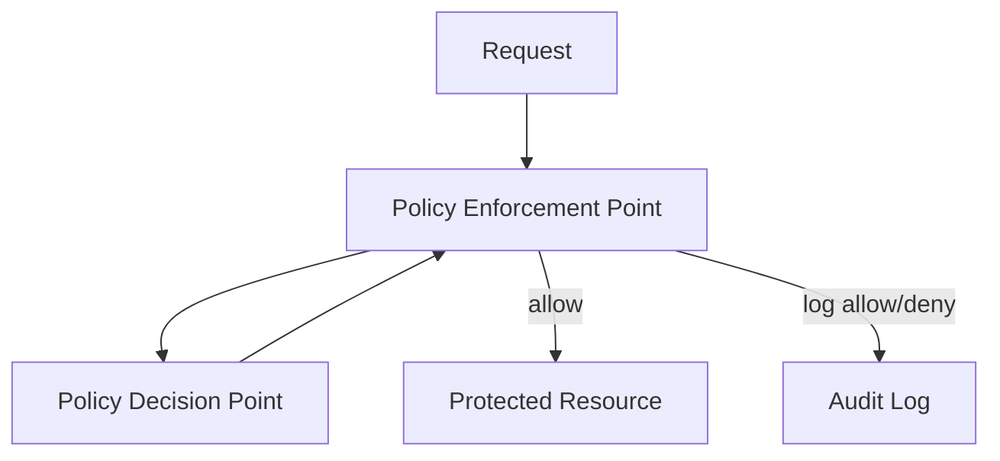
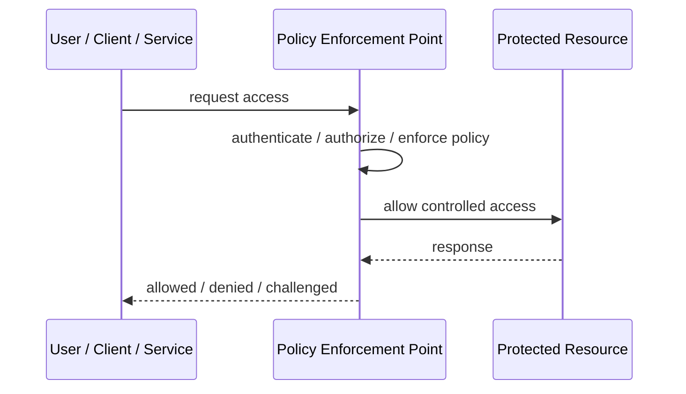
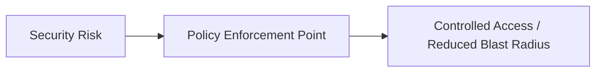

# Policy Enforcement Point

## Core Idea

A Policy Enforcement Point intercepts requests and enforces access decisions from policy logic before allowing access to resources.

---

## Problem It Solves

Authorization rules need to be consistently enforced at system boundaries instead of scattered across application code.

---

## 3 Concrete Examples

### Example 1: API Gateway PEP

Gateway checks authorization policy before routing to services.

### Example 2: Service Mesh PEP

Sidecar proxy enforces service-to-service policy.

### Example 3: Application Middleware PEP

Middleware checks user action permissions before controller logic runs.

---

## Architect Questions

- Where should enforcement happen?
- What is the policy decision point?
- What request attributes are needed?
- What happens on deny?
- How are decisions logged?
- Can services bypass the PEP?

---

## Main Diagram



---

## Runtime / Security Flow



---

## Implementation Shape

```txt
1. Identify the protected asset, identity, trust boundary, or access path.
2. Define who or what is requesting access.
3. Define authentication, authorization, encryption, policy, and audit requirements.
4. Define enforcement points and bypass prevention.
5. Define key, token, certificate, secret, or policy lifecycle.
6. Add observability: audit logs, denied requests, anomalous access, key usage, and policy decisions.
7. Test failure and attack scenarios, not only the happy path.
```

---

## When to Use

- Policy enforcement must be consistent.
- Authorization should happen at clear boundaries.
- Requests can be intercepted before resource access.

---

## When Not to Use

- Services can bypass it.
- Policy decisions require data the PEP cannot access.
- Policy is scattered and not centrally governed.

---

## Common Smell That Suggests This Pattern

```txt
Access decisions are inconsistent,
credentials are spreading,
systems trust the network too much,
or one security control failure would expose too much.
```

---

## Common Mistakes

```txt
Treating authentication as authorization.

Trusting internal networks blindly.

Putting secrets in code or config files.

Using tokens without validating issuer, audience, expiry, and signature.

Adding a gateway but allowing bypass paths.

Creating policies nobody can understand or audit.

Deploying controls without monitoring and incident response.
```

---

## Best Visual Summary



## Final Meaning

Policy Enforcement Point is useful when it reduces a real security risk with enforceable controls. If it is only a label without enforcement, monitoring, and ownership, it is security theater.
