# Adapter Pattern Using Diagrams

## Core Idea

The **Adapter Pattern** is a structural design pattern used when one object has the functionality you need, but its interface does not match what your system expects.

Instead of changing the existing class, you wrap it with an adapter.

```txt
Your system expects:
- send(message)

Existing service provides:
- transmit(payload)

Adapter translates:
- send(message) -> transmit(payload)
```

The adapter acts like a plug converter.

---

# 1. Adapter Pattern: General Structure

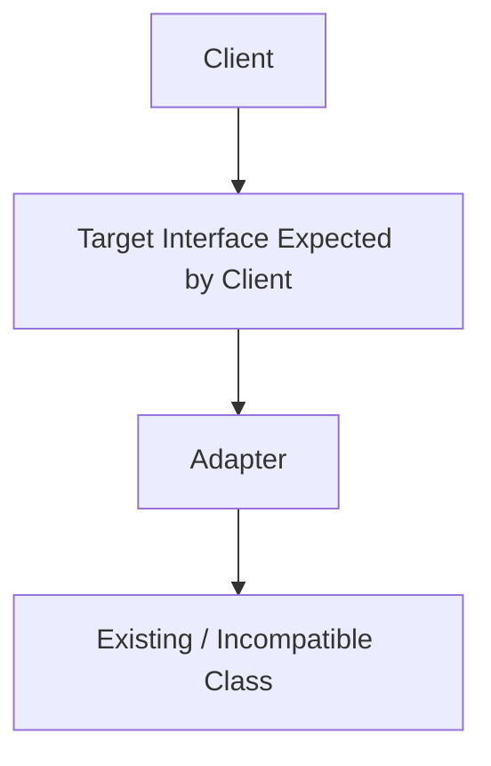

## What This Means

The client wants to use a known interface.

The existing object has a different interface.

The adapter sits between them and translates calls.

---

# 2. Simple Mental Model

Think of Adapter like a power plug adapter.

```txt
Your laptop charger has a US plug.

The wall outlet uses a European socket.

You do not redesign the charger.
You do not rebuild the wall.

You use an adapter.
```

In software:

```txt
Client expects one interface.
Existing class exposes another interface.
Adapter makes them compatible.
```

---

# 3. What Problem Adapter Solves

## Without Adapter

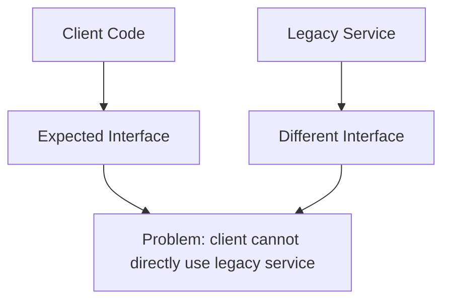

The client and the existing service do not speak the same language.

---

## With Adapter

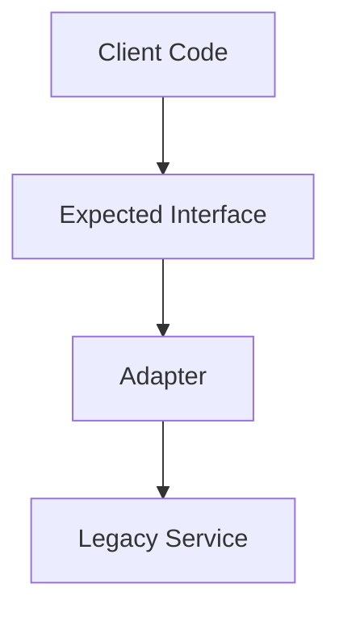

The client keeps using the interface it expects.

The adapter converts that call into something the legacy service understands.

---

# 4. Example 1: Payment Gateway Adapter

## Problem

An e-commerce application expects all payment providers to use this interface:

```txt
PaymentGateway:
- pay(amount)
- refund(transactionId)
```

But a third-party provider has a different interface:

```txt
ExternalPaymentAPI:
- makeCharge(totalInCents)
- reversePayment(referenceCode)
```

The system cannot use the provider directly because the method names and data formats are different.

---

## Architect Questions

An architect would ask:

```txt
Do we need to integrate with an existing external system?

Does the external system have an interface we cannot change?

Does our application already expect a stable internal interface?

Are method names, parameter formats, or return values different?

Should we isolate third-party API details from our business logic?

Will we need to swap or add providers later?

Can an adapter prevent vendor-specific code from spreading everywhere?
```

---

## Adapter Diagram

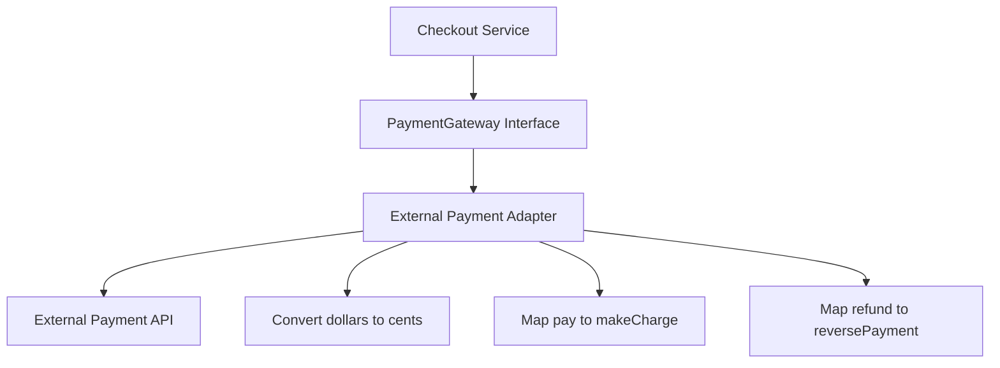

---

## Runtime Flow

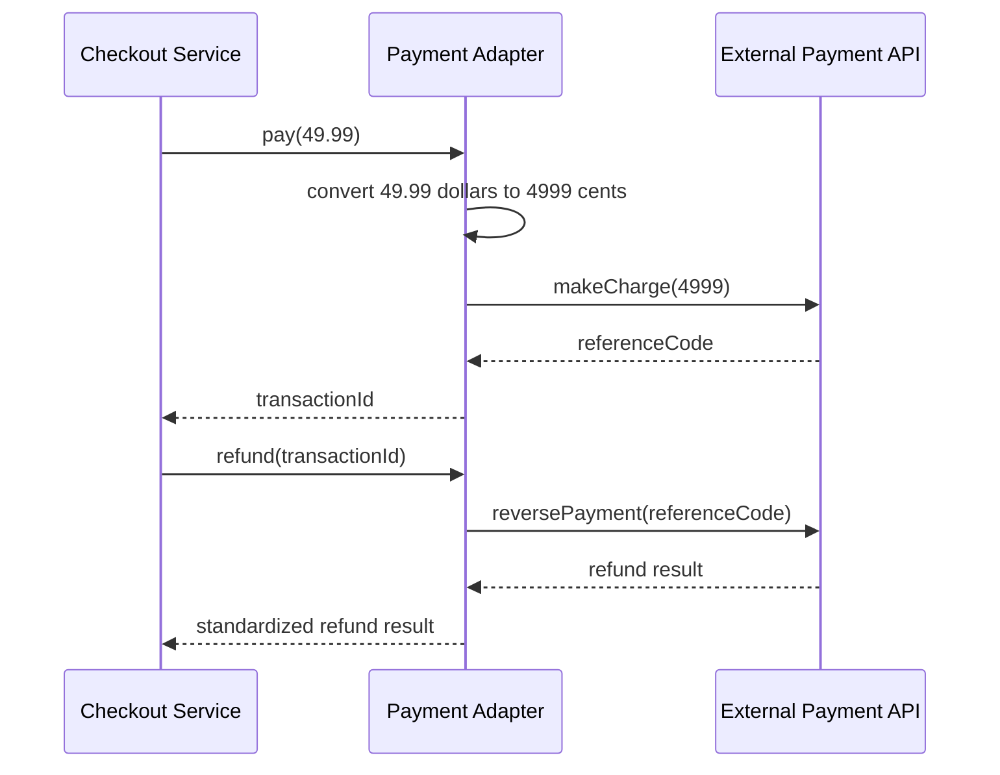

---

## Architectural Meaning

The checkout service does not know about:

```txt
makeCharge()
reversePayment()
cents
referenceCode
vendor-specific response shape
```

It only knows:

```txt
pay()
refund()
```

The adapter hides the external provider’s weird interface.

---

# 5. Example 2: Legacy User System Adapter

## Problem

A new application expects a modern user service:

```txt
UserService:
- getUserById(id)
- createUser(user)
- deactivateUser(id)
```

But the company has an old legacy system with different operations:

```txt
LegacyUserDatabase:
- fetch_customer(customer_number)
- insert_customer(record)
- mark_inactive(customer_number)
```

The new app should not be polluted with legacy naming and record formats.

---

## Architect Questions

An architect would ask:

```txt
Are we integrating old code with new code?

Can the legacy system be changed safely?

Should new modules use clean modern interfaces?

Do legacy field names differ from domain field names?

Do we need data mapping between old records and new models?

Can the adapter become a boundary around technical debt?

How long will the legacy system remain?
```

---

## Adapter Diagram

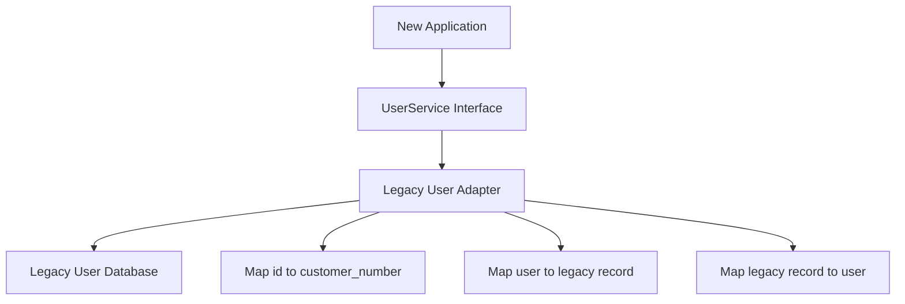

---

## Runtime Flow

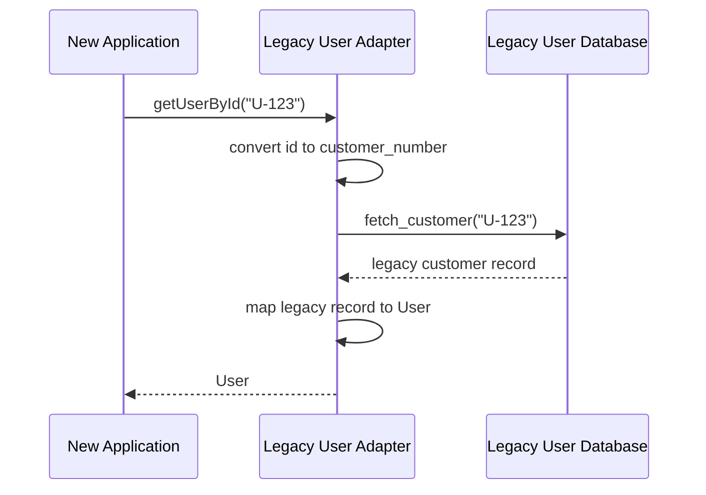

---

## Architectural Meaning

The adapter creates a clean boundary.

The new application does not need to know the legacy system uses names like:

```txt
customer_number
fetch_customer
insert_customer
mark_inactive
```

That ugliness stays inside the adapter.

---

# 6. Example 3: Analytics Tracking Adapter

## Problem

A product app wants to track events using a clean internal interface:

```txt
AnalyticsTracker:
- trackEvent(name, properties)
- identifyUser(userId, traits)
```

But different analytics platforms expose different APIs:

```txt
Platform A:
- logEvent(eventName, metadata)

Platform B:
- capture(event, data)

Platform C:
- sendTrackingPayload(payload)
```

Without adapters, vendor-specific calls spread everywhere in the app.

---

## Architect Questions

An architect would ask:

```txt
Do we depend on a third-party vendor API?

Could the vendor change later?

Do different vendors expose different method names?

Should product code avoid analytics-specific SDK details?

Can we standardize event tracking across the app?

Should we support multiple analytics tools at the same time?

Where should event format conversion live?
```

---

## Adapter Diagram

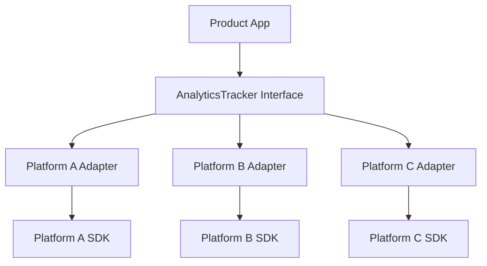

---

## Runtime Flow

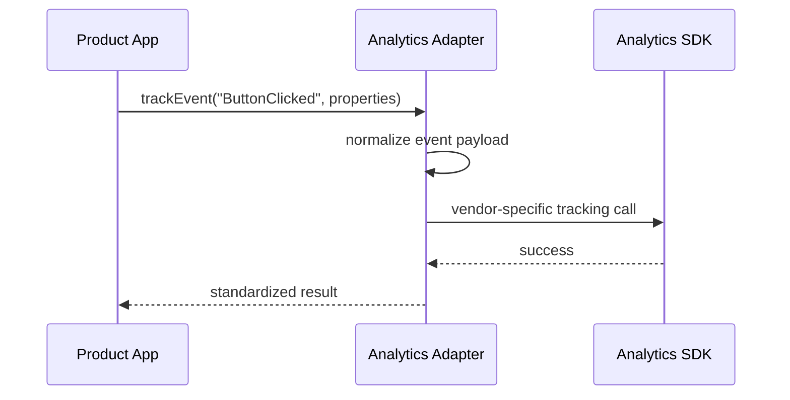

---

## Architectural Meaning

The product app speaks one analytics language:

```txt
trackEvent()
identifyUser()
```

The adapter translates that into whatever the vendor requires.

If the company switches analytics vendors later, most product code does not change.

Only the adapter changes.

---

# 7. Example 4: File Storage Adapter

## Problem

An application expects a simple file storage interface:

```txt
FileStorage:
- save(path, content)
- read(path)
- delete(path)
```

But different storage backends expose different APIs:

```txt
Local Disk:
- writeFile()
- readFile()
- unlink()

Cloud Storage:
- putObject()
- getObject()
- removeObject()

FTP Server:
- upload()
- download()
- remove()
```

The application should not care where the file is stored.

---

## Architect Questions

An architect would ask:

```txt
Does the application need a stable storage interface?

Are there multiple storage backends?

Do storage providers expose different APIs?

Should business logic avoid knowing storage details?

Will storage change between development and production?

Do we need local storage in testing and cloud storage in production?
```

---

## Adapter Diagram

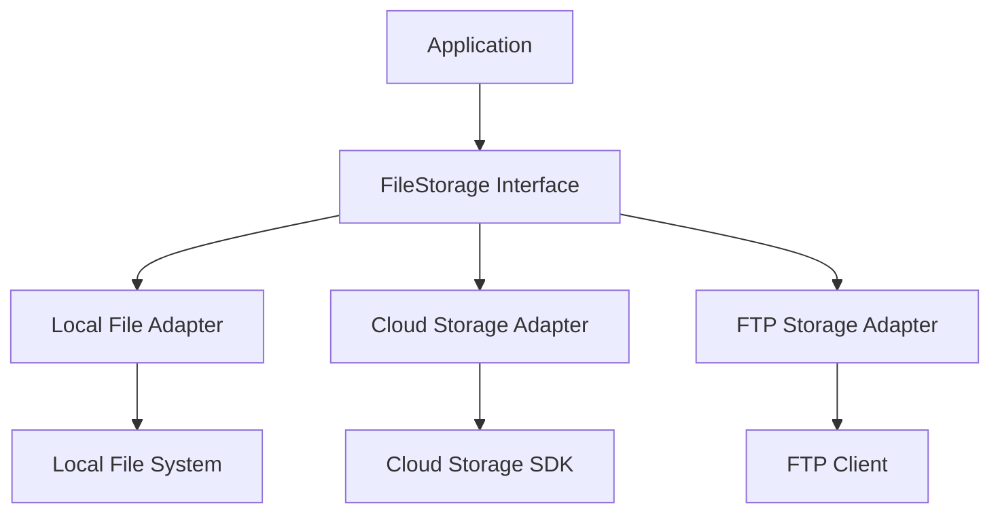

---

## Runtime Flow

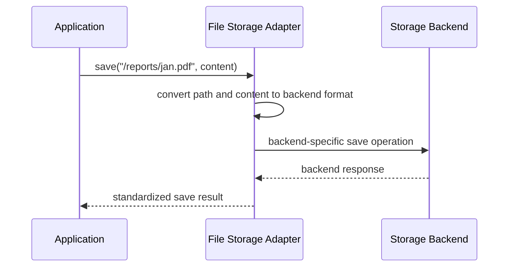

---

## Architectural Meaning

The application depends on:

```txt
FileStorage
```

not:

```txt
Local disk API
Cloud SDK
FTP command syntax
```

That makes the storage layer replaceable and testable.

---

# 8. Object Adapter vs Class Adapter

There are two common ways to think about Adapter.

## Object Adapter

The adapter contains the adaptee.

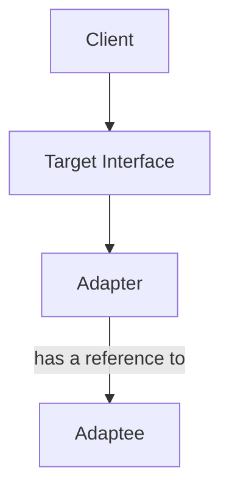

This is the most common style in many languages.

The adapter wraps the incompatible object.

---

## Class Adapter

The adapter inherits from the adaptee and implements the target interface.

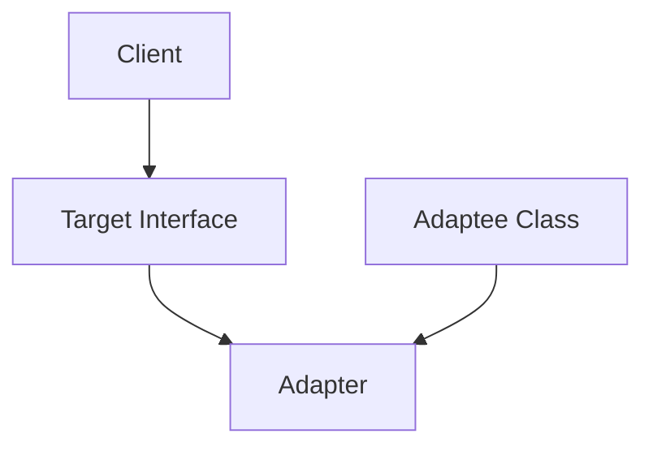

This is less flexible in languages that do not support multiple inheritance.

In TypeScript, object adapters are usually the cleaner mental model.

---

# 9. What Adapter Protects You From

## Problem: Vendor-Specific Code Everywhere

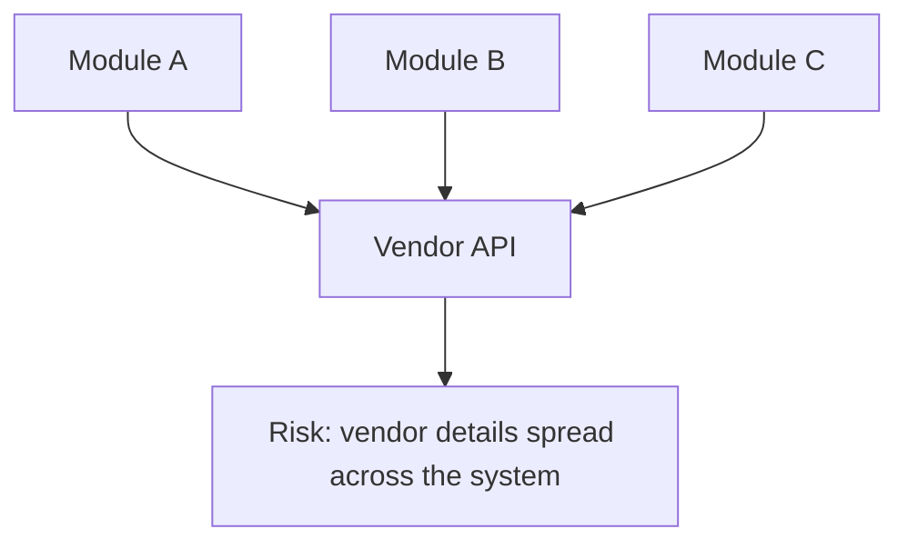

If the vendor API changes, many modules break.

---

## Solution: Adapter Boundary

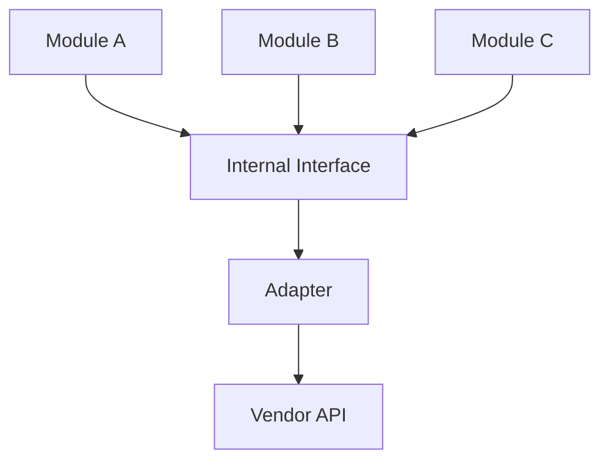

Now vendor-specific details are isolated.

Only the adapter knows about the external API.

---

# 10. Adapter vs Facade

Adapter and Facade are often confused.

## Adapter

Adapter makes an incompatible interface usable.


Question:

```txt
How do I make this existing thing fit the interface my system expects?
```

---

## Facade

Facade provides a simplified interface over a complex subsystem.

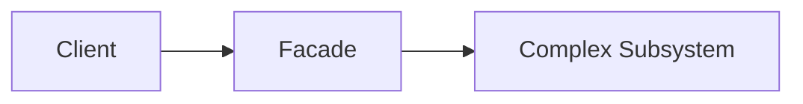

Question:

```txt
How do I hide complexity behind a simpler API?
```

---

## Main Difference

| Pattern | Main Purpose                           |
| ------- | -------------------------------------- |
| Adapter | Convert one interface into another     |
| Facade  | Simplify access to a complex subsystem |

Adapter is about compatibility.

Facade is about simplification.

---

# 11. Adapter vs Bridge

## Adapter

Adapter usually works after you already have incompatible interfaces.

```txt
We already have an external service.
Its interface does not match ours.
Add an adapter.
```

## Bridge

Bridge is designed upfront to separate abstraction from implementation.

```txt
We expect multiple implementations.
Design abstraction and implementation to vary independently.
```

## Main Difference

| Pattern | Timing                 | Purpose                                  |
| ------- | ---------------------- | ---------------------------------------- |
| Adapter | Often after the fact   | Make incompatible interfaces work        |
| Bridge  | Usually upfront design | Separate abstraction from implementation |

---

# 12. Adapter vs Decorator

## Adapter

Adapter changes the interface.

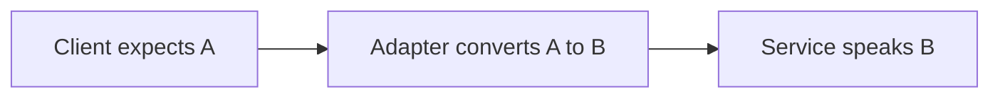

---

## Decorator

Decorator keeps the same interface but adds behavior.


## Main Difference

| Pattern   | Interface            | Purpose       |
| --------- | -------------------- | ------------- |
| Adapter   | Changes interface    | Compatibility |
| Decorator | Keeps same interface | Add behavior  |

---

# 13. Implementation Shape Without Code

## Step 1: Identify the Target Interface

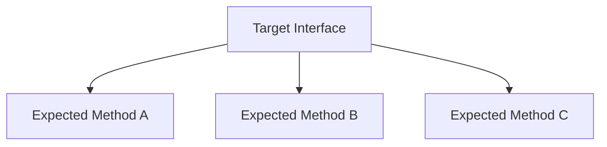

This is the interface your application wants to use.

Example:

```txt
PaymentGateway:
- pay()
- refund()
```

---

## Step 2: Identify the Adaptee

```mermaid
flowchart TD
    ADAPTEE[Existing Class / External API]

    ADAPTEE --> OLD1[Existing Method X]
    ADAPTEE --> OLD2[Existing Method Y]
    ADAPTEE --> OLD3[Existing Data Format]
```

This is the thing you want to reuse but cannot directly plug in.

Example:

```txt
ExternalPaymentAPI:
- makeCharge()
- reversePayment()
```

---

## Step 3: Create the Adapter

```mermaid
flowchart TD
    ADAPTER[Adapter]

    TARGET[Target Interface]

    ADAPTEE[Adaptee]

    ADAPTER --> TARGET
    ADAPTER --> ADAPTEE
```

The adapter implements the target interface and calls the adaptee internally.

---

## Step 4: Translate Calls and Data

```mermaid
flowchart TD
    CLIENT_CALL[Client Call]

    ADAPTER[Adapter]

    TRANSLATE[Translate Method / Parameters / Result]

    ADAPTEE_CALL[Adaptee Call]

    CLIENT_CALL --> ADAPTER
    ADAPTER --> TRANSLATE
    TRANSLATE --> ADAPTEE_CALL
```

The adapter may translate:

```txt
Method names
Parameter names
Data formats
Units
Error objects
Return values
Authentication details
```

---

## Step 5: Keep the Client Clean

```mermaid
flowchart TD
    CLIENT[Client]

    TARGET[Internal Interface]

    ADAPTER[Adapter]

    EXTERNAL[External System]

    CLIENT --> TARGET
    TARGET --> ADAPTER
    ADAPTER --> EXTERNAL
```

The client should not know the adapter is translating anything.

It should just use the target interface.

---

# 14. When to Use Adapter

Use Adapter when:

```txt
You need to use an existing class, but its interface does not match what your system expects.

You are integrating a third-party API.

You are wrapping a legacy system.

You want to isolate vendor-specific code.

You want your application to depend on your own interface.

You need to translate method names, parameters, return values, or data formats.

You want to make old code usable in a new architecture.
```

---

# 15. When Not to Use Adapter

Do not use Adapter when:

```txt
The existing interface already matches what the client needs.

You control both sides and can simply change the interface.

You are only trying to hide complexity, not adapt compatibility.

The adapter becomes a dumping ground for business logic.

The translation rules are unclear or unstable.

You need to add behavior while keeping the same interface.
```

If you only need to simplify a complex subsystem, use Facade.

If you only need to add behavior without changing the interface, use Decorator.

---

# 16. Common Smell That Suggests Adapter

Adapter is often useful when you see this:

```txt
This service does what we need, but its API does not fit our code.
```

Examples:

```txt
The method names are different.

The parameter format is different.

The return object shape is different.

The external system uses old terminology.

The vendor SDK leaks into business logic.

Multiple modules are manually converting the same data.
```

That usually means an adapter boundary is missing.

---

# 17. Simple Pattern Summary

| Concept          | Meaning                                                        |
| ---------------- | -------------------------------------------------------------- |
| Client           | Code that wants to use a stable interface                      |
| Target Interface | Interface the client expects                                   |
| Adapter          | Wrapper that implements the target interface                   |
| Adaptee          | Existing class or external service with incompatible interface |
| Translation      | Mapping calls, data, and responses between interfaces          |

---

# 18. Best Visual Summary

```mermaid
flowchart LR
    CLIENT[Client expects Target Interface]

    ADAPTER[Adapter translates]

    ADAPTEE[Existing Incompatible Service]

    CLIENT --> ADAPTER
    ADAPTER --> ADAPTEE
```

## Final Meaning

Adapter is not mainly about wrapping code.

It is about protecting your system from incompatible interfaces.

Use it when something already exists and works, but does not speak the interface your application expects.
