# Bridge Pattern Using Diagrams

## Core Idea

The **Bridge Pattern** is a structural design pattern used to separate an abstraction from its implementation so both can change independently.

That sounds abstract, so here is the practical meaning:

```txt
You have two things that can vary independently.

Instead of creating a class for every combination,
you split the design into two sides:

1. Abstraction side
2. Implementation side

Then you connect them with a bridge.
```

---

# 1. The Problem Bridge Solves

Imagine you have:

```txt
Different message types:
- Short message
- Urgent message
- Scheduled message

Different delivery channels:
- Email
- SMS
- Push notification
```

A bad design creates one class for every combination:

```txt
ShortEmailMessage
ShortSmsMessage
ShortPushMessage

UrgentEmailMessage
UrgentSmsMessage
UrgentPushMessage

ScheduledEmailMessage
ScheduledSmsMessage
ScheduledPushMessage
```

That is class explosion.

If you add one new message type, you may need several new classes.

If you add one new delivery channel, you may need several new classes.

Bridge avoids this by separating:

```txt
Message type
from
Delivery channel
```

---

# 2. Bridge Pattern: General Structure

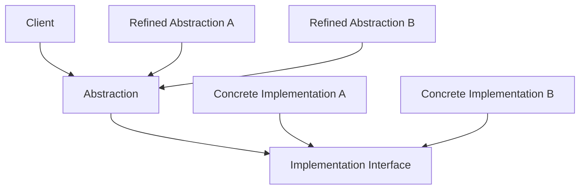

## What This Means

The abstraction does not directly implement the low-level behavior.

Instead, it delegates to an implementation interface.

That gives you two independent dimensions:

```txt
Abstraction hierarchy
Implementation hierarchy
```

---

# 3. Simple Mental Model

Think of Bridge like a remote control and a device.

```txt
Remote controls:
- Basic remote
- Advanced remote
- Voice remote

Devices:
- TV
- Radio
- Projector
```

Without Bridge, you might create:

```txt
BasicTVRemote
BasicRadioRemote
BasicProjectorRemote

AdvancedTVRemote
AdvancedRadioRemote
AdvancedProjectorRemote

VoiceTVRemote
VoiceRadioRemote
VoiceProjectorRemote
```

With Bridge:

```txt
Remote controls vary independently.

Devices vary independently.

A remote has a device.
```

The remote is the abstraction.

The device is the implementation.

---

# 4. What Bridge Protects You From

## Without Bridge: Class Explosion

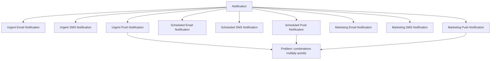

The design becomes harder to extend because every new variation multiplies the number of classes.

---

## With Bridge: Separate the Dimensions

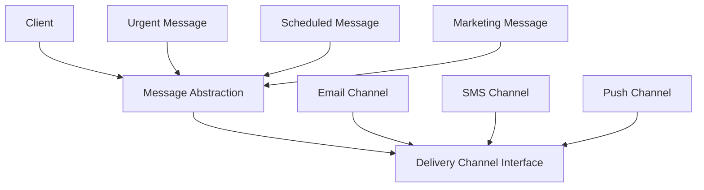

Now message types and delivery channels can grow independently.

---

# 5. Example 1: Notification Message and Delivery Channel

## Problem

A system sends different kinds of notifications:

```txt
Notification types:
- Urgent notification
- Scheduled notification
- Marketing notification
```

Through different channels:

```txt
Delivery channels:
- Email
- SMS
- Push notification
```

Without Bridge, the system creates a class for every combination.

That design gets ugly fast.

---

## Architect Questions

An architect would ask:

```txt
Do we have two independent dimensions of variation?

Can message type change separately from delivery channel?

Are we creating too many combination classes?

Will new message types be added later?

Will new delivery channels be added later?

Can the high-level workflow delegate low-level delivery details?

Should business logic avoid knowing vendor-specific channel details?

Is inheritance forcing combinations that should be composed instead?
```

---

## Bridge Diagram

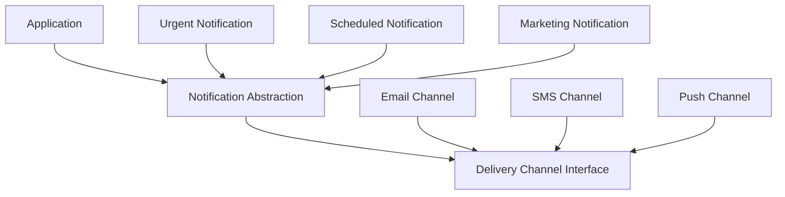

---

## Runtime Flow

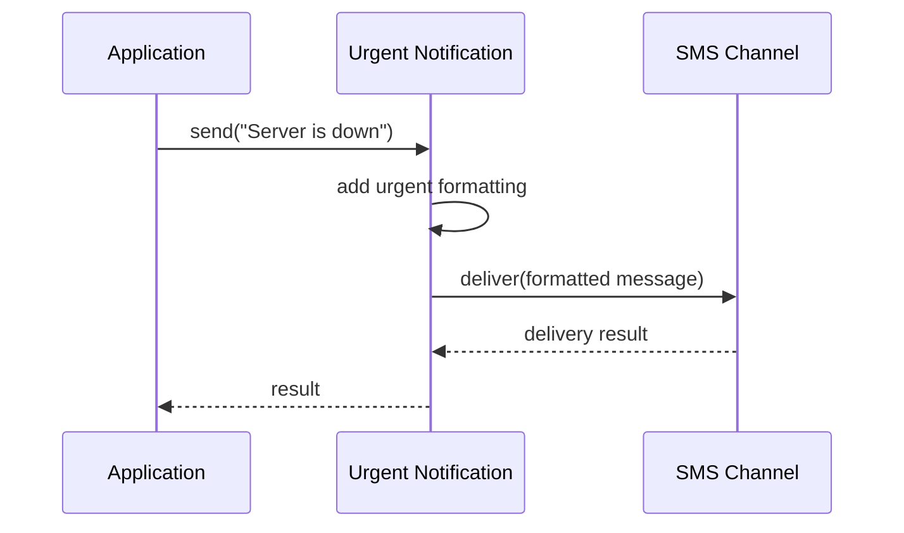

---

## Architectural Meaning

The urgent notification does not care whether it is sent by email, SMS, or push.

It only knows:

```txt
I format the message as urgent.
Then I ask the channel to deliver it.
```

The delivery channel handles the low-level sending details.

That is the bridge.

---

# 6. Example 2: Remote Controls and Devices

## Problem

A home automation app supports different remotes:

```txt
Remote types:
- Basic remote
- Advanced remote
- Voice remote
```

And different devices:

```txt
Devices:
- TV
- Speaker
- Projector
```

Bad design:

```txt
BasicTVRemote
AdvancedTVRemote
VoiceTVRemote

BasicSpeakerRemote
AdvancedSpeakerRemote
VoiceSpeakerRemote

BasicProjectorRemote
AdvancedProjectorRemote
VoiceProjectorRemote
```

This is not scalable.

---

## Architect Questions

An architect would ask:

```txt
Are remote features separate from device behavior?

Can we add a new device without creating new remotes?

Can we add a new remote type without modifying every device?

Does the remote need to delegate operations to a device interface?

Are we abusing inheritance to model combinations?

Would composition reduce the number of classes?
```

---

## Bridge Diagram

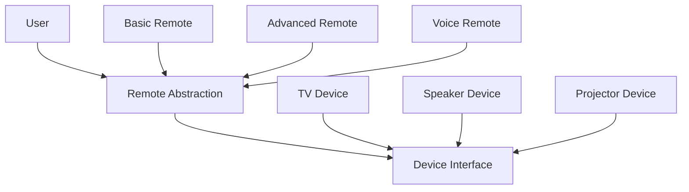

---

## Runtime Flow

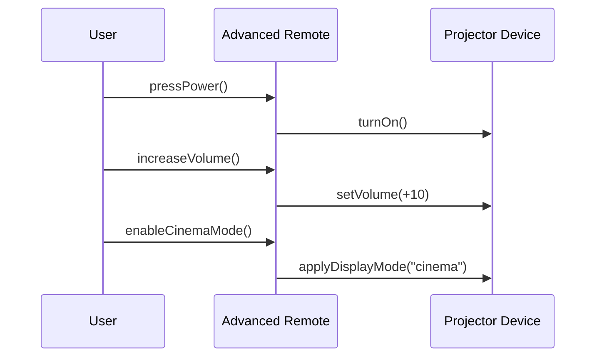

---

## Architectural Meaning

The remote controls high-level behavior.

The device performs the actual hardware-specific operation.

You can pair:

```txt
Advanced Remote + TV
Advanced Remote + Speaker
Advanced Remote + Projector
```

without creating a separate class for each combination.

---

# 7. Example 3: Report Format and Rendering Engine

## Problem

A reporting application supports different report types:

```txt
Report types:
- Financial report
- Inventory report
- Compliance report
```

And different output renderers:

```txt
Renderers:
- PDF renderer
- HTML renderer
- Excel renderer
```

Bad design:

```txt
FinancialPdfReport
FinancialHtmlReport
FinancialExcelReport

InventoryPdfReport
InventoryHtmlReport
InventoryExcelReport

CompliancePdfReport
ComplianceHtmlReport
ComplianceExcelReport
```

This design grows badly as report types and formats increase.

---

## Architect Questions

An architect would ask:

```txt
Is report content separate from rendering format?

Can new report types be added independently of output formats?

Can new output formats be added without changing every report?

Should report logic avoid PDF, HTML, or Excel-specific details?

Can rendering be delegated to a renderer interface?

Are we creating one class per content-format combination?
```

---

## Bridge Diagram

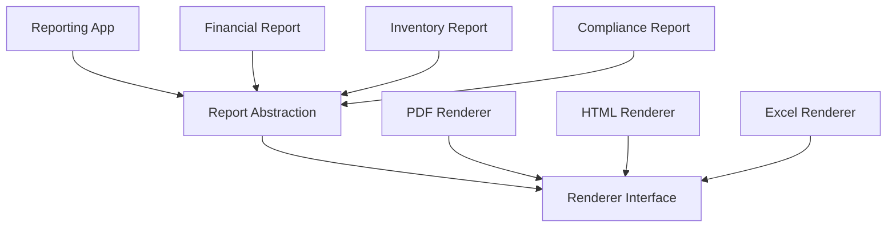

---

## Runtime Flow

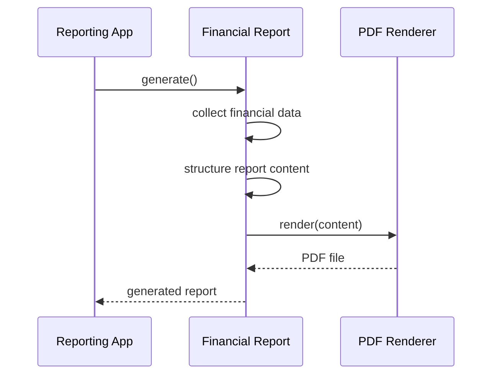

---

## Architectural Meaning

The financial report owns the report-specific logic.

The renderer owns the output-format logic.

They are connected, but independent.

That means you can add:

```txt
New report type:
- Security report

New renderer:
- Markdown renderer
```

without creating a huge pile of combination classes.

---

# 8. Example 4: Drawing Tools and Rendering Backends

## Problem

A graphics editor has drawing tools:

```txt
Drawing tools:
- Pencil
- Brush
- Shape tool
```

And rendering backends:

```txt
Rendering backends:
- Canvas renderer
- SVG renderer
- WebGL renderer
```

Without Bridge, the system may create:

```txt
CanvasPencil
SvgPencil
WebGlPencil

CanvasBrush
SvgBrush
WebGlBrush

CanvasShapeTool
SvgShapeTool
WebGlShapeTool
```

That creates a combinatorial mess.

---

## Architect Questions

An architect would ask:

```txt
Are drawing tools separate from rendering technology?

Can tools be reused across different renderers?

Can renderers be swapped depending on platform or performance needs?

Should tool behavior avoid depending directly on Canvas, SVG, or WebGL calls?

Will more tools and renderers be added later?

Can rendering commands be abstracted behind a common interface?
```

---

## Bridge Diagram

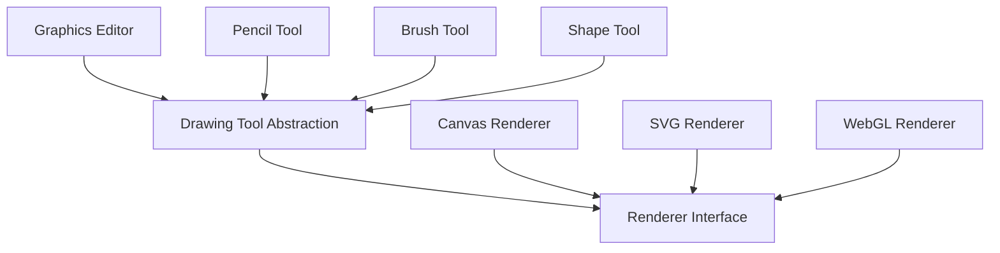

---

## Runtime Flow

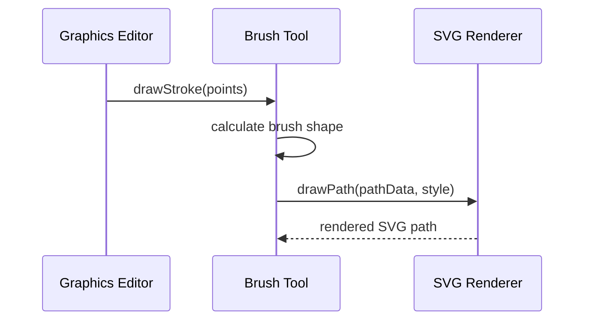

---

## Architectural Meaning

The brush tool focuses on brush behavior.

The renderer focuses on how that behavior is drawn on a specific backend.

This lets the editor reuse the same tools across multiple rendering technologies.

---

# 9. Implementation Shape Without Code

## Step 1: Identify the Two Dimensions

Bridge starts with this question:

```txt
What are the two things changing independently?
```

Example:

```txt
Dimension 1:
- Notification type

Dimension 2:
- Delivery channel
```

Diagram:

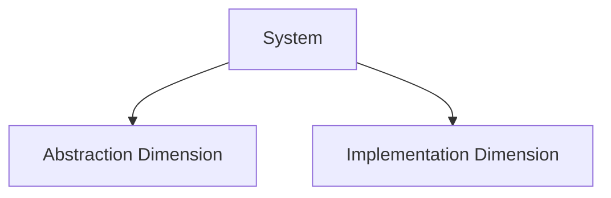

---

## Step 2: Define the Implementation Interface

The implementation side is the lower-level behavior that the abstraction delegates to.

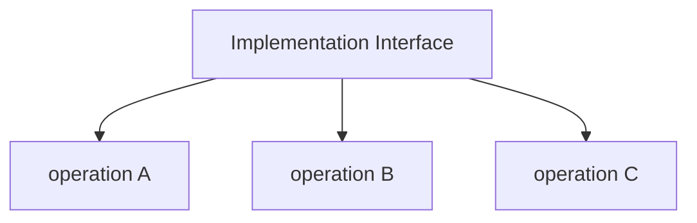

Example:

```txt
DeliveryChannel:
- deliver(message)
```

---

## Step 3: Create Concrete Implementations

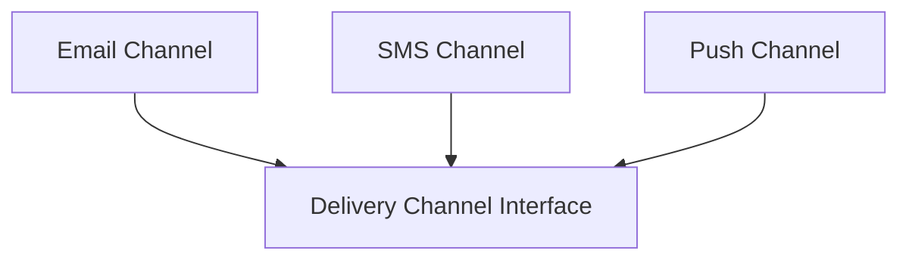

Each concrete implementation handles low-level behavior.

---

## Step 4: Define the Abstraction

The abstraction stores a reference to the implementation interface.

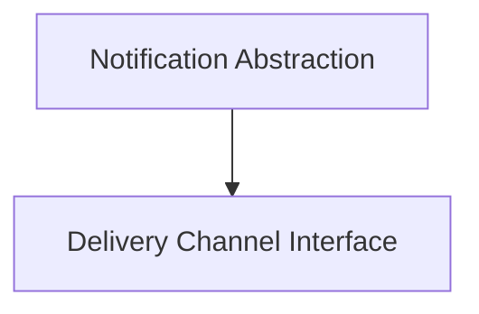

The abstraction uses the implementation instead of hardcoding concrete classes.

---

## Step 5: Create Refined Abstractions

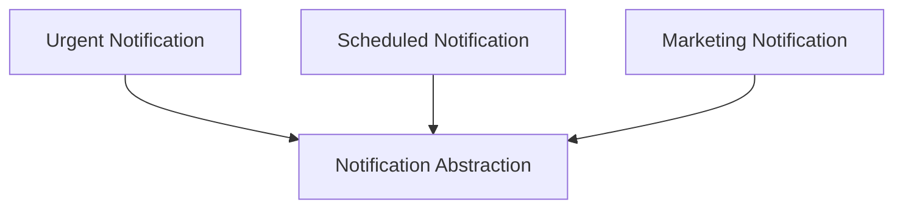

Each refined abstraction adds high-level behavior.

---

## Step 6: Compose Them at Runtime

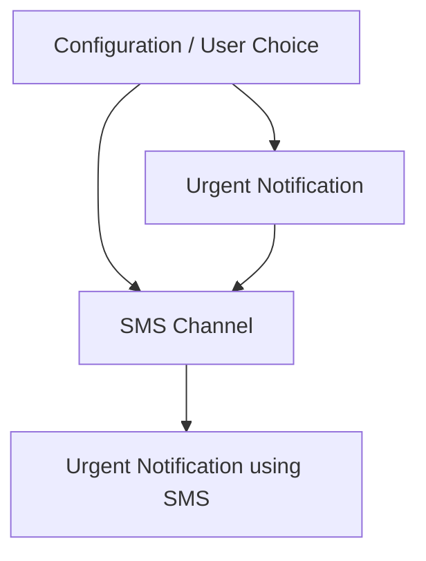

Instead of inheritance creating every combination, composition connects the two sides.

---

# 10. Bridge vs Adapter

Bridge and Adapter both involve interfaces, but they solve different problems.

## Adapter

Adapter is usually used after the fact.

```txt
We already have an incompatible class.
We need to make it fit our expected interface.
```

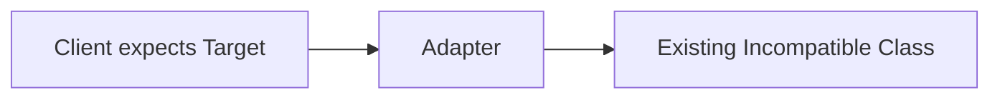

## Bridge

Bridge is usually designed upfront.

```txt
We know two dimensions will vary.
We separate them so they can evolve independently.
```

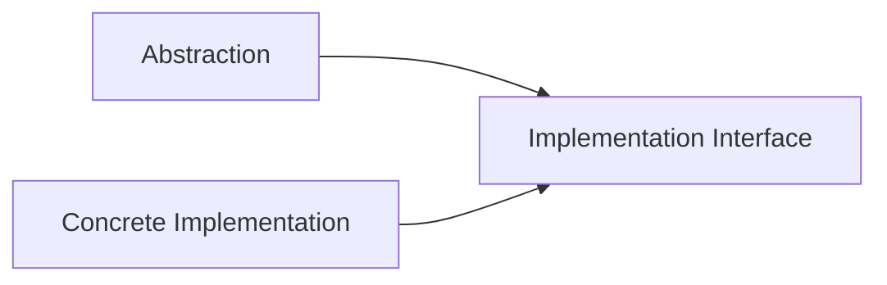

## Main Difference

| Pattern | Main Purpose                                                    |
| ------- | --------------------------------------------------------------- |
| Adapter | Make incompatible interfaces work together                      |
| Bridge  | Separate two changing dimensions so they can vary independently |

Bluntly:

```txt
Adapter is a compatibility patch.

Bridge is an architectural split.
```

---

# 11. Bridge vs Strategy

Bridge and Strategy can look similar because both use composition.

## Strategy

Strategy swaps an algorithm or behavior.

```txt
How should this calculation / validation / sorting / pricing be done?
```

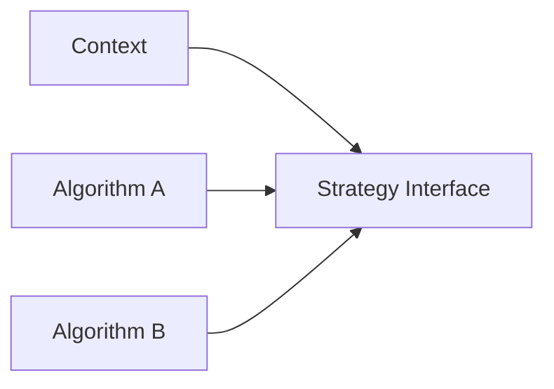

## Bridge

Bridge separates an abstraction from an implementation.

```txt
How do we prevent abstraction types and implementation types from multiplying into combinations?
```

```mermaid
flowchart LR
    ABSTRACTION[Abstraction Hierarchy]

    IMPLEMENTATION[Implementation Hierarchy]

    ABSTRACTION --> IMPLEMENTATION
```

## Main Difference

| Pattern  | Main Purpose                            |
| -------- | --------------------------------------- |
| Strategy | Swap behavior or algorithm              |
| Bridge   | Split two independent class hierarchies |

Strategy usually changes one behavior inside an object.

Bridge usually separates two axes of variation.

---

# 12. Bridge vs Abstract Factory

## Abstract Factory

Abstract Factory creates families of related objects.

```txt
Which family should I create?
```

```mermaid
flowchart LR
    FACTORY[Factory]

    FAMILY[Product Family]

    FACTORY --> FAMILY
```

## Bridge

Bridge connects an abstraction to an implementation.

```txt
How do I keep these two dimensions independent?
```

```mermaid
flowchart LR
    ABSTRACTION[Abstraction]

    IMPLEMENTATION[Implementation]

    ABSTRACTION --> IMPLEMENTATION
```

## How They Can Work Together

Abstract Factory can create the correct implementation objects that a Bridge uses.

Example:

```txt
Factory chooses SMSChannel.

Notification uses SMSChannel through the Bridge.
```

---

# 13. Common Smell That Suggests Bridge

Bridge may be useful when you see this:

```txt
Class names are turning into combinations.
```

Examples:

```txt
UrgentEmailNotification
UrgentSmsNotification
MarketingEmailNotification
MarketingSmsNotification

FinancialPdfReport
FinancialHtmlReport
InventoryPdfReport
InventoryHtmlReport

BasicTVRemote
AdvancedTVRemote
BasicProjectorRemote
AdvancedProjectorRemote
```

This usually means you have two dimensions trapped in one inheritance tree.

Bridge separates them.

---

# 14. When to Use Bridge

Use Bridge when:

```txt
You have two independent dimensions of variation.

You are creating too many combination classes.

You want abstraction and implementation to evolve separately.

You want to switch implementations at runtime.

You want to avoid deep inheritance trees.

You need platform-specific implementations behind stable high-level logic.

You expect both sides of the design to grow.
```

---

# 15. When Not to Use Bridge

Do not use Bridge when:

```txt
You only have one dimension of variation.

There are only one or two simple combinations.

The design is not likely to grow.

A simple interface and implementation is enough.

You are only adapting an old interface to a new one.

You are only swapping one algorithm.
```

Bridge is powerful, but it is heavier than a basic interface.

Do not add it unless you actually have independent variation.

---

# 16. Simple Pattern Summary

| Concept              | Meaning                                               |
| -------------------- | ----------------------------------------------------- |
| Abstraction          | High-level control interface used by the client       |
| Refined Abstraction  | Specialized version of the abstraction                |
| Implementor          | Interface for low-level implementation behavior       |
| Concrete Implementor | Actual implementation behind the abstraction          |
| Bridge               | The reference from abstraction to implementation      |
| Client               | Uses the abstraction, not the concrete implementation |

---

# 17. Best Visual Summary

```mermaid
flowchart LR
    CLIENT[Client]

    ABSTRACTION[High-Level Abstraction]

    IMPLEMENTATION[Low-Level Implementation Interface]

    CONCRETE_A[Implementation A]
    CONCRETE_B[Implementation B]

    CLIENT --> ABSTRACTION
    ABSTRACTION --> IMPLEMENTATION

    CONCRETE_A --> IMPLEMENTATION
    CONCRETE_B --> IMPLEMENTATION
```

## Final Meaning

Bridge is not mainly about wrapping an object.

It is about preventing two independent dimensions from collapsing into a huge inheritance mess.

Use it when the system is creating too many combination classes and both sides need to change independently.
