# Composite Pattern Using Diagrams

## Core Idea

The **Composite Pattern** is a structural design pattern used when objects are organized in a **tree-like structure**, and the system should treat individual objects and groups of objects through the same interface.

In simple words:

```txt
A single item and a group of items should be usable the same way.
```

Example:

```txt
File
Folder

A file is one item.
A folder is a group of files and folders.

But both can answer:
- getSize()
- rename()
- delete()
```

That is the Composite idea.

---

# 1. The Problem Composite Solves

Imagine you are building a file explorer.

You have:

```txt
Files
Folders
```

A file is simple.

A folder can contain:

```txt
Files
Other folders
More nested folders
```

Bad design:

```txt
If item is a file:
    calculate file size

If item is a folder:
    loop through children
    if child is file:
        calculate file size
    if child is folder:
        loop again
```

This creates messy recursive conditional logic.

Composite cleans this up.

---

# 2. Composite Pattern: General Structure

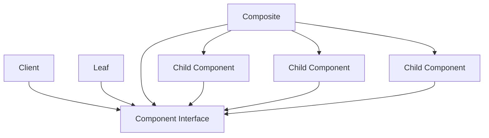

## What This Means

The client talks to the **Component Interface**.

The client does not need to care whether the object is:

```txt
A single object
or
A group of objects
```

Both support the same operations.

---

# 3. Simple Mental Model

Think of Composite like a company organization chart.

```txt
Employee
Manager
Department
Division
```

An employee is an individual.

A manager can contain employees.

A department can contain managers and employees.

A division can contain departments.

But from the outside, you may ask any node:

```txt
getTotalSalary()
printStructure()
countPeople()
```

The operation works whether the node is one person or a group.

---

# 4. What Composite Protects You From

## Without Composite: Type Checking Everywhere

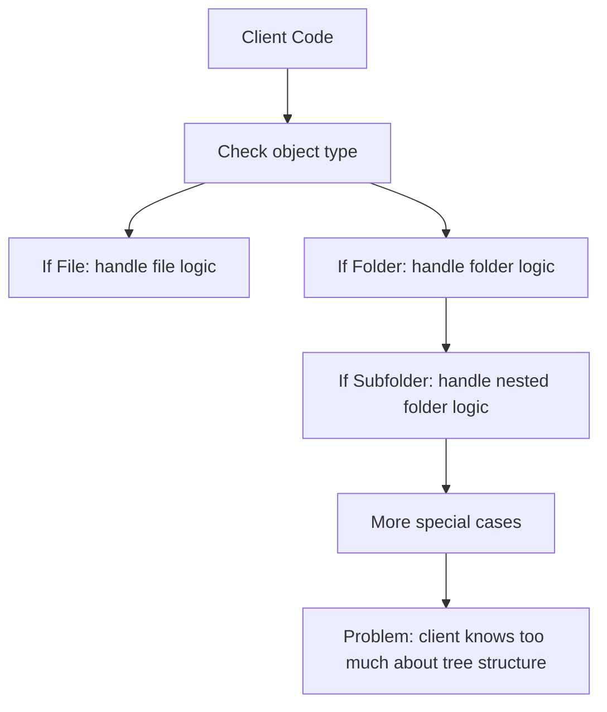

The client becomes responsible for navigating the tree.

That is fragile.

---

## With Composite: Uniform Operation

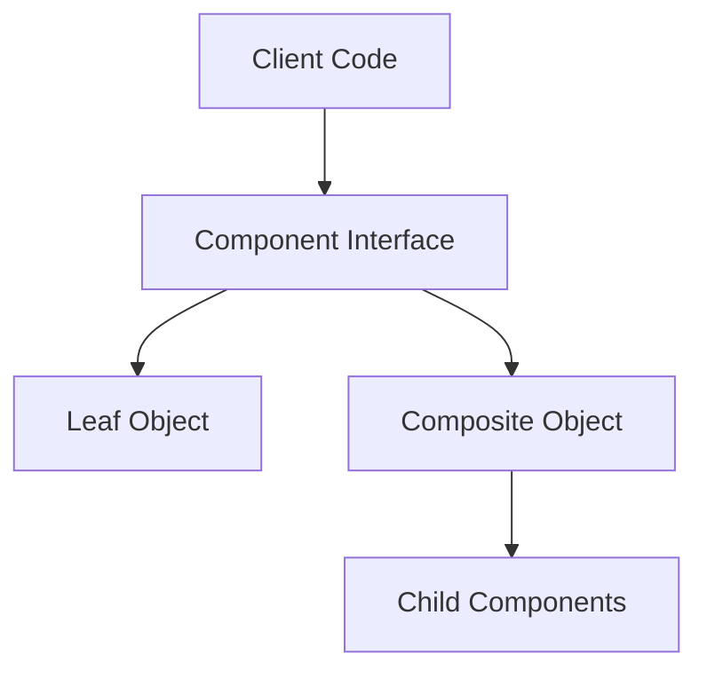

The client simply calls the same method on any component.

The component handles the details.

---

# 5. Example 1: File System

## Problem

A file explorer needs to work with:

```txt
Files
Folders
```

Files have size.

Folders contain files and other folders.

The system needs operations like:

```txt
getSize()
rename()
delete()
printTree()
```

Without Composite, every operation becomes full of type checks.

---

## Architect Questions

An architect would ask:

```txt
Do we have a tree structure?

Are there individual objects and container objects?

Should the client treat single items and groups the same way?

Do containers hold children of the same general type?

Are recursive operations common?

Are we writing repeated type checks like "if file, if folder"?

Can the object own the traversal logic instead of the client?
```

---

## Composite Diagram

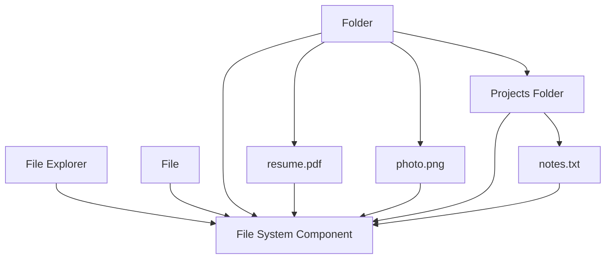

---

## Runtime Flow: Get Folder Size

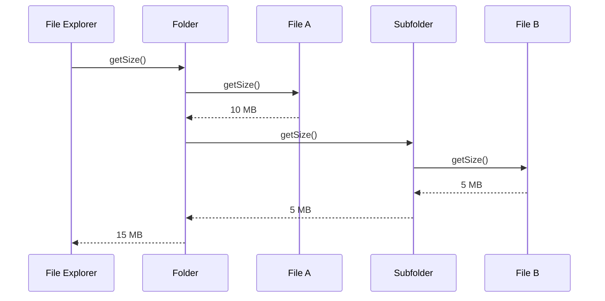

---

## Architectural Meaning

The file explorer does not manually calculate nested folder sizes.

It simply asks:

```txt
folder.getSize()
```

The folder knows how to ask its children.

The file knows how to return its own size.

That is Composite.

---

# 6. Example 2: Menu System

## Problem

A restaurant ordering app has menus like this:

```txt
Main Menu
- Breakfast Menu
  - Pancakes
  - Coffee
- Lunch Menu
  - Burger
  - Salad
- Drinks Menu
  - Soda
  - Tea
```

Some items are individual food items.

Some items are menu groups.

The app needs to:

```txt
display()
calculateTotalPrice()
markUnavailable()
applyDiscount()
```

Without Composite, the app must constantly check whether something is a menu group or a menu item.

---

## Architect Questions

An architect would ask:

```txt
Is the menu hierarchical?

Can menus contain other menus?

Should menu groups and menu items support common operations?

Do we need recursive display or pricing?

Should the ordering UI treat everything as a menu component?

Can menu-level operations apply to all child items?
```

---

## Composite Diagram

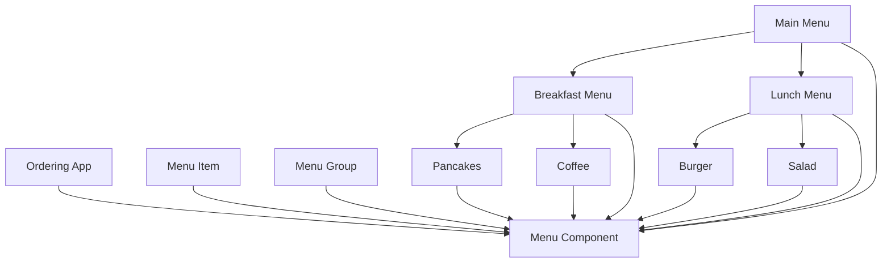

---

## Runtime Flow: Display Menu

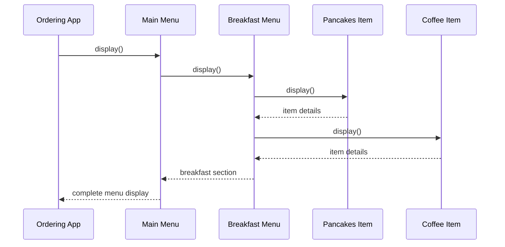

---

## Architectural Meaning

The app does not need special code for every menu depth.

It calls:

```txt
display()
```

on the root menu.

The whole tree displays itself.

---

# 7. Example 3: Graphic Editor Layers

## Problem

A graphic design tool has objects like:

```txt
Circle
Rectangle
Text
Image
Group
Layer
Artboard
```

A single shape can be moved.

A group of shapes can also be moved.

A layer can contain groups and shapes.

The editor needs operations like:

```txt
move()
resize()
render()
hide()
delete()
```

Without Composite, the editor needs separate logic for every object and group type.

---

## Architect Questions

An architect would ask:

```txt
Can a design object be either simple or grouped?

Can groups contain other groups?

Should move/render/delete work the same way on one shape and many shapes?

Do operations need to recurse through nested children?

Can the editor treat all drawable objects through one interface?

Are we duplicating logic for single selection vs group selection?
```

---

## Composite Diagram

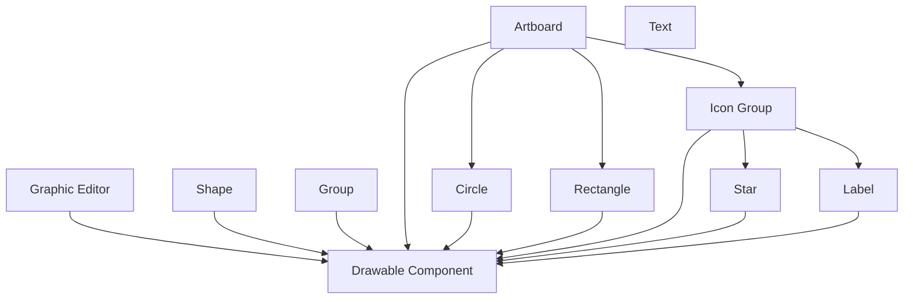

---

## Runtime Flow: Move Group

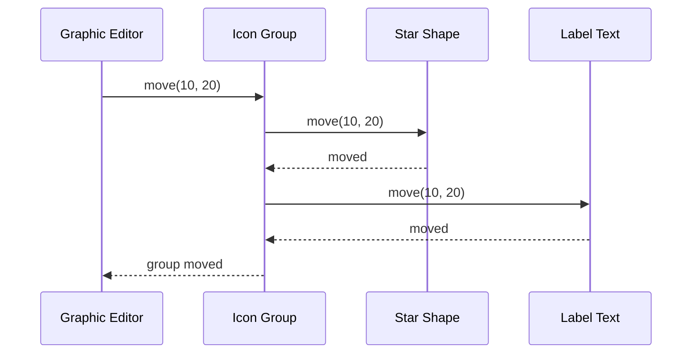

---

## Architectural Meaning

The editor does not care whether the selected object is:

```txt
One shape
A group
An artboard
```

It calls the same method:

```txt
move(10, 20)
```

The selected object handles the rest.

---

# 8. Example 4: Organization Structure

## Problem

A company HR system needs to represent:

```txt
Employee
Manager
Team
Department
Division
```

The system needs to calculate:

```txt
total salary cost
headcount
reporting structure
available capacity
```

An individual employee has a salary.

A department contains employees, managers, and teams.

A division contains departments.

This is naturally a tree.

---

## Architect Questions

An architect would ask:

```txt
Is the business structure hierarchical?

Do individual employees and departments need common operations?

Can departments contain other departments or teams?

Do calculations need to aggregate child values?

Should the client avoid manual recursion?

Can each node in the hierarchy calculate its own contribution?
```

---

## Composite Diagram

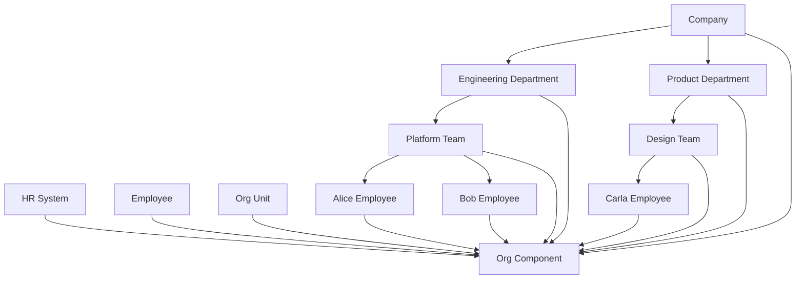

---

## Runtime Flow: Calculate Headcount

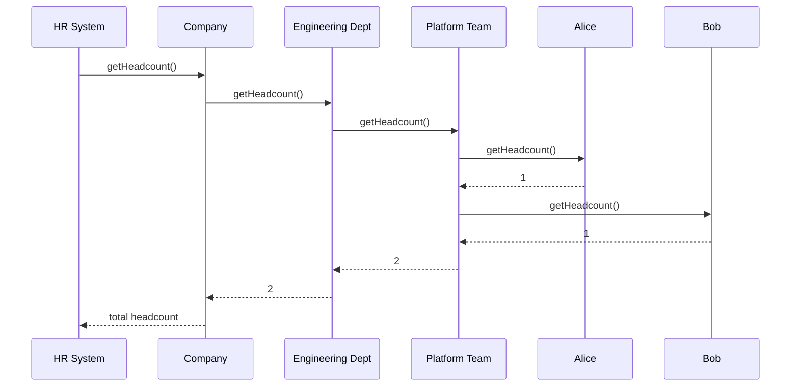

---

## Architectural Meaning

The HR system can ask any level:

```txt
getHeadcount()
```

A single employee returns `1`.

A department returns the sum of all its children.

The client does not manually walk the organization chart.

---

# 9. Leaf vs Composite

Composite has two important roles.

## Leaf

A **Leaf** is an individual object.

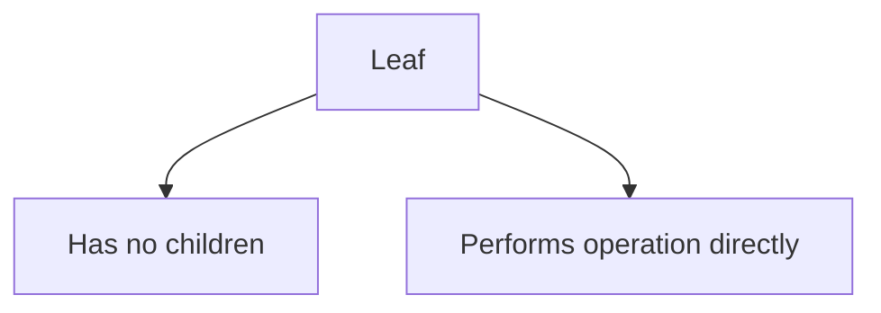

Examples:

```txt
File
Menu Item
Circle
Employee
```

---

## Composite

A **Composite** is a container object.

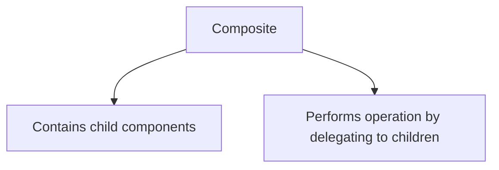

Examples:

```txt
Folder
Menu Group
Graphic Group
Department
```

---

# 10. Transparent vs Safe Composite

There are two common ways to design Composite.

## Transparent Composite

The component interface includes child-management methods:

```txt
addChild()
removeChild()
getChild()
operation()
```

Diagram:

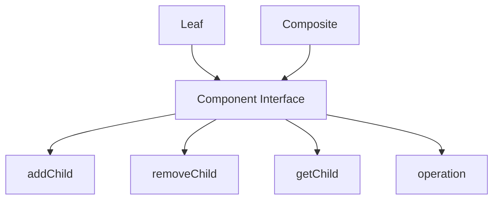

### Benefit

The client treats leaf and composite exactly the same.

### Problem

Leaf objects expose methods that do not make sense.

Example:

```txt
file.addChild()
```

A file cannot have children.

That method is nonsense for a leaf.

---

## Safe Composite

Only composite objects have child-management methods.

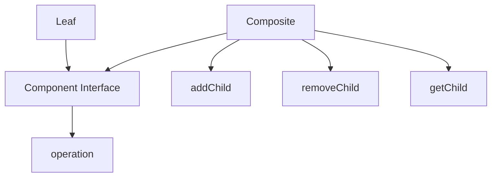

### Benefit

Leaf objects do not expose invalid methods.

### Problem

The client may need to know whether something is a composite before adding children.

---

## Architectural Judgment

Use **safe composite** most of the time.

It is cleaner because it avoids fake methods on leaf objects.

Use **transparent composite** only when uniform treatment is more important than strict correctness.

---

# 11. Composite vs Decorator

Composite and Decorator both use composition, but they solve different problems.

## Composite

Composite represents tree structures.

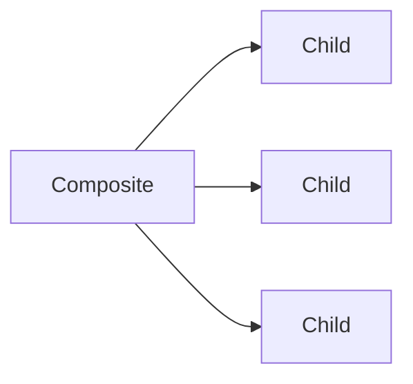

Question:

```txt
How do I treat individual objects and groups uniformly?
```

---

## Decorator

Decorator adds behavior around one object while keeping the same interface.


Question:

```txt
How do I add behavior without modifying the original object?
```

---

## Main Difference

| Pattern   | Purpose                  |
| --------- | ------------------------ |
| Composite | Build tree structures    |
| Decorator | Add behavior dynamically |

---

# 12. Composite vs Iterator

## Composite

Composite organizes objects into a tree.

```txt
Folder contains files and folders.
```

## Iterator

Iterator walks through a collection.

```txt
Visit each item one by one.
```

They often work together.

Example:

```txt
Composite defines the file/folder tree.
Iterator provides a way to traverse it.
```

---

# 13. Composite vs Tree Data Structure

Composite is not just “a tree.”

A normal tree is data.

Composite is an object design pattern where each node shares a common interface.

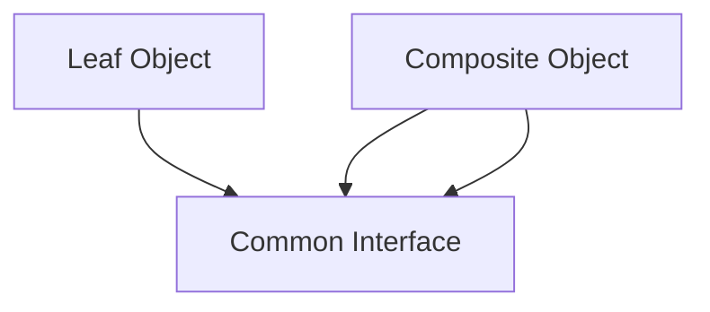

The important part is not only nesting.

The important part is that the client can call the same operation on both:

```txt
leaf.operation()
composite.operation()
```

---

# 14. Implementation Shape Without Code

## Step 1: Identify the Tree

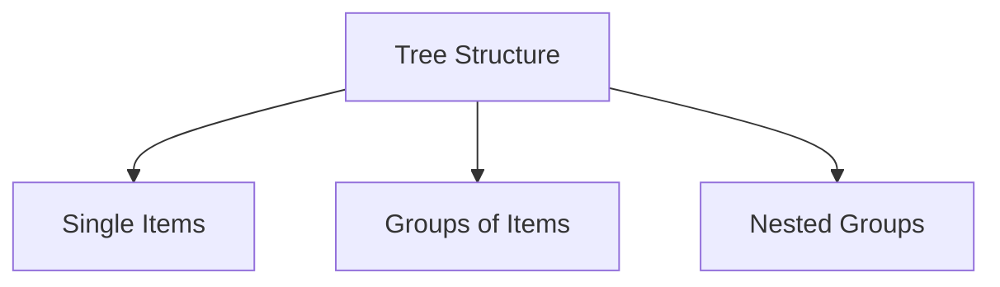

Examples:

```txt
Files and folders
Menus and menu items
Shapes and groups
Employees and departments
```

---

## Step 2: Define the Component Interface

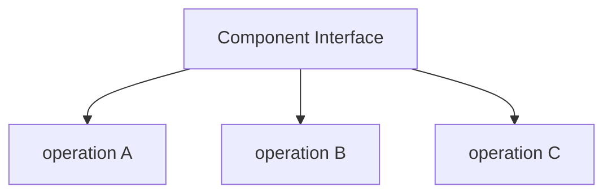

Example operations:

```txt
getSize()
display()
render()
move()
calculateCost()
getHeadcount()
```

---

## Step 3: Create Leaf Objects

```mermaid
flowchart TD
    COMPONENT[Component Interface]

    LEAF1[Leaf A]
    LEAF2[Leaf B]
    LEAF3[Leaf C]

    LEAF1 --> COMPONENT
    LEAF2 --> COMPONENT
    LEAF3 --> COMPONENT
```

Leaf objects perform the operation directly.

Example:

```txt
File returns its own size.
Employee returns 1 headcount.
Menu item returns its own price.
```

---

## Step 4: Create Composite Objects

```mermaid
flowchart TD
    COMPONENT[Component Interface]

    COMPOSITE[Composite]

    CHILDREN[Child Components]

    COMPOSITE --> COMPONENT
    COMPOSITE --> CHILDREN
```

Composite objects store child components.

They perform operations by delegating to children.

Example:

```txt
Folder size = sum of child sizes.
Department headcount = sum of child headcounts.
Group render = render each child.
```

---

## Step 5: Client Uses the Component Interface

```mermaid
flowchart TD
    CLIENT[Client]

    COMPONENT[Component Interface]

    CLIENT --> COMPONENT
```

The client does not need to know whether the object is a leaf or a composite.

It just calls the operation.

---

# 15. When to Use Composite

Use Composite when:

```txt
You have a tree-like structure.

You have individual objects and container objects.

The client should treat both uniformly.

Operations are recursive.

Containers can contain both leaves and other containers.

You want to move traversal logic out of client code.

You are seeing repeated type checks for leaf vs group.
```

---

# 16. When Not to Use Composite

Do not use Composite when:

```txt
Your data is not hierarchical.

Groups and individual objects do not share meaningful operations.

You do not need recursive behavior.

The tree is simple and unlikely to grow.

The client must treat every type very differently.

The abstraction would hide important differences.
```

Do not force Composite where the objects are not naturally part of the same hierarchy.

---

# 17. Common Smell That Suggests Composite

Composite may be useful when you see code like this:

```txt
if object is a file:
    do file operation

if object is a folder:
    loop through children
    do the same operation recursively
```

Or this:

```txt
if selected object is a shape:
    move shape

if selected object is a group:
    move every child shape
```

That usually means the operation belongs in the object hierarchy.

---

# 18. Simple Pattern Summary

| Concept             | Meaning                                      |
| ------------------- | -------------------------------------------- |
| Component           | Common interface for leaf and composite      |
| Leaf                | Individual object with no children           |
| Composite           | Container object that holds child components |
| Child               | Any component inside a composite             |
| Client              | Uses the component interface                 |
| Recursive Operation | Operation that delegates through the tree    |

---

# 19. Best Visual Summary

```mermaid
flowchart LR
    CLIENT[Client]

    COMPONENT[Component Interface]

    LEAF[Leaf]

    COMPOSITE[Composite]

    CHILDREN[Child Components]

    CLIENT --> COMPONENT

    LEAF --> COMPONENT
    COMPOSITE --> COMPONENT

    COMPOSITE --> CHILDREN
```

## Final Meaning

Composite is not mainly about trees.

It is about letting the client treat **one object** and **a group of objects** the same way.

Use it when your system has nested structures and recursive operations.
