# Decorator Pattern Using Diagrams

## Core Idea

The **Decorator Pattern** is a structural design pattern used to add new behavior to an object dynamically without modifying the original object.

In simple words:

```txt
Wrap an object with another object that adds behavior.
```

Example:

```txt
Base coffee:
- cost: $3

Add milk decorator:
- adds $1

Add caramel decorator:
- adds $2

Final coffee:
- base coffee + milk + caramel
```

The object keeps the same interface, but its behavior is extended.

---

# 1. The Problem Decorator Solves

Imagine you have a notification system.

Base behavior:

```txt
Send notification
```

Optional behaviors:

```txt
Log notification
Encrypt notification
Retry failed notification
Send metrics
Add priority header
```

A bad design creates one class for every combination:

```txt
EncryptedNotification

LoggedNotification

RetriedNotification

EncryptedLoggedNotification

EncryptedLoggedRetriedNotification

EncryptedLoggedRetriedMetricsNotification
```

That becomes a mess.

Decorator avoids this by wrapping behavior layer by layer.

---

# 2. Decorator Pattern: General Structure

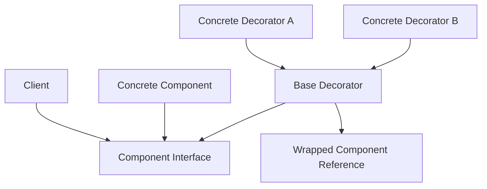

## What This Means

The client talks to the same interface.

The original object implements the interface.

The decorator also implements the same interface.

That means decorators can wrap:

```txt
The original object
or
Another decorator
```

This allows behavior stacking.

---

# 3. Simple Mental Model

Think of Decorator like adding layers to a sandwich.

```txt
Plain sandwich
+ cheese
+ lettuce
+ tomato
+ sauce
```

Each layer adds something.

But it is still treated as a sandwich.

In software:

```txt
Base object
+ decorator
+ decorator
+ decorator
```

The client still uses the same interface.

---

# 4. What Decorator Protects You From

## Without Decorator: Subclass Explosion

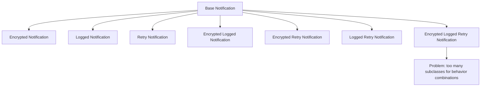

The more optional behaviors you add, the more combinations explode.

---

## With Decorator: Stack Behavior

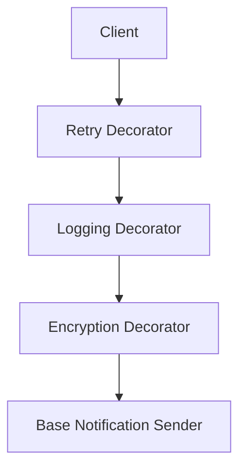

Now behavior is composed instead of inherited.

You can combine features in different orders.

---

# 5. Example 1: Notification Sender

## Problem

A system sends notifications.

The base notification sender can send a message.

But different deployments may need optional behaviors:

```txt
Logging
Encryption
Retry
Metrics
Rate limiting
```

Without Decorator, you may end up with many classes for every combination.

Bad design:

```txt
EncryptedNotificationSender
LoggedNotificationSender
RetryNotificationSender
EncryptedLoggedNotificationSender
LoggedRetryNotificationSender
EncryptedLoggedRetryNotificationSender
```

That does not scale.

---

## Architect Questions

An architect would ask:

```txt
Do we need to add optional behavior to an object?

Can these behaviors be combined in different ways?

Should the base object remain unchanged?

Would inheritance create too many subclasses?

Can each extra behavior be represented as a wrapper?

Should the client keep using the same interface?

Does behavior order matter?
```

---

## Decorator Diagram

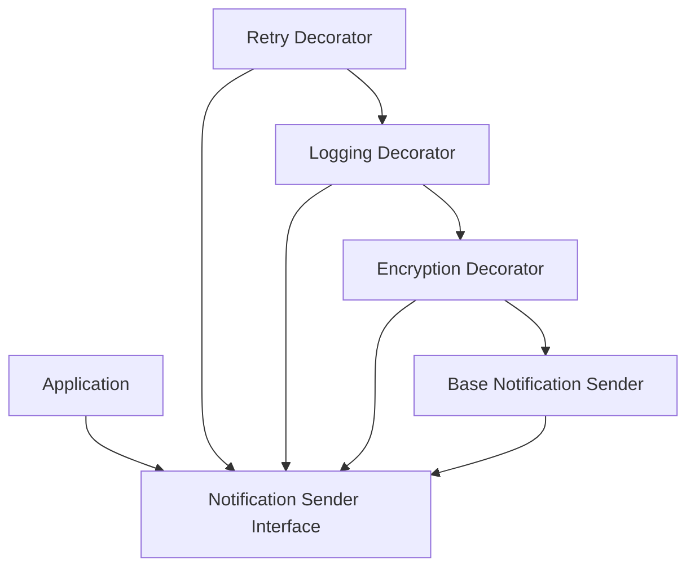

---

## Runtime Flow

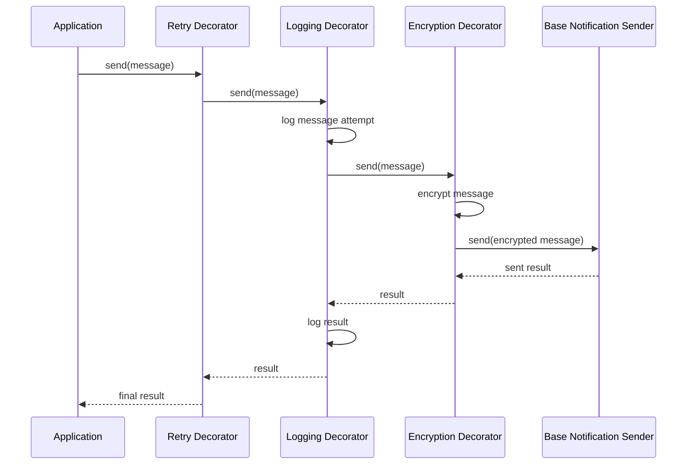

---

## Architectural Meaning

The base sender only knows how to send.

Logging only knows how to log.

Encryption only knows how to encrypt.

Retry only knows how to retry.

Each responsibility stays separate.

That is the point of Decorator.

---

# 6. Example 2: Coffee Order Customization

## Problem

A coffee shop app sells drinks.

A base coffee has a price and description.

Customers can add:

```txt
Milk
Caramel
Whipped cream
Extra espresso
Chocolate
```

Without Decorator, you may create:

```txt
CoffeeWithMilk
CoffeeWithCaramel
CoffeeWithMilkAndCaramel
CoffeeWithMilkCaramelAndWhippedCream
```

That is obviously bad.

---

## Architect Questions

An architect would ask:

```txt
Is there a base object with optional add-ons?

Can add-ons be combined freely?

Can add-ons affect behavior like cost and description?

Should add-ons be stackable?

Would subclassing every combination be ridiculous?

Can each add-on wrap the previous drink?
```

---

## Decorator Diagram

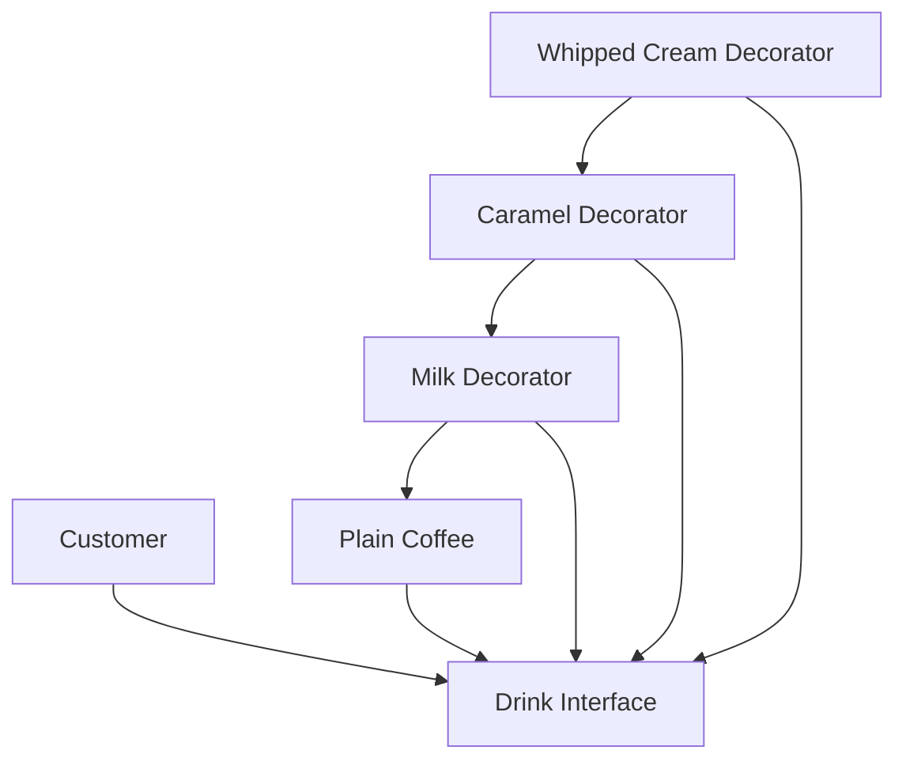

---

## Runtime Flow

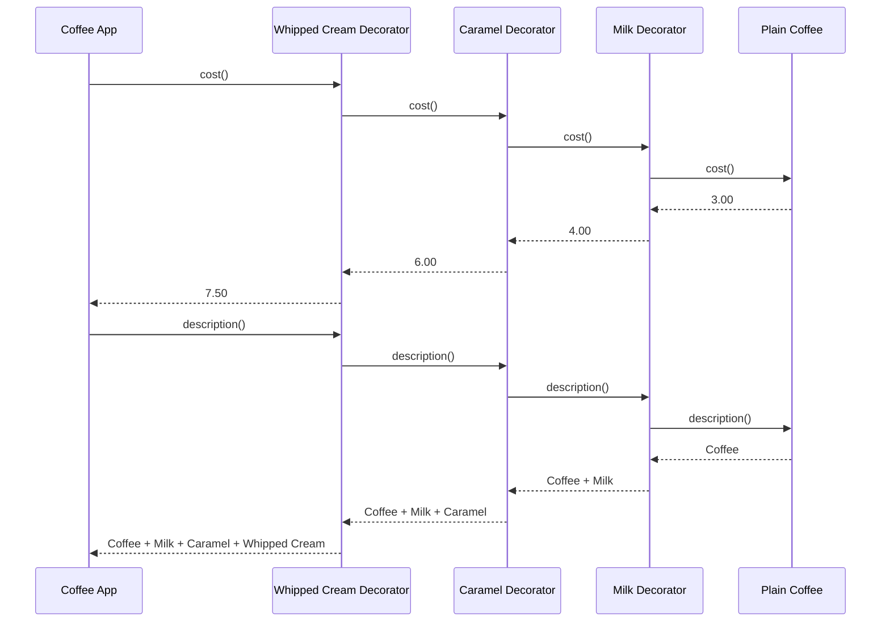

---

## Architectural Meaning

Each add-on is independent.

The app does not need one class for every drink combination.

It builds the final drink by stacking decorators.

---

# 7. Example 3: Data Stream Processing

## Problem

An application reads and writes data streams.

Base stream behavior:

```txt
Read bytes
Write bytes
```

Optional stream behaviors:

```txt
Compression
Encryption
Buffering
Logging
Checksum validation
```

Without Decorator, you may create:

```txt
EncryptedStream
CompressedStream
BufferedStream
EncryptedCompressedStream
BufferedEncryptedCompressedStream
```

That gets ugly fast.

---

## Architect Questions

An architect would ask:

```txt
Do we have a base object that performs an operation?

Do we need optional processing before or after that operation?

Can processing steps be stacked?

Should the stream interface remain the same?

Can each processing concern be isolated?

Does order matter, such as compress before encrypt?
```

---

## Decorator Diagram

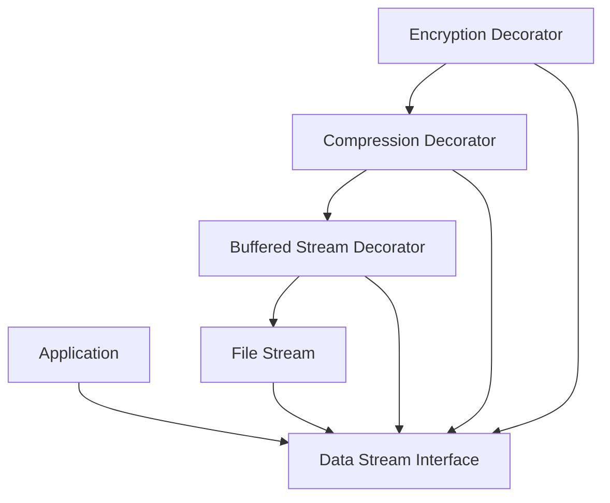

---

## Runtime Flow: Write Data

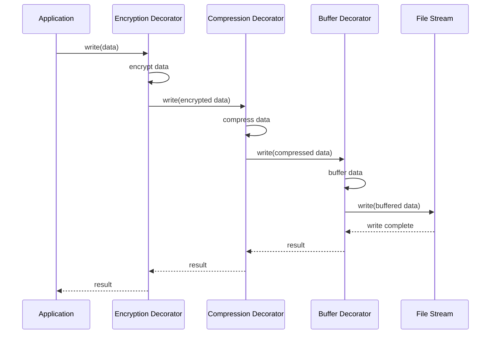

---

## Architectural Meaning

The application still sees one stream.

But internally the stream behavior has layers.

That is exactly where Decorator shines.

---

# 8. Example 4: Web Request Middleware

## Problem

A web server handles HTTP requests.

Base handler:

```txt
Handle request
Return response
```

Optional behaviors:

```txt
Authentication
Authorization
Logging
Rate limiting
Caching
Error handling
Metrics
```

If you put all of this into one handler, it becomes a giant class.

If you subclass every combination, it becomes worse.

Decorator-style middleware solves this.

---

## Architect Questions

An architect would ask:

```txt
Do requests need multiple optional processing steps?

Can these steps be ordered as a pipeline?

Should each step wrap the next handler?

Should the final handler stay focused on business logic?

Can middleware be added or removed without changing the handler?

Does the client still call the same handle request operation?
```

---

## Decorator Diagram

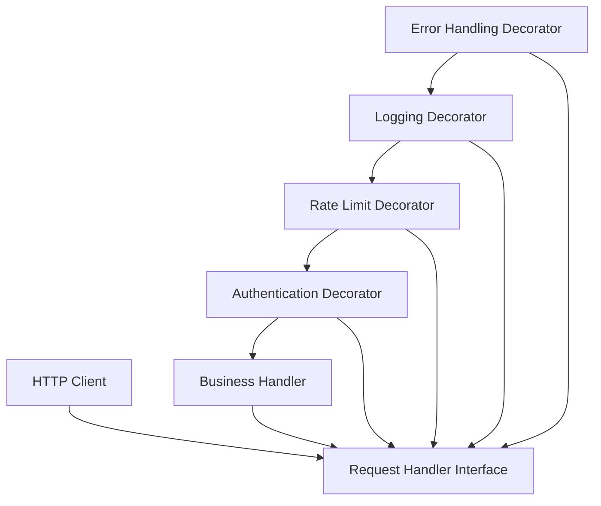

---

## Runtime Flow

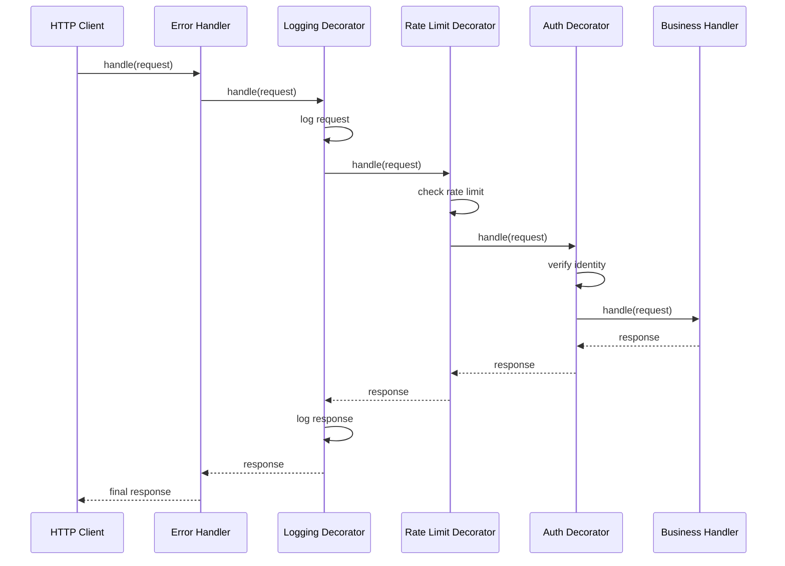

---

## Architectural Meaning

Each middleware layer adds behavior around the next handler.

The business handler does not need to know about logging, rate limiting, authentication, or error handling.

That keeps the core handler clean.

---

# 9. Decorator vs Composite

Decorator and Composite both use composition, but they are not the same.

## Decorator

Decorator wraps **one object** to add behavior.


Question:

```txt
How do I add behavior to this object without changing its class?
```

---

## Composite

Composite groups **many objects** into a tree.

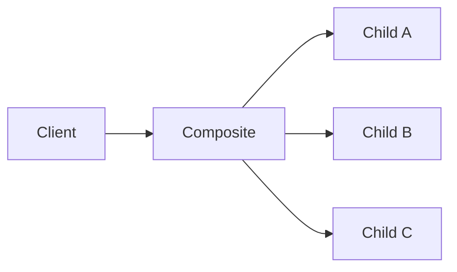

Question:

```txt
How do I treat one object and a group of objects the same way?
```

---

## Main Difference

| Pattern   | Structure     | Purpose                          |
| --------- | ------------- | -------------------------------- |
| Decorator | Wrapper chain | Add behavior                     |
| Composite | Tree          | Treat single and group uniformly |

---

# 10. Decorator vs Adapter

## Decorator

Decorator keeps the same interface and adds behavior.


## Adapter

Adapter changes one interface into another.


## Main Difference

| Pattern   | Interface           | Purpose                           |
| --------- | ------------------- | --------------------------------- |
| Decorator | Same interface      | Add behavior                      |
| Adapter   | Different interface | Make incompatible interfaces work |

Bluntly:

```txt
Decorator adds.
Adapter translates.
```

---

# 11. Decorator vs Proxy

Decorator and Proxy also look similar because both wrap another object.

## Decorator

Decorator adds behavior.

```txt
Add logging.
Add encryption.
Add compression.
Add retries.
```

## Proxy

Proxy controls access.

```txt
Lazy loading.
Permission checks.
Remote access.
Caching.
Access control.
```

## Main Difference

| Pattern   | Main Purpose                     |
| --------- | -------------------------------- |
| Decorator | Add responsibilities dynamically |
| Proxy     | Control access to another object |

Sometimes they overlap, but the intent is different.

---

# 12. Decorator vs Inheritance

## Inheritance Approach

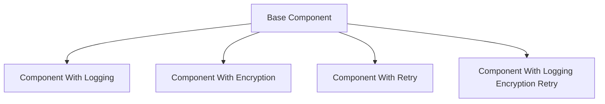

Problem:

```txt
Every behavior combination needs a new subclass.
```

---

## Decorator Approach

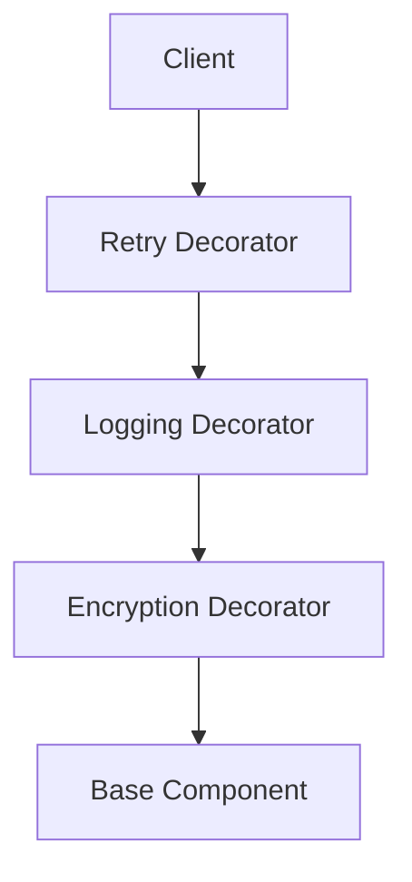

Benefit:

```txt
Behaviors are separate and stackable.
```

---

# 13. Implementation Shape Without Code

## Step 1: Define the Component Interface

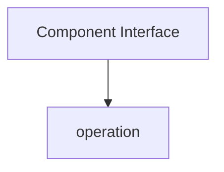

Example:

```txt
NotificationSender:
- send(message)

Drink:
- cost()
- description()

Stream:
- read()
- write()

RequestHandler:
- handle(request)
```

---

## Step 2: Create the Concrete Component

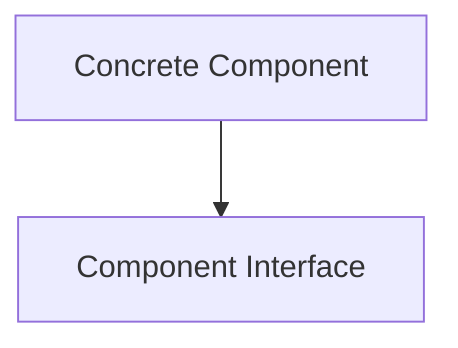

This is the base object.

Example:

```txt
Base notification sender
Plain coffee
File stream
Business request handler
```

---

## Step 3: Create the Base Decorator

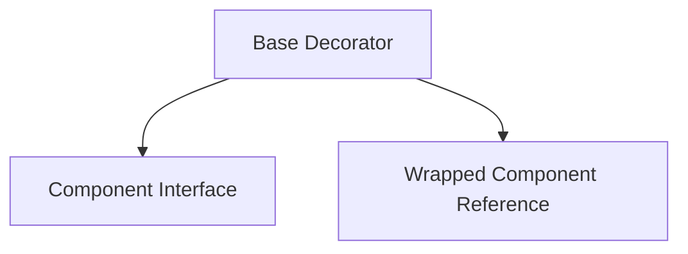

The decorator implements the same interface and stores a reference to another component.

---

## Step 4: Create Concrete Decorators

```mermaid
flowchart TD
    DECORATOR[Base Decorator]

    LOGGING[Logging Decorator]

    ENCRYPTION[Encryption Decorator]

    RETRY[Retry Decorator]

    LOGGING --> DECORATOR
    ENCRYPTION --> DECORATOR
    RETRY --> DECORATOR
```

Each decorator adds one responsibility.

---

## Step 5: Stack Decorators

```mermaid
flowchart TD
    CLIENT[Client]

    DECORATOR_C[Decorator C]

    DECORATOR_B[Decorator B]

    DECORATOR_A[Decorator A]

    BASE[Base Component]

    CLIENT --> DECORATOR_C
    DECORATOR_C --> DECORATOR_B
    DECORATOR_B --> DECORATOR_A
    DECORATOR_A --> BASE
```

The client sees only the outermost object.

The chain handles the behavior.

---

# 14. Order Matters

Decorator order can change behavior.

Example:

```txt
Compress then encrypt
is not the same as
Encrypt then compress
```

Diagram:

```mermaid
flowchart TD
    FLOW1[Option 1]

    COMPRESS1[Compress]
    ENCRYPT1[Encrypt]
    WRITE1[Write]

    FLOW1 --> COMPRESS1
    COMPRESS1 --> ENCRYPT1
    ENCRYPT1 --> WRITE1

    FLOW2[Option 2]

    ENCRYPT2[Encrypt]
    COMPRESS2[Compress]
    WRITE2[Write]

    FLOW2 --> ENCRYPT2
    ENCRYPT2 --> COMPRESS2
    COMPRESS2 --> WRITE2
```

Architecturally, this matters.

If behavior order changes results, the construction of the decorator chain must be deliberate.

---

# 15. When to Use Decorator

Use Decorator when:

```txt
You need to add behavior without modifying the original class.

You have optional features that can be combined.

Inheritance would create too many subclasses.

The client should keep using the same interface.

You need behavior stacking.

You want each responsibility isolated.

Behavior may be added at runtime.
```

---

# 16. When Not to Use Decorator

Do not use Decorator when:

```txt
The object does not share a stable interface.

The added behavior changes the interface.

The behavior combinations are simple and fixed.

The chain order is too confusing.

Debugging wrapper layers becomes harder than the benefit.

A simple function call or configuration flag is enough.
```

Decorator can become painful when there are too many invisible layers.

Do not decorate everything just because it looks elegant.

---

# 17. Common Smell That Suggests Decorator

Decorator may be useful when you see this:

```txt
A base object has many optional behaviors.
```

Or this:

```txt
We keep creating subclasses for combinations of features.
```

Examples:

```txt
LoggedEncryptedSender
CachedCompressedStream
AuthorizedRateLimitedRequestHandler
MilkCaramelWhippedCoffee
```

Those class names are screaming for Decorator.

---

# 18. Simple Pattern Summary

| Concept            | Meaning                                    |
| ------------------ | ------------------------------------------ |
| Component          | Common interface used by the client        |
| Concrete Component | Original object being wrapped              |
| Decorator          | Wrapper that implements the same interface |
| Concrete Decorator | Adds one specific behavior                 |
| Wrapped Component  | Object inside the decorator                |
| Chain              | Multiple decorators stacked together       |

---

# 19. Best Visual Summary

```mermaid
flowchart LR
    CLIENT[Client]

    DECORATOR_C[Decorator C]

    DECORATOR_B[Decorator B]

    DECORATOR_A[Decorator A]

    BASE[Base Object]

    CLIENT --> DECORATOR_C
    DECORATOR_C --> DECORATOR_B
    DECORATOR_B --> DECORATOR_A
    DECORATOR_A --> BASE
```

## Final Meaning

Decorator is not mainly about wrapping objects.

It is about adding optional, stackable behavior while keeping the same interface.

Use it when subclassing behavior combinations would create a mess.
