# Facade Pattern Using Diagrams

## Core Idea

The **Facade Pattern** is a structural design pattern used to provide a simple interface over a complex subsystem.

In simple words:

```txt
The system has many complicated parts.

The client should not need to know all of them.

Create one simple object that coordinates the complexity.
```

Example:

```txt
Instead of the client calling:
- InventoryService
- PaymentService
- FraudService
- ShippingService
- EmailService

The client calls:
- CheckoutFacade.placeOrder()
```

The facade hides the steps.

---

# 1. The Problem Facade Solves

Imagine an online checkout system.

To place an order, the application may need to:

```txt
Validate cart
Check inventory
Calculate tax
Process payment
Create order
Reserve stock
Create shipment
Send confirmation email
Update analytics
```

Bad design:

```txt
Checkout UI directly calls every subsystem.
```

That makes the client too smart.

The UI now knows too much about backend workflow.

Facade fixes this by giving the client one simple entry point.

---

# 2. Facade Pattern: General Structure

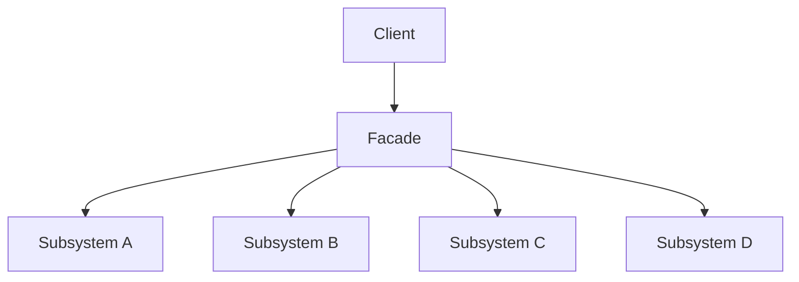

## What This Means

The client talks to the facade.

The facade talks to the subsystem classes.

The subsystem still exists, but the client does not need to coordinate it manually.

---

# 3. Simple Mental Model

Think of Facade like a hotel front desk.

```txt
Guest asks:
- Check me in.

The front desk coordinates:
- Room availability
- Payment
- Key card
- Housekeeping status
- Guest record
```

The guest does not go talk to every department separately.

The front desk is the facade.

---

# 4. What Facade Protects You From

## Without Facade: Client Knows Too Much

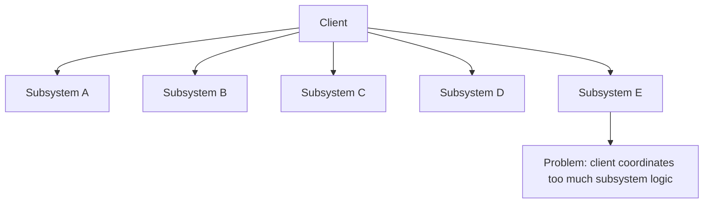

The client becomes tightly coupled to many internal services.

If subsystem order changes, the client must change.

If a subsystem is replaced, the client may break.

---

## With Facade: Simple Entry Point

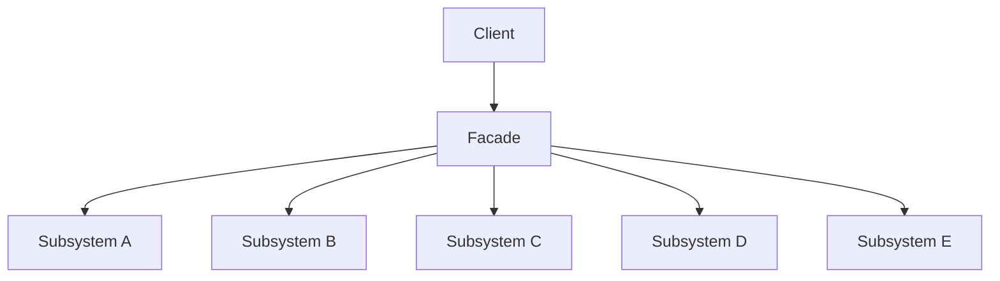

The client only knows the simplified operation.

The facade owns the coordination.

---

# 5. Example 1: E-Commerce Checkout Facade

## Problem

An e-commerce app needs to place customer orders.

Order placement requires several services:

```txt
Cart validation
Inventory check
Payment processing
Tax calculation
Order creation
Shipping creation
Email confirmation
```

Without Facade, the checkout controller or UI calls everything directly.

That creates messy orchestration code in the wrong place.

---

## Architect Questions

An architect would ask:

```txt
Is the client coordinating too many subsystem calls?

Is there a common workflow that should be exposed as one operation?

Do subsystem details leak into UI or controller code?

Will the order of operations change over time?

Do we need one stable API over unstable internals?

Can we hide payment, inventory, tax, and shipping complexity behind one use-case interface?

Is this simplification, not interface conversion?
```

---

## Facade Diagram

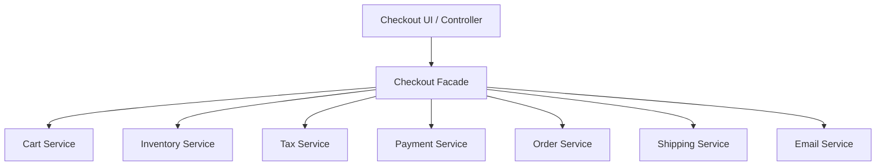

---

## Runtime Flow

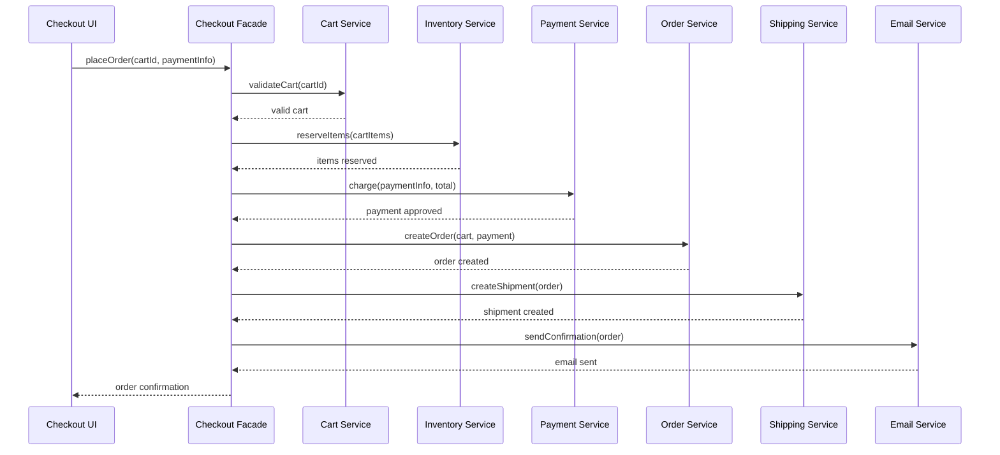

---

## Architectural Meaning

The UI should not know the entire checkout workflow.

The UI should only say:

```txt
placeOrder()
```

The facade coordinates the subsystem calls.

This keeps the client clean.

---

# 6. Example 2: Video Conversion Facade

## Problem

A media application converts uploaded videos.

Video conversion may involve:

```txt
Reading metadata
Choosing codec
Extracting audio
Transcoding video
Compressing output
Generating thumbnail
Saving output file
Updating media record
```

Without Facade, the upload handler has to understand all video processing details.

That is bad separation of concerns.

---

## Architect Questions

An architect would ask:

```txt
Is there a complicated subsystem with many technical steps?

Should clients avoid knowing codec, compression, and thumbnail details?

Can the common operation be expressed simply?

Are subsystem APIs too low-level for application code?

Will implementation details change while the public operation stays stable?

Can the facade provide a use-case-level method like convertVideo()?
```

---

## Facade Diagram

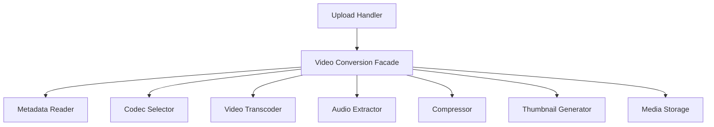

---

## Runtime Flow

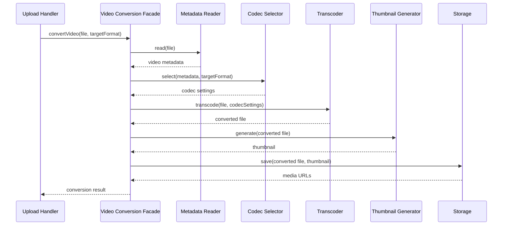

---

## Architectural Meaning

The upload handler does not care how video conversion works.

It just asks for conversion.

The facade hides the internal processing pipeline.

---

# 7. Example 3: Smart Home Facade

## Problem

A smart home app needs to start a “movie night” mode.

That may require:

```txt
Dim lights
Close blinds
Turn on TV
Set sound system
Set thermostat
Lock doors
Start streaming app
```

Without Facade, the user interface must call every device service manually.

That makes the UI tied to device-level details.

---

## Architect Questions

An architect would ask:

```txt
Is there a user-facing action that coordinates many subsystems?

Should the UI expose one simple command?

Are device APIs too detailed for the client?

Can the operation be modeled as a scenario or preset?

Will device-specific steps change independently of the UI?

Can the facade hide the orchestration behind startMovieNight()?
```

---

## Facade Diagram

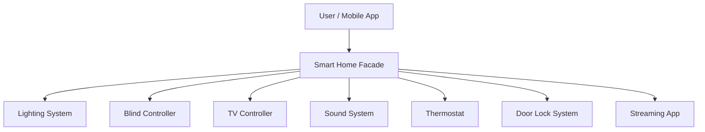

---

## Runtime Flow

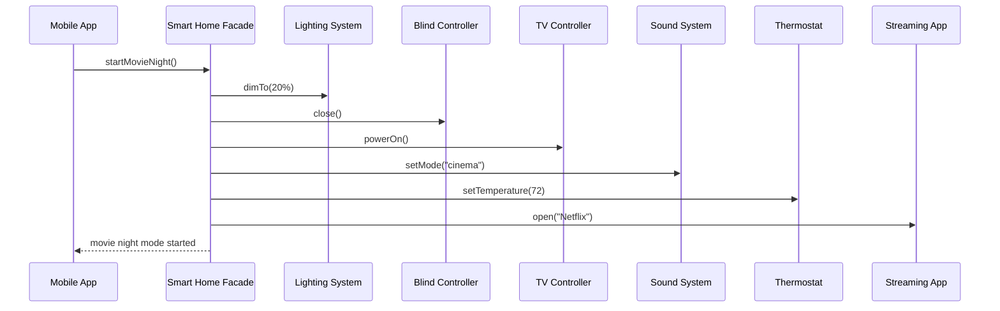

---

## Architectural Meaning

The user does not need seven buttons.

The app exposes one meaningful action:

```txt
startMovieNight()
```

The facade translates that high-level intent into subsystem calls.

---

# 8. Example 4: Travel Booking Facade

## Problem

A travel app lets users book a trip.

Booking a trip may require:

```txt
Search flights
Reserve flight
Search hotel
Reserve hotel
Reserve rental car
Process payment
Generate itinerary
Send confirmation
```

Without Facade, the client must coordinate airline, hotel, car rental, payment, and notification services.

That is too much responsibility for the client.

---

## Architect Questions

An architect would ask:

```txt
Is this a use case composed of multiple external services?

Should the client know the order of reservations?

Do we need rollback or compensation if one step fails?

Should payment and booking details be hidden behind one operation?

Can we expose a simpler trip-booking API?

Would changing hotel or airline providers affect the client?
```

---

## Facade Diagram

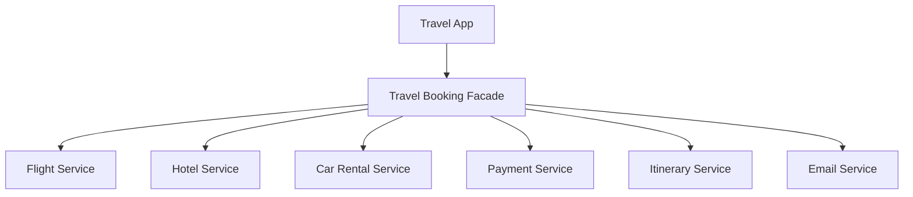

---

## Runtime Flow

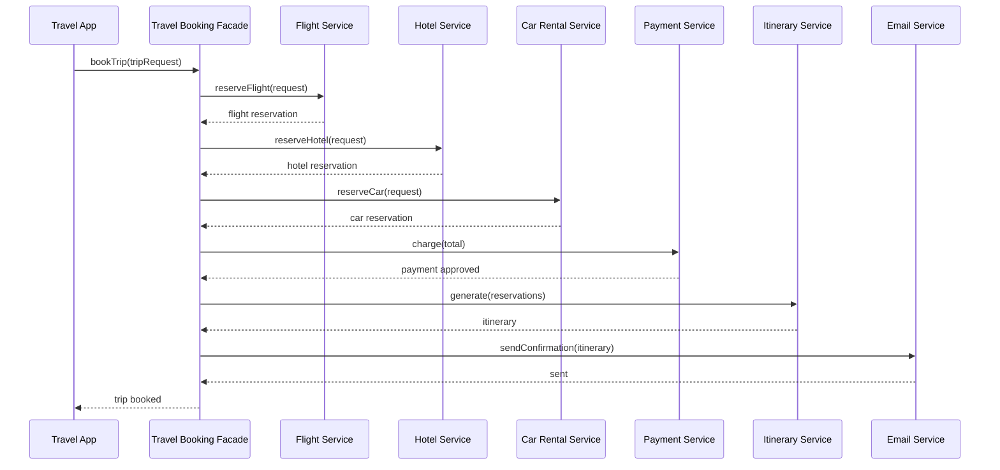

---

## Architectural Meaning

The travel app should not manually orchestrate every vendor service.

The facade provides one clear operation:

```txt
bookTrip()
```

Internally, it coordinates the subsystem.

---

# 9. Facade vs Adapter

Facade and Adapter are often confused.

## Facade

Facade simplifies a complex subsystem.

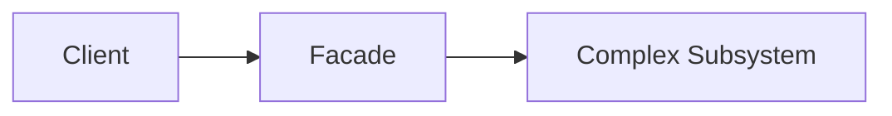

Question:

```txt
How do I make this complex subsystem easier to use?
```

---

## Adapter

Adapter converts one interface into another interface.

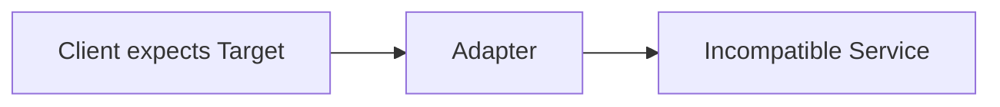

Question:

```txt
How do I make this incompatible thing fit my expected interface?
```

---

## Main Difference

| Pattern | Main Purpose                    |
| ------- | ------------------------------- |
| Facade  | Simplify usage                  |
| Adapter | Convert interface compatibility |

Bluntly:

```txt
Facade simplifies.
Adapter translates.
```

---

# 10. Facade vs Mediator

## Facade

Facade gives clients a simple entry point into a subsystem.

```txt
Client calls facade.
Facade coordinates subsystem.
Subsystem objects may still talk to each other normally.
```

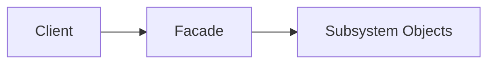

## Mediator

Mediator controls communication between many peer objects.

```txt
Objects communicate through mediator instead of directly with each other.
```

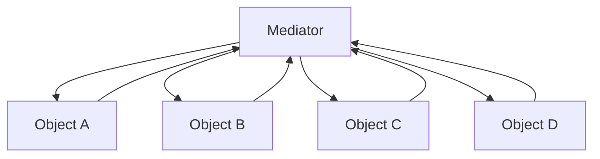

## Main Difference

| Pattern  | Main Purpose                       |
| -------- | ---------------------------------- |
| Facade   | Simplify access to a subsystem     |
| Mediator | Manage communication among objects |

Facade is a front door.

Mediator is a traffic controller.

---

# 11. Facade vs Proxy

## Facade

Facade simplifies multiple subsystem calls.

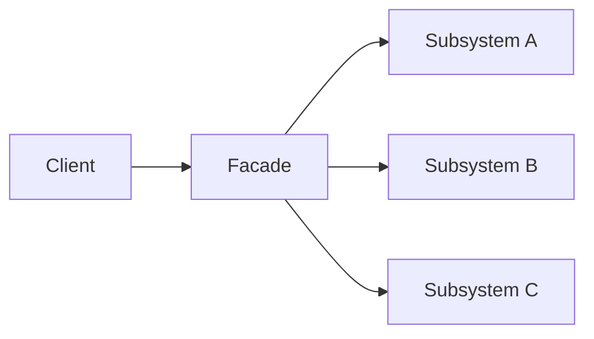

## Proxy

Proxy controls access to one object.

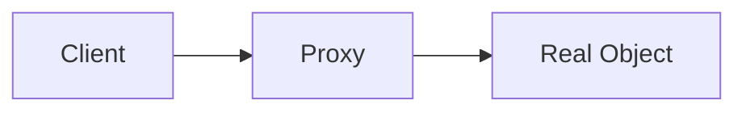

## Main Difference

| Pattern | Structure                               | Purpose             |
| ------- | --------------------------------------- | ------------------- |
| Facade  | One wrapper over many subsystem objects | Simplify complexity |
| Proxy   | One wrapper over one main object        | Control access      |

---

# 12. Facade vs Service Layer

They can look similar.

## Facade

Facade hides complexity of a subsystem.

```txt
Purpose:
- simplify a complicated set of classes
- provide a smaller API
- hide subsystem details
```

## Service Layer

Service Layer organizes business use cases.

```txt
Purpose:
- define application operations
- coordinate domain logic
- manage transactions and business workflows
```

## Practical Difference

| Pattern       | Usually Focuses On             |
| ------------- | ------------------------------ |
| Facade        | Simplifying subsystem access   |
| Service Layer | Application/business use cases |

In real systems, a service layer method can act like a facade.

The name matters less than the intent.

---

# 13. Implementation Shape Without Code

## Step 1: Identify the Complex Subsystem

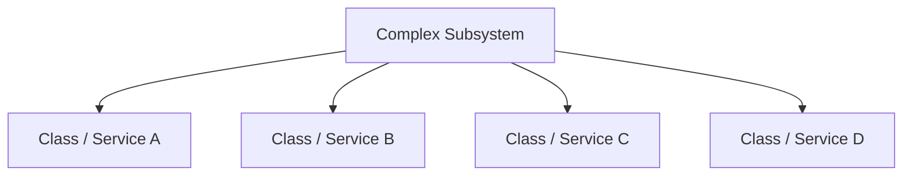

Ask:

```txt
Which details should the client not know?
```

---

## Step 2: Identify the Client Goal

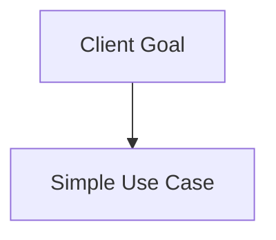

Example:

```txt
placeOrder()
convertVideo()
startMovieNight()
bookTrip()
```

The facade should expose meaningful operations, not random low-level methods.

---

## Step 3: Create the Facade

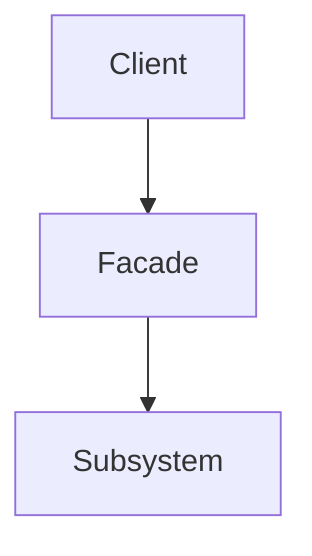

The facade owns the orchestration.

---

## Step 4: Move Coordination Logic Into the Facade

```mermaid
flowchart TD
    FACADE[Facade]

    STEP1[Step 1]
    STEP2[Step 2]
    STEP3[Step 3]
    STEP4[Step 4]

    FACADE --> STEP1
    STEP1 --> STEP2
    STEP2 --> STEP3
    STEP3 --> STEP4
```

The client should no longer call every subsystem manually.

---

## Step 5: Keep Subsystems Available When Needed

```mermaid
flowchart TD
    CLIENT_A[Simple Client]

    FACADE[Facade]

    ADVANCED_CLIENT[Advanced Client]

    SUBSYSTEM[Subsystem Classes]

    CLIENT_A --> FACADE
    FACADE --> SUBSYSTEM

    ADVANCED_CLIENT --> SUBSYSTEM
```

Important: Facade does not have to block access to the subsystem.

It provides a simpler path for common usage.

Advanced clients may still use subsystem classes directly if needed.

---

# 14. When to Use Facade

Use Facade when:

```txt
A subsystem is complex.

Clients are calling too many internal services directly.

You want a simpler API for common workflows.

You want to reduce coupling between clients and subsystem internals.

You need to hide ordering, coordination, or setup details.

You want a stable interface over changing internals.

You want to expose use-case-level operations.
```

---

# 15. When Not to Use Facade

Do not use Facade when:

```txt
The subsystem is already simple.

The facade only forwards calls without simplifying anything.

The facade becomes a giant god object.

Clients need full control over subsystem details.

You are trying to convert an incompatible interface.

You are trying to add optional behavior to an object.
```

A facade that does nothing but pass calls through is mostly noise.

A facade that does everything becomes a god object.

Both are bad.

---

# 16. Common Smell That Suggests Facade

Facade may be useful when you see this:

```txt
The same client code repeatedly calls five or more services in the same order.
```

Or this:

```txt
UI/controller code knows too much about subsystem internals.
```

Examples:

```txt
Checkout controller calls cart, inventory, payment, order, shipping, email.

Upload handler calls metadata reader, codec selector, transcoder, compressor, storage.

Mobile app calls lights, blinds, TV, sound system, thermostat for one user action.
```

That usually means a facade or service-layer boundary is missing.

---

# 17. Simple Pattern Summary

| Concept            | Meaning                                       |
| ------------------ | --------------------------------------------- |
| Client             | Code that wants a simple operation            |
| Facade             | Simple interface over a complex subsystem     |
| Subsystem          | Internal classes/services doing the real work |
| Orchestration      | The facade coordinates subsystem calls        |
| Simplified API     | Small set of meaningful operations            |
| Coupling Reduction | Client depends less on internal details       |

---

# 18. Best Visual Summary

```mermaid
flowchart LR
    CLIENT[Client]

    FACADE[Simple Facade API]

    COMPLEX[Complex Subsystem]

    CLIENT --> FACADE
    FACADE --> COMPLEX
```

## Final Meaning

Facade is not mainly about hiding code.

It is about giving clients a simpler, more stable way to use a complicated subsystem.

Use it when clients are forced to know too many internal steps.
