# Flyweight Pattern Using Diagrams

## Core Idea

The **Flyweight Pattern** is a structural design pattern used to reduce memory usage when a system creates a large number of similar objects.

Instead of storing the same repeated data inside every object, the system shares common data through reusable objects.

In simple words:

```txt
If thousands of objects share the same data,
store that shared data once,
then let each object reference it.
```

Example:

```txt
A game has 10,000 trees.

Many trees share:
- same model
- same texture
- same bark color
- same leaf texture

Each tree has unique:
- x position
- y position
- height variation
```

The shared tree data becomes the **flyweight**.

The unique position data stays outside or is passed in when needed.

---

# 1. The Problem Flyweight Solves

Imagine a forest simulation with thousands of trees.

Bad design:

```txt
Tree 1 stores oak mesh, oak texture, oak color, position
Tree 2 stores oak mesh, oak texture, oak color, position
Tree 3 stores oak mesh, oak texture, oak color, position
...
Tree 10,000 stores oak mesh, oak texture, oak color, position
```

That wastes memory because the same mesh and texture are copied again and again.

Flyweight fixes this by sharing the repeated parts.

---

# 2. Flyweight Pattern: General Structure

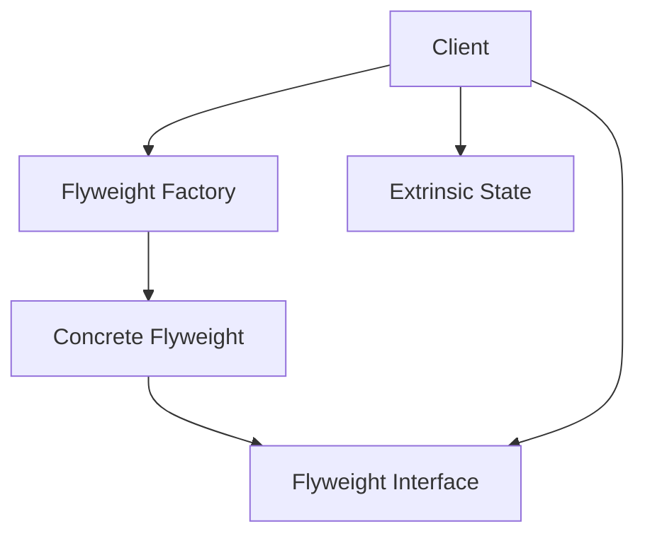

## What This Means

The client asks the factory for a shared flyweight object.

The flyweight contains reusable shared state.

The client provides unique state when using the flyweight.

---

# 3. Simple Mental Model

Think of Flyweight like fonts in a text editor.

```txt
The letter "A" appears 5,000 times.

The font data for "A" should not be copied 5,000 times.

The system stores the shape/style data once.

Each occurrence only stores:
- character position
- maybe color
- maybe size
```

The glyph shape is shared.

The placement is unique.

---

# 4. Intrinsic State vs Extrinsic State

This is the most important part of Flyweight.

## Intrinsic State

Intrinsic state is shared and reusable.

```txt
It belongs inside the flyweight.
It does not change from object to object.
```

Examples:

```txt
Tree texture
Tree mesh
Font glyph shape
Enemy sprite image
Product category icon
Map tile image
```

## Extrinsic State

Extrinsic state is unique per object.

```txt
It belongs outside the flyweight,
or it is passed into the flyweight when needed.
```

Examples:

```txt
Tree position
Tree height variation
Character screen position
Map tile coordinates
Enemy current health
Product listing price
```

---

## State Separation Diagram

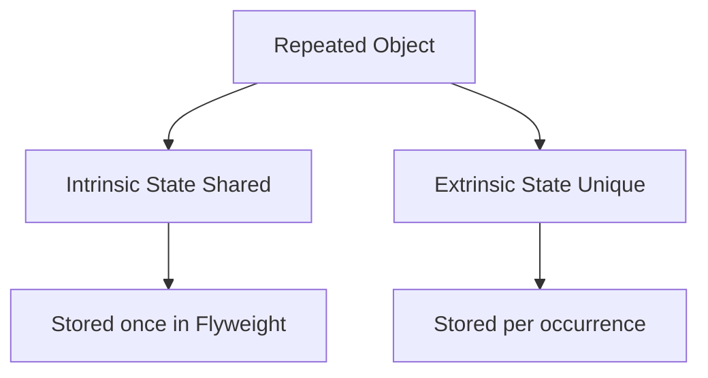

---

# 5. What Flyweight Protects You From

## Without Flyweight: Duplicated Memory

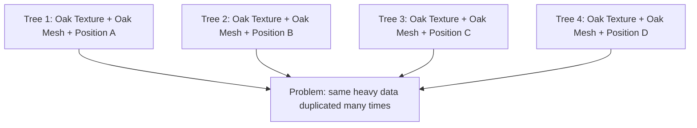

Each tree carries its own copy of expensive repeated data.

That wastes memory.

---

## With Flyweight: Shared Heavy Data

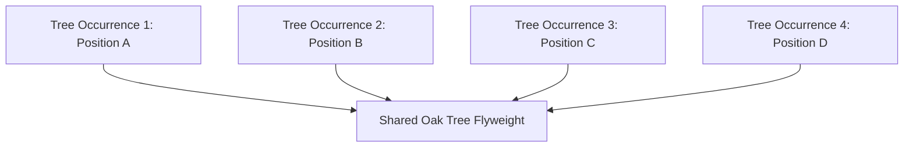

The heavy shared data exists once.

Each tree occurrence stores only its unique state.

---

# 6. Example 1: Forest Rendering System

## Problem

A game renders a large forest.

There may be:

```txt
100,000 trees
```

But only a few tree types:

```txt
Oak
Pine
Palm
Birch
```

Each tree type has expensive shared data:

```txt
3D model
Texture
Bark color
Leaf texture
Collision shape
```

Each tree occurrence has unique data:

```txt
Position
Rotation
Scale
Health
Season variation
```

If every tree stores its own model and texture, memory usage explodes.

---

## Architect Questions

An architect would ask:

```txt
Are we creating many similar objects?

Do many objects share the same heavy data?

Can shared state be separated from unique state?

Is memory usage becoming a real problem?

Can repeated data be cached and reused?

Are objects mostly identical except for location or small variations?

Can clients pass unique state when rendering or operating?
```

---

## Flyweight Diagram

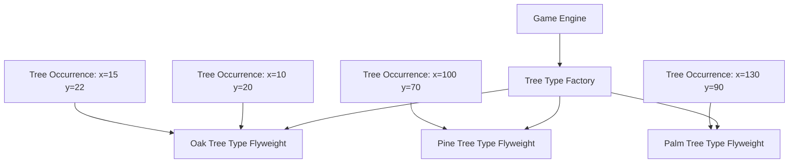

---

## Runtime Flow

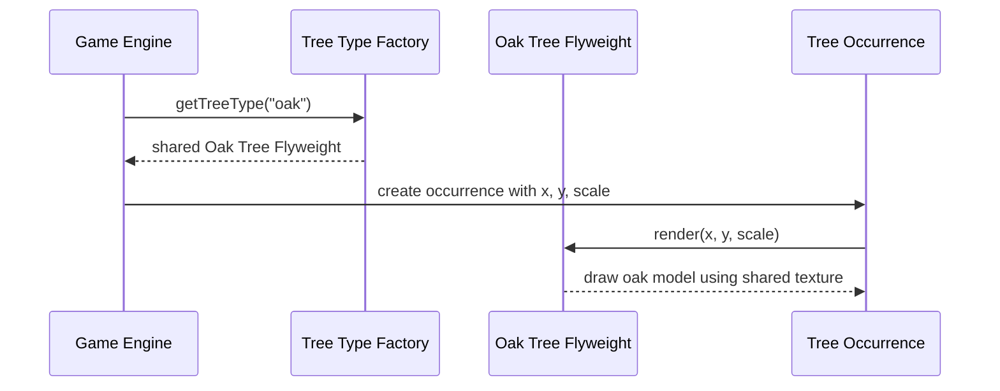

---

## Architectural Meaning

The tree occurrence owns the unique position.

The flyweight owns the shared tree data.

This keeps memory usage under control.

---

# 7. Example 2: Text Editor Glyph Rendering

## Problem

A text editor displays millions of characters.

Characters repeat constantly:

```txt
a, e, t, o, n, s
```

If every visible character stores its own full glyph shape and font rendering data, memory usage becomes wasteful.

Instead, the system can share glyph data.

---

## Architect Questions

An architect would ask:

```txt
Are there many repeated visual objects?

Can glyph shape be reused?

Is character position separate from character appearance?

Can font data be stored once?

Should each occurrence only store coordinates and formatting?

Do we need a cache of glyph objects?
```

---

## Flyweight Diagram

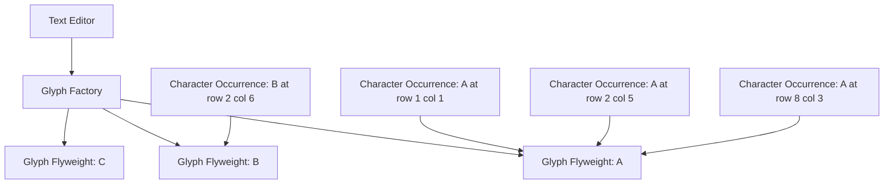

---

## Runtime Flow

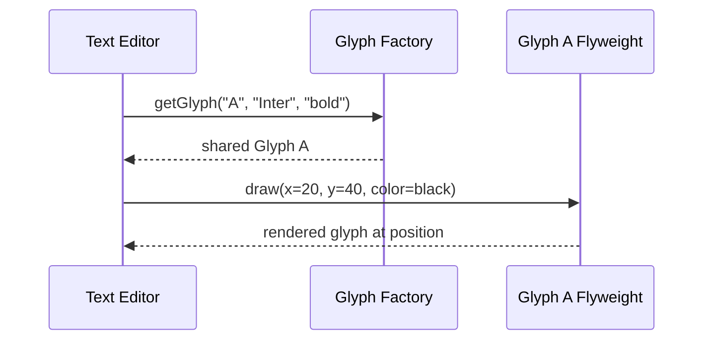

---

## Architectural Meaning

The glyph object does not store where every “A” appears.

It stores the reusable appearance of “A”.

The editor passes in position and color when drawing.

---

# 8. Example 3: Map Tile Rendering

## Problem

A mapping application displays a huge grid of map tiles.

Many tiles may reuse the same visual style:

```txt
water tile
grass tile
road tile
building tile
mountain tile
```

Each tile type has shared data:

```txt
image
style rules
texture
collision metadata
rendering behavior
```

Each tile occurrence has unique data:

```txt
x coordinate
y coordinate
zoom level
selection state
```

Duplicating tile image data per map cell wastes memory.

---

## Architect Questions

An architect would ask:

```txt
Do many map cells share the same tile type?

Are tile images or textures expensive?

Can tile type be shared separately from tile position?

Can rendering use shared tile data plus coordinates?

Do we need to support a huge number of visible objects?

Can a factory cache tile types?
```

---

## Flyweight Diagram

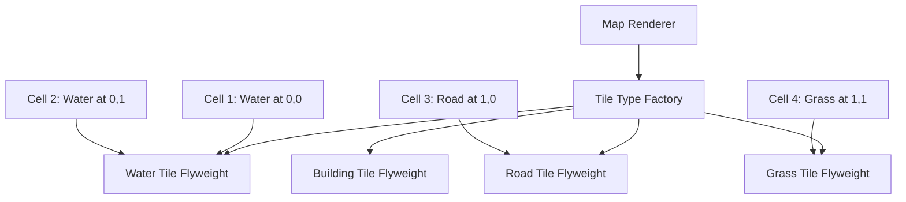

---

## Runtime Flow

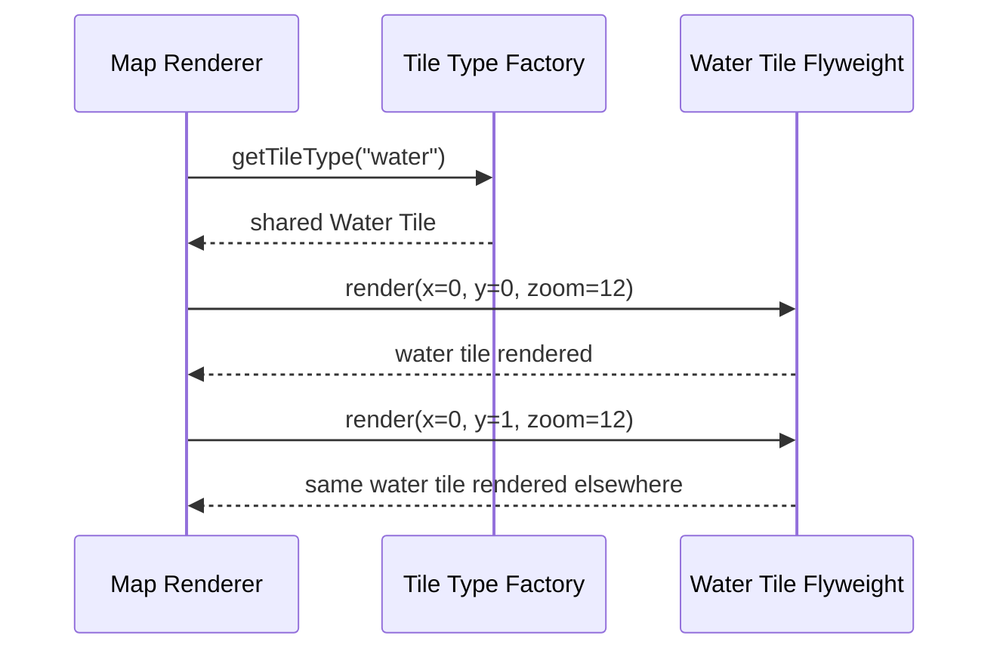

---

## Architectural Meaning

The map does not create a full object with image data for every grid cell.

It shares tile type data and applies it at different coordinates.

---

# 9. Example 4: Chat Emoji Rendering

## Problem

A chat application displays many repeated emojis:

```txt
😀
🔥
❤️
👍
😂
```

Each emoji may have shared data:

```txt
image asset
animation frames
accessibility label
category
rendering rules
```

Each emoji occurrence has unique data:

```txt
message id
position in message
skin tone variant
size
timestamp context
```

If every emoji occurrence stores its own image asset, the app wastes memory.

---

## Architect Questions

An architect would ask:

```txt
Are visual assets repeated many times?

Can the asset be shared across occurrences?

Can message-specific placement stay outside the shared object?

Do we need caching for emoji assets?

Can variants be modeled as separate flyweights?

Is memory pressure high on mobile devices?
```

---

## Flyweight Diagram

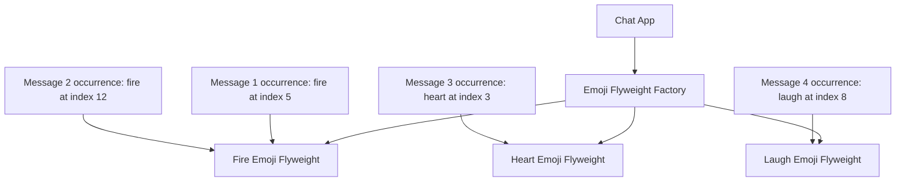

---

## Runtime Flow

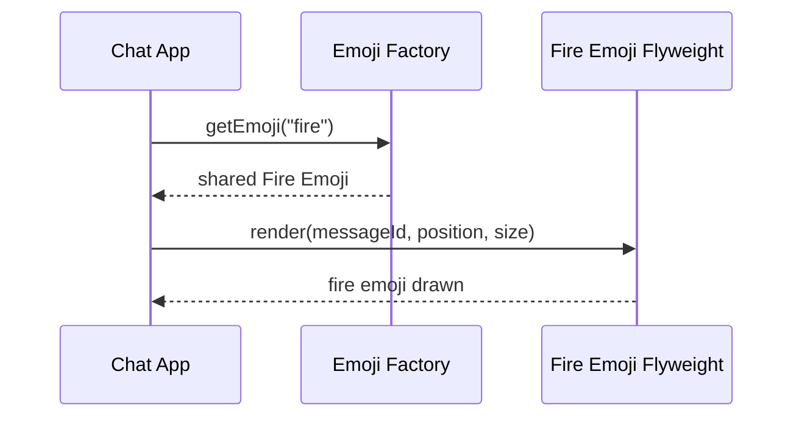

---

## Architectural Meaning

The emoji asset is shared.

Each occurrence only stores where and how that emoji is used.

That is Flyweight in a very practical UI scenario.

---

# 10. Flyweight Factory

The factory is important.

The factory prevents duplicate flyweights from being created.

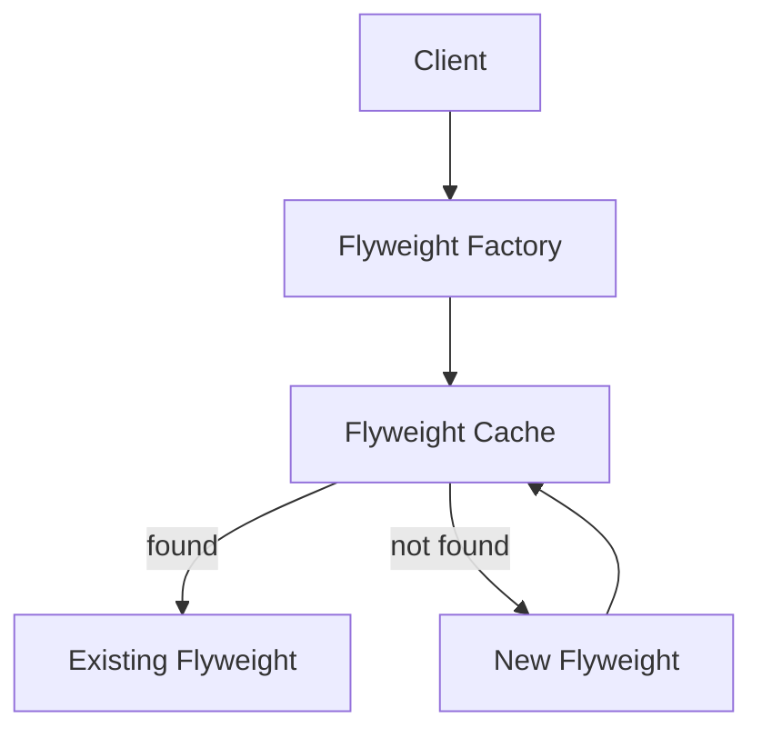

## What the Factory Does

The factory answers:

```txt
Do we already have a shared object for this type?
```

If yes:

```txt
Return existing flyweight.
```

If no:

```txt
Create it once, cache it, return it.
```

---

# 11. Flyweight vs Singleton

Flyweight and Singleton both involve shared objects, but they are not the same.

## Singleton

Singleton allows only one instance of a class.

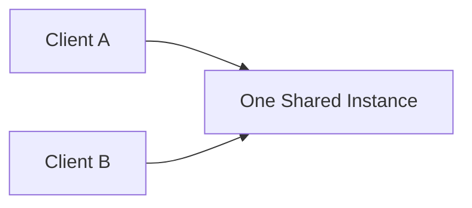

Question:

```txt
Should only one instance exist?
```

---

## Flyweight

Flyweight shares many reusable objects by type or key.

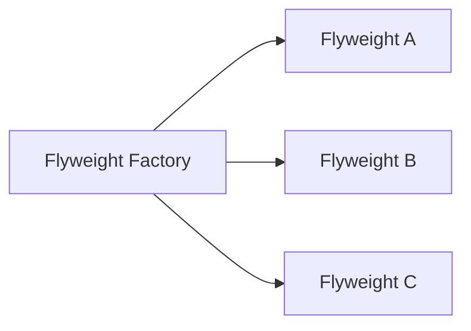

Question:

```txt
Can repeated shared data be reused across many object occurrences?
```

---

## Main Difference

| Pattern   | Main Purpose                        |
| --------- | ----------------------------------- |
| Singleton | Enforce one instance                |
| Flyweight | Share repeated state to save memory |

Bluntly:

```txt
Singleton controls instance count.

Flyweight controls memory duplication.
```

---

# 12. Flyweight vs Prototype

## Prototype

Prototype clones objects.

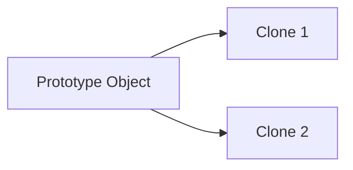

Question:

```txt
Can I copy this object to create a similar one?
```

---

## Flyweight

Flyweight shares part of an object instead of copying it.

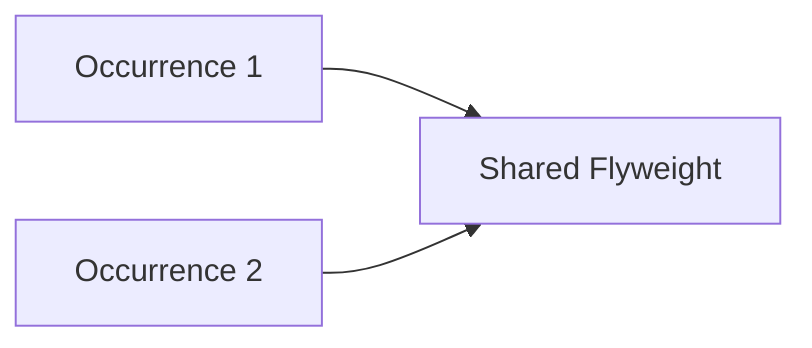

Question:

```txt
Can I avoid copying repeated shared state?
```

---

## Main Difference

| Pattern   | Main Purpose                  |
| --------- | ----------------------------- |
| Prototype | Create new objects by copying |
| Flyweight | Reduce memory by sharing      |

Prototype creates more objects.

Flyweight avoids duplicating heavy internal data.

---

# 13. Flyweight vs Object Pool

These are easy to confuse.

## Object Pool

Object Pool reuses object instances because creating them is expensive.

```txt
Borrow object.
Use object.
Return object.
Reuse later.
```

Good for:

```txt
Database connections
Threads
Socket connections
Expensive reusable workers
```

## Flyweight

Flyweight shares immutable or mostly immutable data across many logical objects.

```txt
Many occurrences reference the same shared data.
```

Good for:

```txt
Textures
Glyphs
Sprites
Tile images
Shared metadata
```

## Main Difference

| Pattern     | Main Purpose                                       |
| ----------- | -------------------------------------------------- |
| Object Pool | Reuse expensive objects over time                  |
| Flyweight   | Share common data across many simultaneous objects |

---

# 14. Implementation Shape Without Code

## Step 1: Identify the Repeated Object

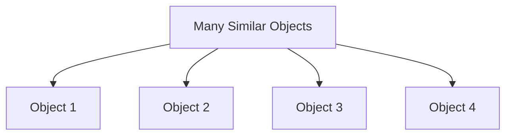

Ask:

```txt
Are we creating many objects that are mostly the same?
```

---

## Step 2: Split Shared and Unique State

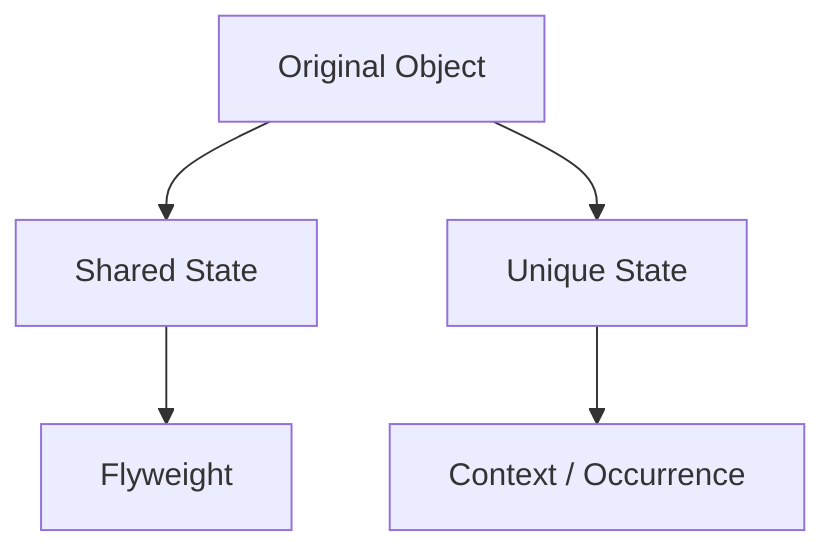

This is the key design move.

Shared state goes into the flyweight.

Unique state stays outside.

---

## Step 3: Create the Flyweight

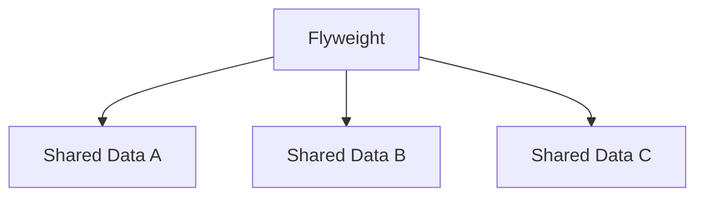

The flyweight should usually be immutable or treated as immutable.

If shared data changes unexpectedly, all objects using it are affected.

---

## Step 4: Create the Flyweight Factory

```mermaid
flowchart TD
    FACTORY[Flyweight Factory]

    CACHE[Cache by Key]

    FACTORY --> CACHE
```

The factory reuses existing flyweights.

Example keys:

```txt
tree type
font + character + style
tile type
emoji id
sprite id
```

---

## Step 5: Use Flyweight with Extrinsic State

```mermaid
flowchart TD
    CLIENT[Client]

    CONTEXT[Unique Context]

    FLYWEIGHT[Shared Flyweight]

    CLIENT --> CONTEXT
    CONTEXT --> FLYWEIGHT

    CONTEXT --> UNIQUE[Unique State]
    FLYWEIGHT --> SHARED[Shared State]
```

The final behavior combines:

```txt
shared flyweight data
+
unique context data
```

---

# 15. When to Use Flyweight

Use Flyweight when:

```txt
The application creates a very large number of similar objects.

Many objects share identical data.

Memory usage is a real concern.

Shared state can be separated from unique state.

The shared state can be immutable or safely reused.

Objects differ mostly by position, context, or small external values.

A factory/cache can manage shared instances.
```

---

# 16. When Not to Use Flyweight

Do not use Flyweight when:

```txt
You only have a small number of objects.

Memory usage is not a problem.

Objects do not share much data.

Shared and unique state cannot be separated cleanly.

Shared state is highly mutable.

The added complexity is worse than the memory savings.

The system becomes harder to understand for a tiny optimization.
```

This is not a pattern you use “just because.”

Flyweight only pays off when repetition and memory pressure are real.

---

# 17. Common Smell That Suggests Flyweight

Flyweight may be useful when you see this:

```txt
We have thousands or millions of objects,
and many of them store the same heavy data.
```

Examples:

```txt
Every tree stores the same texture.

Every character stores the same glyph shape.

Every map tile stores the same image.

Every emoji occurrence stores the same asset.

Every product card stores the same category metadata.
```

That is a clear Flyweight smell.

---

# 18. Common Mistake: Sharing Mutable State

The biggest Flyweight mistake is putting unique mutable state inside the flyweight.

Bad:

```txt
TreeType flyweight stores current position.
```

Why bad?

```txt
All oak trees share the same TreeType.

If TreeType stores position,
then every oak tree appears to move together.
```

Correct:

```txt
TreeType stores shared oak texture and model.

Tree occurrence stores x and y position.
```

---

## Mistake Diagram

```mermaid
flowchart TD
    FLYWEIGHT[Shared Flyweight]

    POSITION[Mutable Position Stored Inside Flyweight]

    TREE1[Tree 1]
    TREE2[Tree 2]
    TREE3[Tree 3]

    TREE1 --> FLYWEIGHT
    TREE2 --> FLYWEIGHT
    TREE3 --> FLYWEIGHT

    FLYWEIGHT --> POSITION

    BUG[Bug: changing position affects all trees]

    POSITION --> BUG
```

---

## Correct Diagram

```mermaid
flowchart TD
    FLYWEIGHT[Shared Tree Type]

    TREE1[Tree 1: x=10 y=20]
    TREE2[Tree 2: x=30 y=50]
    TREE3[Tree 3: x=90 y=70]

    TREE1 --> FLYWEIGHT
    TREE2 --> FLYWEIGHT
    TREE3 --> FLYWEIGHT
```

Unique state stays outside the shared object.

---

# 19. Simple Pattern Summary

| Concept              | Meaning                                            |
| -------------------- | -------------------------------------------------- |
| Flyweight            | Shared object that stores reusable intrinsic state |
| Intrinsic State      | Shared data stored inside the flyweight            |
| Extrinsic State      | Unique data stored outside or passed in            |
| Flyweight Factory    | Creates and reuses flyweights                      |
| Context / Occurrence | Object or data that holds unique state             |
| Client               | Combines shared flyweight with unique state        |

---

# 20. Best Visual Summary

```mermaid
flowchart LR
    OCC1[Occurrence 1 with unique state]
    OCC2[Occurrence 2 with unique state]
    OCC3[Occurrence 3 with unique state]

    SHARED[Shared Flyweight Data]

    OCC1 --> SHARED
    OCC2 --> SHARED
    OCC3 --> SHARED
```

## Final Meaning

Flyweight is not mainly about caching.

It is about reducing memory by sharing repeated internal state across many similar objects.

Use it when object count is high, repeated data is heavy, and shared state can be cleanly separated from unique state.
