# Proxy Pattern Using Diagrams

## Core Idea

The **Proxy Pattern** is a structural design pattern used when you want one object to stand in front of another object and control access to it.

In simple words:

```txt
Client wants to use a real object.

Instead of talking to the real object directly,
the client talks to a proxy.

The proxy decides how, when, or whether to forward the request.
```

Example:

```txt
Client wants to load a large image.

Proxy checks:
- Is the image already loaded?
- If not, load it.
- Then return it.

The client thinks it is using an image,
but it is really using a proxy first.
```

---

# 1. The Problem Proxy Solves

Sometimes direct access to an object is not ideal.

The real object may be:

```txt
Expensive to create
Remote over the network
Protected by permissions
Slow to load
Sensitive
Shared by many clients
```

Bad design:

```txt
Client directly accesses real object every time.
```

That can cause:

```txt
Unnecessary loading
Security leaks
Expensive operations
Network coupling
Repeated calls
No access control
```

Proxy adds a controlled access layer.

---

# 2. Proxy Pattern: General Structure

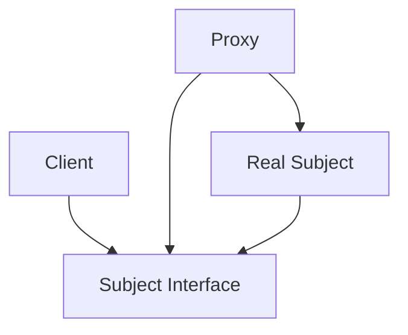

## What This Means

The client depends on the same interface used by the real object.

Both the proxy and the real object implement that interface.

The proxy holds a reference to the real object and controls access to it.

---

# 3. Simple Mental Model

Think of Proxy like a receptionist.

```txt
You want to talk to the CEO.

You do not walk directly into the CEO's office.

The receptionist checks:
- Do you have an appointment?
- Is the CEO available?
- Can this be handled without interrupting the CEO?
```

The receptionist is the proxy.

The CEO is the real object.

The requester is the client.

---

# 4. What Proxy Protects You From

## Without Proxy: Direct Access

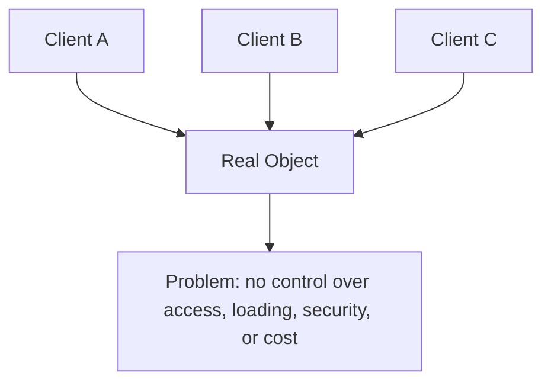

Every client talks directly to the real object.

There is no centralized place to control access.

---

## With Proxy: Controlled Access

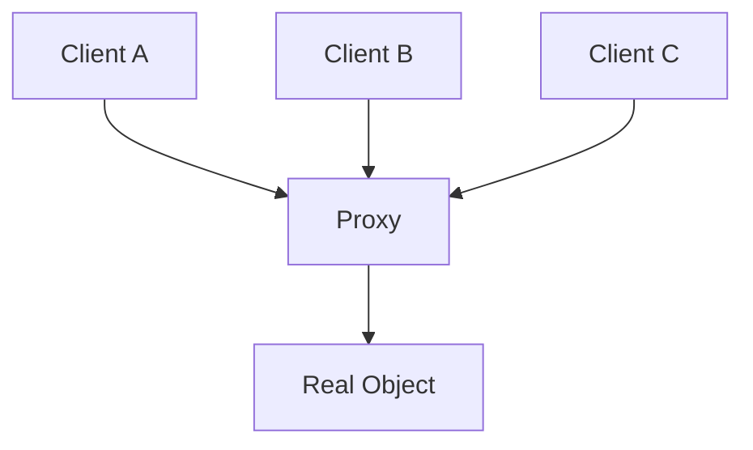

Now the proxy can decide:

```txt
Should I forward the request?
Should I block it?
Should I cache the result?
Should I load the real object lazily?
Should I log or rate-limit the call?
```

---

# 5. Example 1: Virtual Proxy for Large Images

## Problem

A photo gallery shows many high-resolution images.

Loading all images immediately is expensive.

Problems:

```txt
Slow page load
High memory usage
Bad user experience
Unnecessary network requests
```

The app should show image placeholders first and load the real image only when needed.

---

## Architect Questions

An architect would ask:

```txt
Is the real object expensive to create or load?

Can the object be loaded only when actually needed?

Can the proxy expose the same interface as the real object?

Should the client avoid knowing whether the object is loaded?

Can lazy loading improve performance?

Do we need placeholders before real data is available?

What happens if loading fails?
```

---

## Proxy Diagram

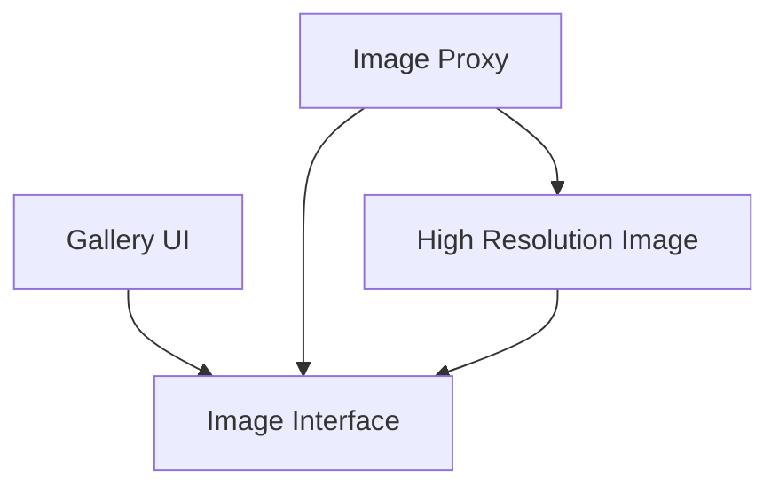

---

## Runtime Flow

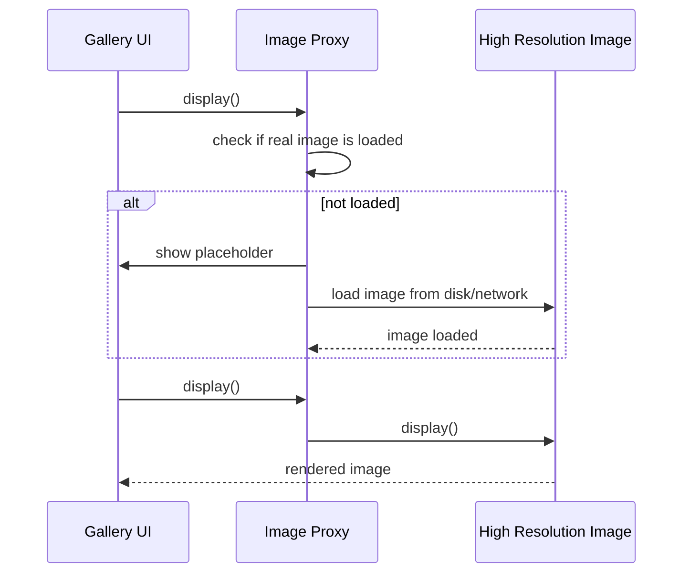

---

## Architectural Meaning

The UI does not need to know whether the image is loaded.

It calls:

```txt
display()
```

The proxy handles lazy loading and delegates to the real image when ready.

This is called a **Virtual Proxy**.

---

# 6. Example 2: Protection Proxy for Admin Actions

## Problem

An application has sensitive admin operations:

```txt
Delete user
Export private records
Change billing settings
Disable security rules
```

The real admin service can perform these actions.

But not every user should be allowed to call it directly.

A proxy can enforce access control before forwarding the request.

---

## Architect Questions

An architect would ask:

```txt
Does the real object perform sensitive operations?

Should access be checked before the operation runs?

Can authorization be centralized in a proxy?

Should the client use the same interface regardless of permission checks?

Can the real service stay focused on business logic?

What should happen when access is denied?

Should permission checks be reusable across multiple operations?
```

---

## Proxy Diagram

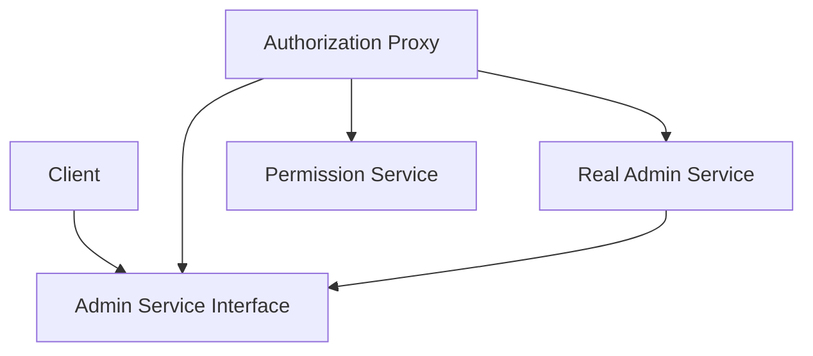

---

## Runtime Flow

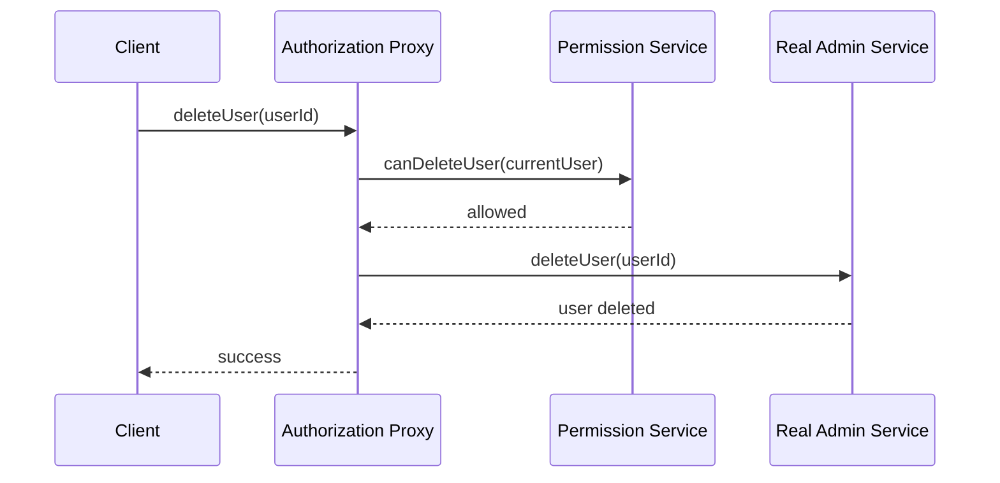

---

## Access Denied Flow

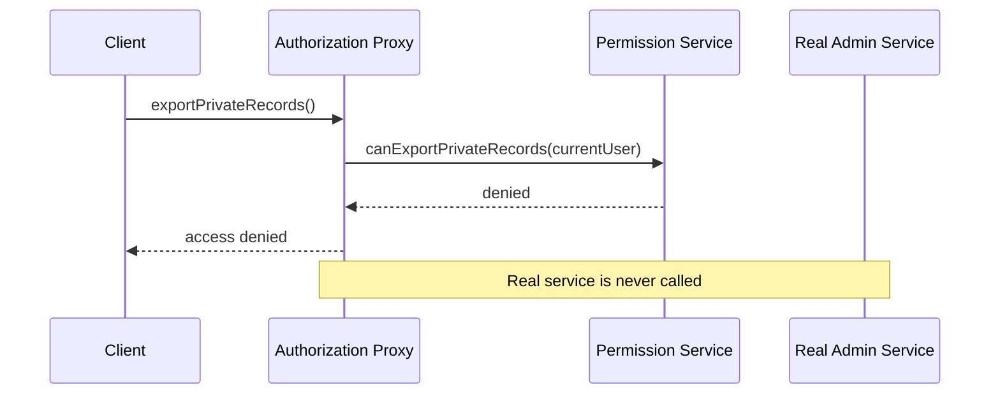

---

## Architectural Meaning

The proxy protects the real service.

The real service does not need to repeat permission checks everywhere.

The proxy acts as a gatekeeper.

This is called a **Protection Proxy**.

---

# 7. Example 3: Remote Proxy for External Service Calls

## Problem

A client application needs to call a remote service.

Example:

```txt
Weather API
Payment API
Document conversion API
Search API
```

The real object is not local.

It exists across the network.

Directly exposing network details to business logic is bad.

The client should call a local-looking object, while the proxy handles network communication.

---

## Architect Questions

An architect would ask:

```txt
Is the real object remote?

Should clients avoid knowing HTTP, retries, serialization, or network errors?

Can the proxy expose a normal local interface?

Should the proxy handle authentication headers?

Should the proxy handle timeout and retry policies?

Can network details be isolated from business logic?

How should remote failures be represented to the client?
```

---

## Proxy Diagram

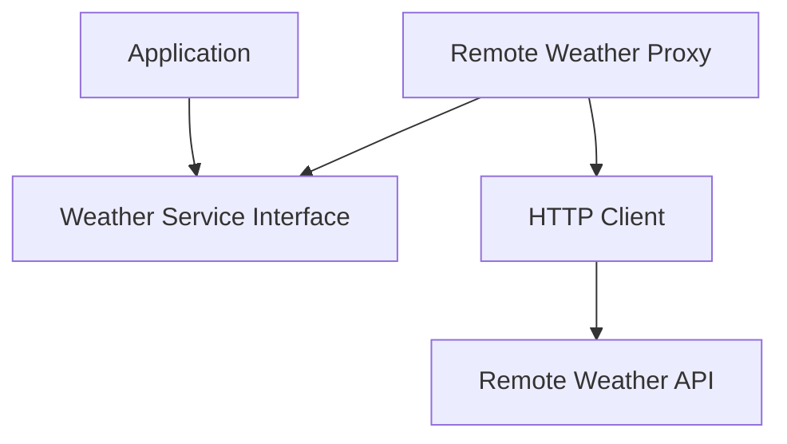

---

## Runtime Flow

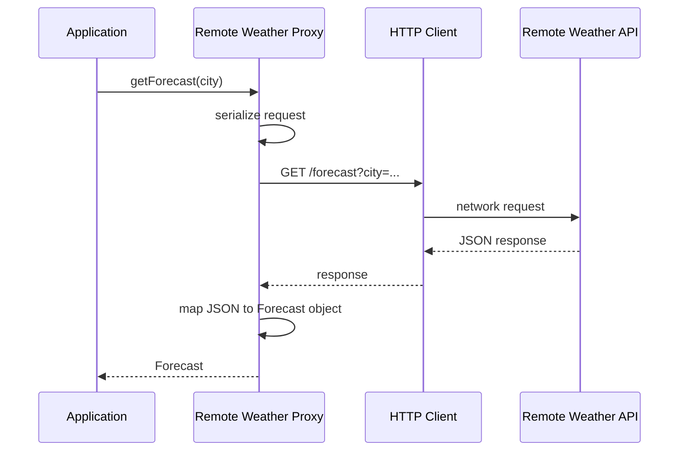

---

## Architectural Meaning

The application does not deal with:

```txt
HTTP routes
JSON parsing
Authentication headers
Timeouts
Retry logic
Remote error formats
```

The proxy hides remote communication behind a normal interface.

This is called a **Remote Proxy**.

---

# 8. Example 4: Caching Proxy for Product Catalog

## Problem

An e-commerce app frequently reads product information.

The real product service may be slow or expensive:

```txt
Database query
External vendor API
Large search index
Remote microservice
```

If every request goes directly to the real service, performance suffers.

A proxy can cache results and only call the real service when needed.

---

## Architect Questions

An architect would ask:

```txt
Are repeated calls returning the same data?

Is the real service expensive or slow?

Can cached data be safely reused?

How long should cached data live?

What invalidates the cache?

Should the client know whether data came from cache?

Can caching be added without changing the real service?
```

---

## Proxy Diagram

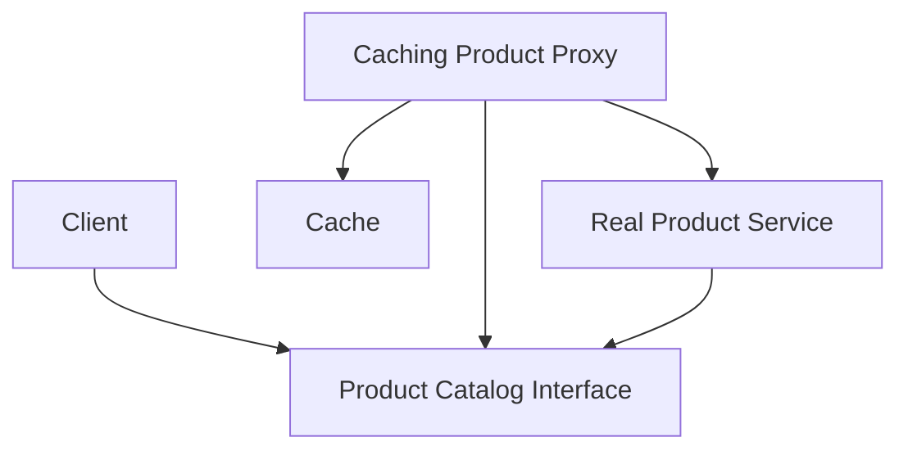

---

## Runtime Flow: Cache Miss

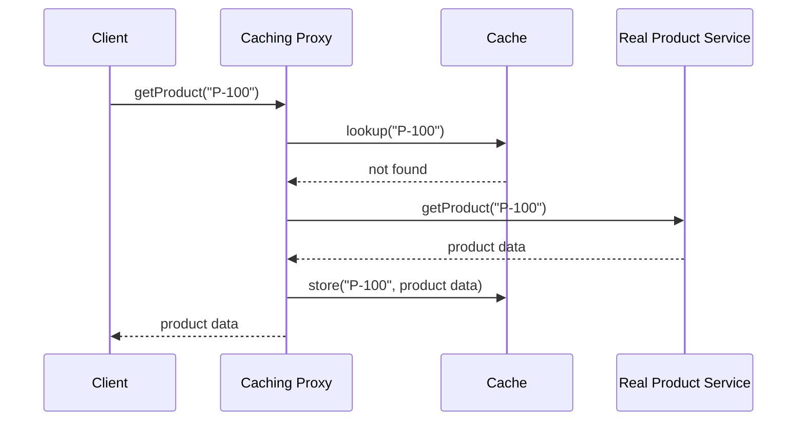

---

## Runtime Flow: Cache Hit

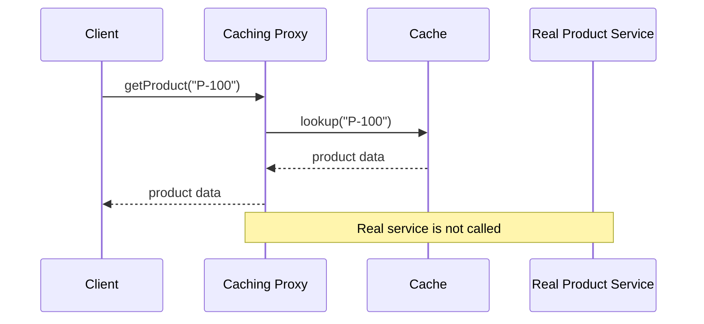

---

## Architectural Meaning

The client still calls:

```txt
getProduct()
```

But the proxy decides whether to return cached data or call the real service.

This is called a **Caching Proxy**.

---

# 9. Common Types of Proxy

## Virtual Proxy

Used for lazy loading expensive objects.

```txt
Load the real object only when needed.
```

Examples:

```txt
Large images
Heavy documents
Video previews
Expensive reports
```

---

## Protection Proxy

Used for access control.

```txt
Check permissions before forwarding the request.
```

Examples:

```txt
Admin operations
Private records
Billing actions
Security settings
```

---

## Remote Proxy

Used for remote communication.

```txt
Represent a remote object as if it were local.
```

Examples:

```txt
API client wrappers
RPC clients
Microservice clients
Cloud service clients
```

---

## Caching Proxy

Used to avoid repeated expensive calls.

```txt
Return cached result when possible.
```

Examples:

```txt
Product catalog
User profiles
Search results
Feature flags
```

---

## Logging / Monitoring Proxy

Used to observe access to the real object.

```txt
Record calls, timing, failures, or metrics.
```

Examples:

```txt
Audit logs
Performance monitoring
Security tracing
```

Be careful here: if the main intent is adding behavior, it may be closer to Decorator.

---

# 10. Proxy vs Decorator

Proxy and Decorator both wrap another object and usually implement the same interface.

But the intent is different.

## Proxy

Proxy controls access.

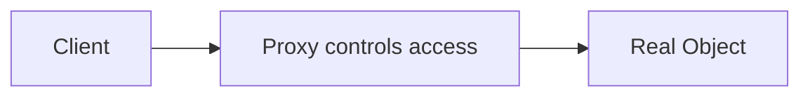

Question:

```txt
Should this request reach the real object?
When should the real object be loaded?
Should this result come from cache?
Is the caller authorized?
```

---

## Decorator

Decorator adds behavior.

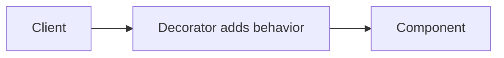

Question:

```txt
How do I add responsibilities around this object?
```

---

## Main Difference

| Pattern   | Main Purpose                |
| --------- | --------------------------- |
| Proxy     | Control access to an object |
| Decorator | Add behavior to an object   |

Bluntly:

```txt
Proxy controls.

Decorator enhances.
```

---

# 11. Proxy vs Adapter

## Proxy

Proxy keeps the same interface and controls access.

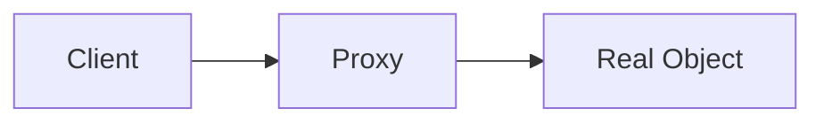

The proxy and real object usually share the same interface.

---

## Adapter

Adapter changes one interface into another.

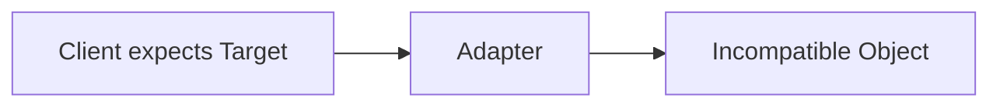

The adapter makes incompatible interfaces work together.

---

## Main Difference

| Pattern | Interface           | Purpose             |
| ------- | ------------------- | ------------------- |
| Proxy   | Same interface      | Control access      |
| Adapter | Different interface | Translate interface |

---

# 12. Proxy vs Facade

## Proxy

Proxy stands in for one main object.


---

## Facade

Facade provides a simple entry point to many subsystem objects.

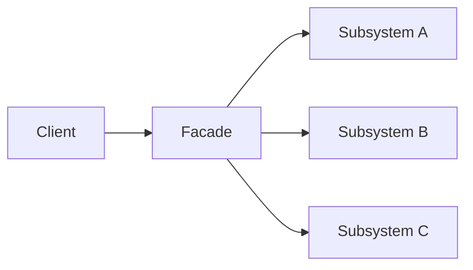

---

## Main Difference

| Pattern | Structure                               | Purpose                  |
| ------- | --------------------------------------- | ------------------------ |
| Proxy   | One wrapper for one main object         | Control access           |
| Facade  | One wrapper over many subsystem objects | Simplify subsystem usage |

---

# 13. Proxy vs Flyweight

## Proxy

Proxy controls access to a real object.

```txt
Should I load it?
Should I allow access?
Should I call the remote object?
Should I return cached data?
```

## Flyweight

Flyweight shares repeated internal state to save memory.

```txt
Can thousands of objects reuse the same shared data?
```

## Main Difference

| Pattern   | Main Purpose        |
| --------- | ------------------- |
| Proxy     | Control access      |
| Flyweight | Reduce memory usage |

---

# 14. Implementation Shape Without Code

## Step 1: Define the Subject Interface

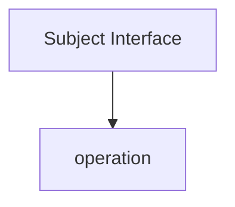

The client should depend on this interface.

Examples:

```txt
Image:
- display()

AdminService:
- deleteUser()

WeatherService:
- getForecast()

ProductCatalog:
- getProduct()
```

---

## Step 2: Create the Real Subject

```mermaid
flowchart TD
    SUBJECT[Subject Interface]

    REAL[Real Subject]

    REAL --> SUBJECT
```

The real subject contains the actual expensive, sensitive, remote, or heavy behavior.

---

## Step 3: Create the Proxy

```mermaid
flowchart TD
    SUBJECT[Subject Interface]

    PROXY[Proxy]

    REAL[Real Subject]

    PROXY --> SUBJECT
    PROXY --> REAL
```

The proxy implements the same interface and holds or creates the real subject.

---

## Step 4: Add Access Control Logic

```mermaid
flowchart TD
    CLIENT_CALL[Client Call]

    PROXY[Proxy]

    CHECK[Control Logic]

    REAL[Real Subject]

    RESULT[Result]

    CLIENT_CALL --> PROXY
    PROXY --> CHECK

    CHECK -->|allowed / needed| REAL
    CHECK -->|blocked / cached / delayed| RESULT

    REAL --> RESULT
```

The proxy may:

```txt
Check permissions
Lazy-load the real object
Return cached data
Send a network request
Log access
Throttle calls
Handle retries
```

---

## Step 5: Client Uses the Proxy as the Subject

```mermaid
flowchart TD
    CLIENT[Client]

    SUBJECT[Subject Interface]

    PROXY[Proxy]

    REAL[Real Subject]

    CLIENT --> SUBJECT
    SUBJECT --> PROXY
    PROXY --> REAL
```

The client should not need to know whether it is talking to the proxy or the real object.

That is the clean design.

---

# 15. When to Use Proxy

Use Proxy when:

```txt
You need to control access to an object.

The real object is expensive to create.

The real object should be loaded lazily.

The real object is remote.

The real object needs permission checks.

You need caching around an expensive call.

You want to isolate network, security, or lifecycle logic.

The client should use the same interface as the real object.
```

---

# 16. When Not to Use Proxy

Do not use Proxy when:

```txt
There is no access-control, loading, remote, or caching problem.

The proxy only forwards calls and adds no value.

The wrapper changes the interface.

You are trying to simplify many subsystem calls.

You are trying to add stackable behavior.

The proxy hides too much and makes debugging harder.
```

A proxy that only forwards every call without controlling anything is useless noise.

---

# 17. Common Smell That Suggests Proxy

Proxy may be useful when you see this:

```txt
Clients should not access the real object directly.
```

Examples:

```txt
The object is too expensive to load upfront.

The object is remote and needs network handling.

The object is sensitive and needs authorization.

The object is frequently requested and should be cached.

The object lifecycle needs to be controlled.
```

That usually means a proxy boundary may be useful.

---

# 18. Common Mistakes

## Mistake 1: Calling Everything a Proxy

Not every wrapper is a proxy.

```txt
If it translates interfaces, it is probably Adapter.

If it adds stackable behavior, it is probably Decorator.

If it simplifies many services, it is probably Facade.

If it controls access to one object, it is Proxy.
```

---

## Mistake 2: Proxy Becomes a God Object

Bad proxy:

```txt
Checks permissions
Caches results
Maps DTOs
Handles business rules
Sends emails
Updates analytics
Formats responses
```

That is too much.

A proxy should focus on access control, lifecycle, remote access, or caching.

Business logic belongs somewhere else.

---

## Mistake 3: Hiding Too Much

If the proxy hides failures too aggressively, debugging becomes painful.

Example:

```txt
Remote service fails.

Proxy silently returns stale cached data.

Client thinks everything is fine.

System now has wrong behavior.
```

Caching and fallback behavior must be explicit and carefully designed.

---

# 19. Simple Pattern Summary

| Concept           | Meaning                                                  |
| ----------------- | -------------------------------------------------------- |
| Subject Interface | Common interface used by client, proxy, and real object  |
| Real Subject      | Object that performs the real work                       |
| Proxy             | Stand-in object that controls access to the real subject |
| Client            | Uses the subject interface                               |
| Access Control    | Permission, caching, lazy loading, or remote handling    |
| Delegation        | Proxy forwards the request when appropriate              |

---

# 20. Best Visual Summary

```mermaid
flowchart LR
    CLIENT[Client]

    PROXY[Proxy controls access]

    REAL[Real Object]

    CLIENT --> PROXY
    PROXY --> REAL
```

## Final Meaning

Proxy is not mainly about wrapping an object.

It is about controlling access to the real object.

Use it when direct access is expensive, unsafe, remote, or needs lifecycle control.
