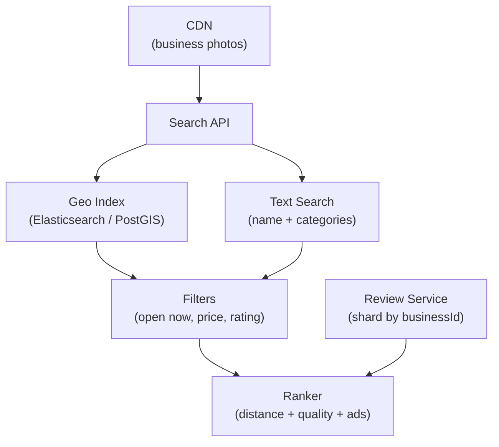

# Problem 28: Yelp (Local Business Discovery)

## Business Problem
Users search for restaurants, salons, and services **near a location**, read reviews, see photos, and book reservations. Businesses claim listings and respond to reviews.

## Hard Requirements
- Geo search: "pizza near me" in **< 200 ms** with filters (price, rating, open now).
- **Reviews** with anti-spam, helpful votes, and photo uploads.
- Business hours and "open now" must respect timezones.
- Rank by distance, rating, review count, and sponsored placement.
- Support **100M+** POIs globally.

## Why One Pattern Is Not Enough
| If you only use… | What breaks |
| --- | --- |
| SQL distance query on all rows | Full table scan; unusable |
| Reviews in same row as business | Hot business lock contention |
| No search index | Text search on reviews too slow |
| Static ranking | Poor results for "best match" intent |

You need **geospatial index**, **search engine for text**, **review sharding**, **ranking pipeline**, and **cache for popular queries**.

## Architecture Overview


## Pattern Mix
| Concern | Patterns | Role |
| --- | --- | --- |
| Geo | [Geospatial Index](../Scalability_patterns/), [Sharding](../Scalability_patterns/03-sharding.md) | Quadtree / geohash cells |
| Reviews | [CQRS](../Scalability_patterns/06-cqrs.md), [Event Sourcing](../Data_domain_patterns/15-event-sourcing.md) | Write review; read avg rating |
| Search | [Inverted Index](../Data_domain_patterns/), [Cache-Aside](../Scalability_patterns/04-cache-aside.md) | Popular city+ category queries |
| Photos | [CDN](../Scalability_patterns/05-cdn.md), object storage | Image resize pipeline |
| Spam | [Pipeline](../Concurrency_patterns/07-pipeline.md), ML classifier | Hold suspicious reviews |
| Ads | [Auction](../composition_problems/30-online-auction.md) (optional) | Sponsored slot bidding |

## Happy-Path Flow
1. User searches lat/lng + "sushi" → geo filter 5 km → text match → 200 candidates.
2. Rank by weighted score → return top 20 with distance and open status.
3. User submits review → stored on business shard → async recompute `avgRating`.
4. Business owner reply linked to review thread.

## Failure Scenarios
- **Geo index stale:** Fallback to city-level centroid search.
- **Rating recompute lag:** Show "rating updating" or use cached value with TTL.
- **Review spam wave:** Rate limit new accounts; captcha on suspicious IPs.

## TypeScript Sketch
```typescript
async function searchNearby(lat: number, lng: number, q: string, radiusKm: number) {
  const geoHits = await geoIndex.search(lat, lng, radiusKm);
  const textHits = await searchIndex.match(q, geoHits.map(h => h.businessId));
  const ranked = ranker.score(textHits, { lat, lng, now: Date.now() });
  return ranked.slice(0, 20);
}
```

## Patterns Used
[CQRS](../Scalability_patterns/06-cqrs.md) · [CDN](../Scalability_patterns/05-cdn.md) · [Cache-Aside](../Scalability_patterns/04-cache-aside.md) · [Pipeline](../Concurrency_patterns/07-pipeline.md) · [Sharding](../Scalability_patterns/03-sharding.md)
