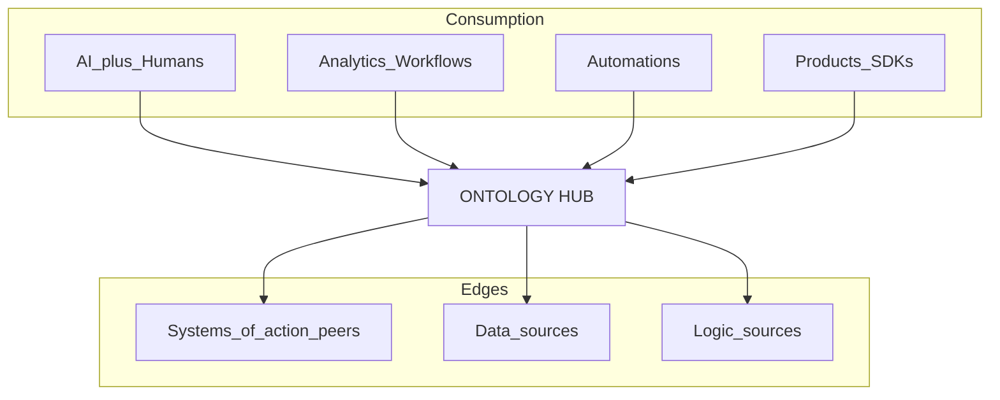

# ControlPanelOntology — Concept of Operations (ConOps)

**Status:** Draft 0.3 (ontology hub + multi–system-of-action)  
**Audience:** shop owner, estimator, floor lead, builders, V&V  
**Scenario files:** [../Subsystem/SCENARIOS.md](../Subsystem/SCENARIOS.md) — **every OPS/E stays Open** until evidence closes it in SRVM (progress ≠ closed).

## 1. Executive summary

**ControlPanelOntology** is **Ontology + AI** for a small manufacturing tool shop (our reference: **carbide tools**): a **Foundry-shaped control plane** inspired by ontology-OS practice (hub, peer edges, governed actions) — **not** a Palantir Foundry clone. At the center is an **ontology** — a shared business map of objects (Estimate, Inventory item, Manufacturing order, …), links, and allowed actions. **AI** participates on that map (intent → allowlisted skill), never as a separate ungoverned path to vendor APIs.

People and **AI** do **not** talk to vendor systems by name. They act on **ontology objects**. **Edges** (systems of action, data sources, logic sources, analytics, automations, apps/SDKs) plug into that map through **first-party connectors** and **allowlisted skills**.

**ERP (today: Odoo) is one system-of-action edge**, not the architectural center. You may have **many** systems of action (ERP, MES, SCM, scheduling, edge, …). Each owns the properties it is bound to; the ontology coordinates the shop language.

**Replicable:** the same hub, V-Model, and software patterns can be **re-bound** for another company — new product-owned entity types, bindings, and connectors — without redesigning the control plane. How we build: [Pattern_Selection](../TSD/Pattern_Selection.md).

```text
  AI + humans
       ↓
  Analytics / Automations / Apps & SDKs
       ↓
     ONTOLOGY  (types · links · actions → skills)
       ↓
  Connectors (edges)
    · Systems of action (ERP, MES, …)   · Data sources
    · Logic sources (rules, models, …)
```

**Golden path:** suggest intent → resolve to known skill → dry-run when needed → approve when needed → execute via connector → leave evidence.

**Layer picture (Foundry-shaped):** same separations as the ontology-system diagram — sources → ontology hub → analytics / automations / products → AI + human teaming. Side-by-side: [Ontology_System_Pattern.md](./Ontology_System_Pattern.md) · reference image [Foundry_Ontology_System_Reference.png](./Foundry_Ontology_System_Reference.png).

**Claim boundary:** This ConOps is operational intent. Verified capability needs SRD, scenarios, tests, evidence, and SRVM — scenarios remain **Open** until then.

---

## 2. Introduction

### 2.1 Purpose

Explain why the product exists, who uses it, how edges attach via ontology, boundaries, and the **external (OPS)** and **internal (E)** scenarios that drive SRD and tests. The carbide-tool shop is the **reference deployment**; another manufacturer should get the same safety rails by rebinding ontology + connectors, not by forking the hub.

### 2.2 Scope

**In scope**

- Ontology as the hub for shop vocabulary and actions  
- Multi–system-of-action connectors (ERP first among peers)  
- Governed skills, dry-run, approval, evidence  
- Control-plane UI (map, console, ontology Schema / Explorer / Vertex / Process)  
- Product OPS scenarios and engineering E scenarios (all Open)  
- Pattern-led design (best practices), not vendor UI cloning  

**Out of scope here**

- Numbered SHALL text (→ SRD)  
- Framework/schema choices (→ TSD)  
- Claiming a full digital twin, customer ontology editors, or Workshop/Quiver-style builders as baseline (→ Risks — inspiration, not clone targets)  
- Palantir feature parity or “compatible with Foundry” claims

### 2.3 Document authority

| Artifact | Authoritative for |
|----------|-------------------|
| **ConOps** | Intent, actors, edges, OPS/E scenarios |
| **SRD** | Testable SHALLs |
| **TSD** | Design / as-built |
| **Scenarios + Test plans** | How we prove |
| **SRVM** | Closure status (Open until evidence) |

---

## 3. Need and vision

### 3.1 Pain

Shops already have ERP and other systems. Wiring every screen and every AI prompt straight into each vendor API is brittle and unsafe. Treating ERP as “the only brain” blocks MES, docs, sensors, and future logic edges.

### 3.2 Need

One **flexible** operating model: interact with **any** approved edge **through the ontology**, with the same safety rails (allowlist, dry-run, approval, evidence).

### 3.3 Value

- Shop language stays stable when vendors change  
- New SoA / data / logic edges land as connectors + bindings + skills — not new special-case UIs  
- Humans and AI share the same governed path  

---

## 4. Stakeholders and users

| Role | What they need |
|------|----------------|
| Estimator / sales | Estimates, commercial intents, Explorer on Estimate |
| Buyer / inventory | Purchase and stock actions (catalog → live later) |
| Production / machines | Manufacturing / shop-floor actions via ontology |
| Quality / drawings | QC and controlled documents |
| Shipping | Ship / deliver actions; ownership via bindings |
| Admin / IT | Enable connectors, credentials, logs, tasks |
| Developer / agent | SDK/API against ontology + skills — not raw vendor RPC |
| Builder / V&V | ConOps → SRD → scenarios → evidence (E scenarios) |

**External edge actors (not inside the control plane):** ERP, other SoAs, data systems, optional ML/rules services, carriers, file stores.

---

## 5. System context and boundaries

### Inside

- Web control panel, Nest gateway, FastAPI orchestrator, Postgres (control-plane data)  
- Product-owned ontology YAML, taxonomy, contracts, skill allowlist  
- First-party **connector catalog** and bindings  

### Outside

- Every **system of action** (ERP, MES, …) and other edges — reached by URL/credentials, **not** hosted in Compose  
- Customer AI models, unless explicitly integrated later  

```text
  AI + humans · Analytics · Automations · Apps/SDKs
                      │
                      ▼
            ┌─────────────────────┐
            │   ONTOLOGY HUB      │
            │ types · links ·     │
            │ actions → skills    │
            └──────────┬──────────┘
                       │
         ┌─────────────┼─────────────┐
         ▼             ▼             ▼
   Systems of      Data sources   Logic sources
   action (peers)
   ERP · MES · …
```



### Critical operational principles

1. **Ontology is the hub** — edges are peers attached by connectors.  
2. **ERP is one SoA**, not “the” product brain.  
3. Natural language may **suggest** an intent — it must **not** invent tools or payloads.  
4. Only **allowlisted skills** execute.  
5. Risky writes get **dry-run** when required; important changes may need **approval**.  
6. Every run leaves **correlation id**, logs, and evidence when applicable.  
7. **Ownership is per binding** — which connector owns which properties on a type.  
8. Progress on a scenario does **not** close it — **Open** until SRVM evidence.

---

## 6. Candidate subsystems (SAC)

| ID | Role in the hub model |
|----|------------------------|
| SAC-001 | Front door — auth, allowlist, rate limit, public API face |
| SAC-002 | Screens — map, console, ontology UI |
| SAC-003 | Taxonomy & contracts |
| SAC-004 | Skills engine (orchestrator) |
| SAC-005 | Connector catalog — **SoA and other edges** (Odoo first peer) |
| SAC-006 | Ontology catalog & Schema / Explorer / Vertex / Process |
| SAC-007 | Tasks, approvals, evidence, logs (automations spine) |
| SAC-008 | Estimate-issues wedge (control-plane outcome) |
| SAC-009 | Compose / runtime (edges stay external) |
| SAC-010 | CI / release evidence |

---

## 7. End-to-end operational concept

1. Customer asks for a carbide tool (often with a drawing).  
2. Shop works **Estimate → Quote → Sales order → Buy/Receive → Make → Inspect → Ship** — the **Process map** shows that spine.  
3. Operators (or AI with a human in the loop) pick an **ontology action** or known intent.  
4. Gateway allowlists → orchestrator runs the **skill** → **connector** for the owning SoA/data/logic edge.  
5. Preview / approve as required; evidence stays in the control plane.

**Degraded modes**

| Condition | Expected |
|-----------|----------|
| SoA down | Honest `down` / simulate path where offered; no fake “live” success |
| Unknown intent | Reject — no invented ERP/MES call |
| Skill not allowlisted | Facade reject |
| Binding missing for property | Fail clearly; do not guess vendor fields |

---

## 8. Product operational modes

| Mode | Name | What the user is doing |
|------|------|------------------------|
| MODE-01 | Browse map | Schema / Process / Map — learn vocabulary |
| MODE-02 | Explore objects | Explorer / Vertex on live or simulate data |
| MODE-03 | Execute skill | Console / section intent → allowlisted skill |
| MODE-04 | Govern write | Dry-run → approve → commit path |
| MODE-05 | Operate connectors | Enable SoA/data/logic edges, health, credentials |
| MODE-06 | Automate | Queued tasks / automations on ontology actions |
| MODE-07 | Integrate | Apps/SDK/API consume ontology + skills |
| MODE-08 | AI + human | NL classifies; human/skill executes |

---

## 9. External scenarios — product operational (OPS)

**External** = day-to-day **product use** (shop, admin, apps, AI-assisted operators).  
Full field tables live in scenario files. ConOps keeps the seed list. **Status for all: Open.**

**Index:** [../Subsystem/SCENARIOS.md](../Subsystem/SCENARIOS.md)

### Distinguishing external vs internal

| | **OPS (external / product)** | **E (internal / engineering)** |
|--|------------------------------|--------------------------------|
| Ask | What happens when someone runs the product? | What happens when we change, prove, or ship? |
| Actors | Estimator, admin, automation, SDK client, AI+human | Builder, V&V, approver, auditor |
| Success | Correct shop outcome + provenance | Evidence-backed baseline + approved release |

### OPS seed list (all Open)

| ID | Title | Edge / theme |
|----|-------|----------------|
| OPS-001 | Read estimates via SoA connector (ERP peer) | SoA — ERP first |
| OPS-002 | Preview a risky write (dry-run) | SoA write governance |
| OPS-003 | Approve or reject a queued task | Automations / human gate |
| OPS-004 | Browse Schema (business map) | Ontology hub |
| OPS-005 | Search objects in Explorer | Ontology + live/simulate |
| OPS-006 | Expand related types in Vertex | Ontology links |
| OPS-007 | Bring up control-plane stack | Deploy boundary |
| OPS-008 | Run allowlisted skill through skills engine | Hub → skill |
| OPS-009 | Pick intent from Map / section → console | Products UI |
| OPS-010 | Classify / resolve known intent vs taxonomy | Vocabulary |
| OPS-011 | Find / dismiss estimate issues | Control-plane wedge |
| OPS-012 | Allowlist / rate-limit reject | Safety front door |
| OPS-013 | Act on ontology object targeting any SoA | **Multi-SoA peers** |
| OPS-014 | Enable / health-check a non-ERP SoA connector | Second SoA edge |
| OPS-015 | Bind a data-source edge into ontology properties | Data sources |
| OPS-016 | Invoke a logic-source edge as ontology action | Logic sources |
| OPS-017 | Analytics / workflow reads ontology objects | Analytics |
| OPS-018 | Automation fires allowlisted skill on ontology action | Automations |
| OPS-019 | App / SDK / API call via ontology (not vendor RPC) | Products & SDKs |
| OPS-020 | AI suggests intent; human/skill executes | AI + human teaming |
| OPS-021 | Walk Estimate→…→Ship Process spine | Shop story |
| OPS-022 | Inspect which connector owns object properties | Ownership / ACL |
| OPS-023 | Dedicated single-tenant deploy — multi-tenant features off | Packaging Offer B |
| OPS-024 | SaaS multi-tenant — multi-tenant features on | Packaging Offer A |

Detail for each: `Subsystem/SAC-*/Scenarios/OPS-*.md` or allocation in the index.

---

## 10. Internal scenarios — engineering lifecycle (E)

**Internal** = how we **change, prove, and ship** the baseline. **All Open.**

| ID | Title |
|----|-------|
| E-01 | Docs / ConOps still match how the shop runs |
| E-02 | Subsystem Digital Thread alignment review |
| E-03 | Verification planning, execution, evidence, and closure |
| E-04 | Controlled build, promotion, deployment, and rollback |
| E-05 | Controlled release and distribution |
| E-06 | Verification failure, blocked release, and recovery |
| E-07 | Operational feedback and controlled baseline update |
| E-08 | Audit reconstruction and requirement closure review |

Files: cross-cutting under [../Subsystem/Scenarios/](../Subsystem/Scenarios/) (E-01…03, E-07…08); **E-04** under [SAC-009](../Subsystem/SAC-009/Scenarios/E-04.md); **E-05 / E-06** under [SAC-010](../Subsystem/SAC-010/Scenarios/) (stubs may remain under `Subsystem/Scenarios/`). Trace: [../Subsystem/Scenarios/TRACE.md](../Subsystem/Scenarios/TRACE.md). Index: [../Subsystem/SCENARIOS.md](../Subsystem/SCENARIOS.md).

---

## 11. Verification and evidence concept

Implemented ≠ verified ≠ closed ≠ released.  
**OPS/E stay Open** even when demos or partial smoke exist. Close only via test report + SRVM row.

---

## 12. Capability and evolution (informational)

**Robust enough** for a small manufacturer today: governed hub + exploration + ERP wedge + **multi-edge-ready** catalog — without a full plant twin or customer ontology marketplace. Proof ladder and invariants: [Capability_Model](../TSD/Capability_Model.md).

Deferred without redesign: full instance twin (GAP-01), customer-authored ontology (GAP-03), live second SoA / data / logic / automation (GAP-09…12), geospatial and Workshop-style builders (GAP-07…08). They attach as **edges**, not a second product — see [Risks](../Subsystem/Risks.md).

---

## 13. Commercial packaging — SaaS vs dedicated (informational)

**Same product** (Ontology + AI hub). **Two offers** — mainly **pricing / contract** and whether **multi-tenant features** are in the SKU. Full write-up: [Product_Packaging_Tenancy](../Guides/Product_Packaging_Tenancy.md). Scenarios **Open**: [OPS-023](../Subsystem/SAC-009/Scenarios/OPS-023.md) (dedicated), [OPS-024](../Subsystem/SAC-009/Scenarios/OPS-024.md) (SaaS).

| Offer | How the shop gets it | Multi-tenant features | Typical price shape |
|-------|----------------------|------------------------|---------------------|
| **A — SaaS** | Shared hosted platform · `DEPLOYMENT_MODE=multi_tenant` | **Available** (tenant context, isolation when built, later admin/metering) | Subscription |
| **B — Dedicated** | Single-tenant deploy (customer or vendor-run) · `DEPLOYMENT_MODE=single_tenant` | **Not available** — no tenant switcher / cross-tenant / multi-shop platform admin | License + deploy (+ rebind services) |

Operators still get the **full manufacturing map** and peer model on either offer. Dedicated is **not** “Estimate-only” or “ERP-only”; it is **one customer per stack** without SaaS multi-tenant entitlements.

**Do not confuse with GAP-03:** neither offer means customers author ontology in the browser. Rebind stays product / integrator owned (RISK-04).

Env knobs (specified; full SaaS isolation not built yet): [Deployment_Tenancy_Env](../Subsystem/SAC-009/Guides/Deployment_Tenancy_Env.md).

---

## 14. Related

- Requirements: [../SRD/ControlPanelOntology_SRD.md](../SRD/ControlPanelOntology_SRD.md)  
- Design: [../TSD/ControlPanelOntology_TSD.md](../TSD/ControlPanelOntology_TSD.md)  
- Subsystems: [../Subsystem/README.md](../Subsystem/README.md)  
- Scenarios: [../Subsystem/SCENARIOS.md](../Subsystem/SCENARIOS.md)  
- Risks: [../Subsystem/Risks.md](../Subsystem/Risks.md)  
