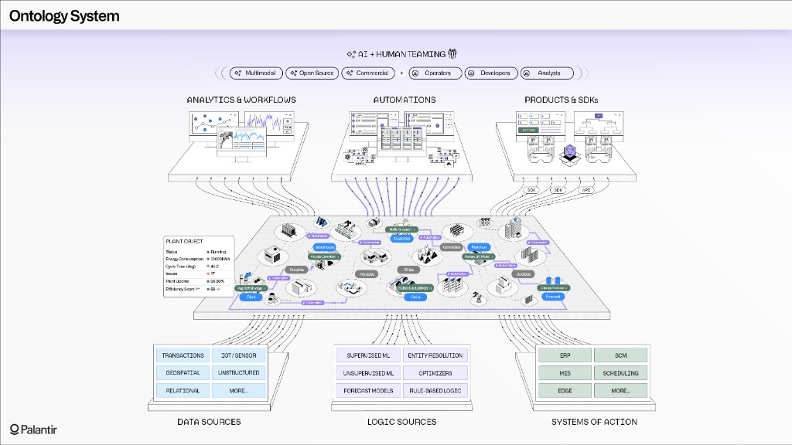
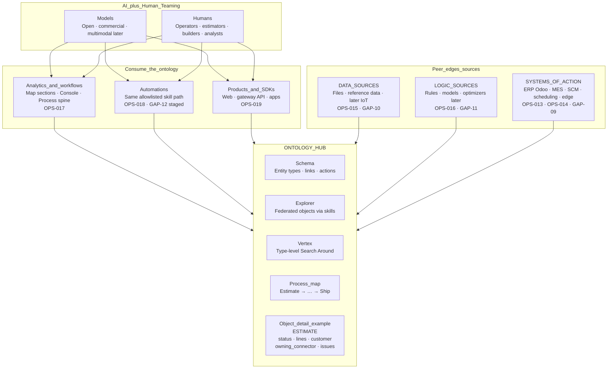
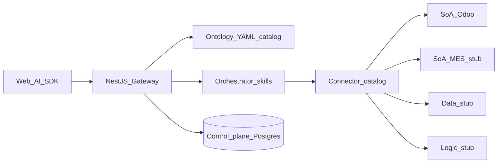

# Ontology system pattern — ControlPanelOntology (Foundry-shaped)

**Audience:** ConOps readers, buyers who know Palantir Foundry, builders  
**Status:** Pattern alignment (design intent) — not feature parity with Foundry  
**Pairs with:** [ControlPanelOntology_ConOps](./ControlPanelOntology_ConOps.md) · [Component_Map](../TSD/Component_Map.md) · [Capability_Model](../TSD/Capability_Model.md) · [Messaging_Ontology_and_AI](../Guides/Messaging_Ontology_and_AI.md)

This note places our product on the **same architectural separations** as the Foundry “Ontology System” diagram: sources at the bottom, **ontology hub** in the middle, analytics / automations / products above, **AI + human teaming** on top.

---

## 1. Reference (Foundry Ontology System)

Industry pattern we are **shaped like** — not cloning.



*Source image stored in this folder for ConOps / sales alignment. Palantir trademarks remain theirs; we claim **Foundry-shaped** practice only.*

---

## 2. Our diagram — same pattern, manufacturing scope



**ASCII twin** (for decks that cannot render Mermaid):

```text
                    AI + HUMAN TEAMING
         Models (classify → allowlisted skills)  ·  Operators / builders
                              │
     ┌────────────────────────┼────────────────────────┐
     │                        │                        │
     ▼                        ▼                        ▼
 Analytics & workflows    Automations            Products & SDKs
 (Map · Console · Process) (same skill path)     (Web · API · apps)
     │                        │                        │
     └────────────────────────┼────────────────────────┘
                              ▼
 ┌────────────────────────────────────────────────────────┐
 │              ONTOLOGY  (hub — product-owned)           │
 │  Schema · Explorer · Vertex · Process                  │
 │  Objects: Estimate, MO, Inventory, QC, Document, …     │
 │  Links · Actions → allowlisted skills                  │
 │  Example object: Estimate { status, lines, owner peer }│
 └────────────────────────────────────────────────────────┘
                              ▲
     ┌────────────────────────┼────────────────────────┐
     │                        │                        │
     ▼                        ▼                        ▼
  DATA SOURCES           LOGIC SOURCES           SYSTEMS OF ACTION
  file / ref data        rules / models          ERP (Odoo #1)
  (stubs → live)         (stubs → live)          MES · SCM · edge
```

---

## 3. Pattern map — Foundry layer → our design

| Foundry diagram layer | Same separation in ControlPanelOntology | Our realization (honest) |
|-----------------------|-------------------------------------------|---------------------------|
| **AI + human teaming** | AI and humans share one path | Intent classify → allowlisted skill; OPS-020 |
| **Analytics & workflows** | Consume ontology, not raw ERP | Map sections, Console, Process; OPS-017 staged |
| **Automations** | Same actions as humans | Tasks / skill path; OPS-018 · GAP-12 |
| **Products & SDKs** | Apps call hub, not vendor RPC | Next.js + gateway API; OPS-019 |
| **Ontology (center)** | Types, links, actions, exploration | SAC-006 · `/ontology` Schema / Explorer / Vertex / Process |
| **Object properties** | Readable business object | e.g. Estimate properties + `owning_connector_id` |
| **Data sources** | Enrich / bind without owning SoA | Catalog `file_reference_data` stub · OPS-015 |
| **Logic sources** | Rules / ML as peers | Catalog `rules_logic_simulate` · OPS-016 |
| **Systems of action** | ERP, MES, SCM, … write/read peers | Odoo live wedge · MES stub · OPS-013/014 |
| **Connectors** | ACL / anti-corruption to peers | `bindings/<connector>/` · SAC-005 |

We **do** keep the Foundry **separations**. We **do not** claim Foundry’s twin scale, Workshop/Quiver builders, or geospatial (GAP-01, GAP-07, GAP-08).

---

## 4. Object callout — manufacturing (not plant twin)

Foundry shows a **Plant** object with industrial properties. Our reference shop centers **manufacturing objects** on the same idea:

| Field idea | Example on **Estimate** (reference shop) |
|------------|------------------------------------------|
| Identity | Estimate id / number |
| Status | draft / sent / won … |
| Business facts | Customer, lines, totals |
| Issues | Estimate-issues path (GAP-02 when built) |
| Ownership | Properties bound to **owning peer** (Odoo SoA #1 today) |
| Actions | → allowlisted skills only |

Other types on the map: Quote, Sales order, Purchase order, Manufacturing order, Shop floor job, Inventory item, Quality check, SCT document, Contact, Employee, Attendance — full manufacturing language, not Estimate-only.

---

## 5. Control-plane vs peers (how we implement the hub)



Peers stay **outside** Compose; the hub coordinates shop language. See [Component_Map](../TSD/Component_Map.md).

---

## 6. Packaging (same pattern, two SKUs)

Ontology pattern is identical for:

- **SaaS multi-tenant** — Offer A (`DEPLOYMENT_MODE=multi_tenant`)  
- **Dedicated single-tenant** — Offer B (multi-tenant features off)

[Product_Packaging_Tenancy](../Guides/Product_Packaging_Tenancy.md)

---

## Related

- [Foundry_Ontology_System_Reference.png](./Foundry_Ontology_System_Reference.png)  
- [ControlPanelOntology_ConOps](./ControlPanelOntology_ConOps.md)  
- [Value_Proposition_and_Market_Fit](./Value_Proposition_and_Market_Fit.md)  
- Connector catalog: `resources/packages/ontology/catalog/connectors.yaml`
