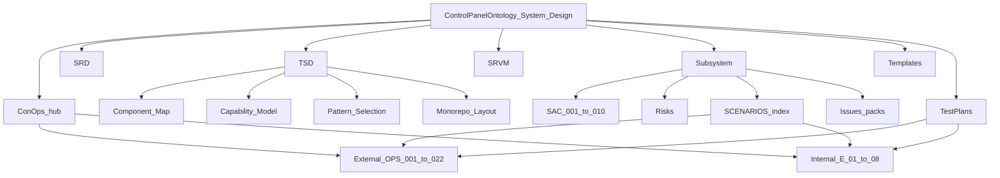

# Document tree (three levels)

Top-down map of `docs/System_Design/`.



```text
System_Design/
├── README.md
├── DOCUMENT_TREE.md
├── ConOps/          ← hub ConOps; OPS external / E internal
├── SRD/
├── SRVM/
├── TSD/             ← parent TSD, Capability_Model, Component_Map, Pattern_Selection
├── Subsystem/       ← SAC-*, SCENARIOS, Risks, Issues
├── Templates/       ← v1.1 ConOps/SRD/TSD/Scenario/Issue/Test (ontology hub)
└── TestPlans/       ← OPS-001…022, E-01…08
```

**Pack home:** [README.md](./README.md)  
**Architecture picture:** [TSD/Component_Map.md](./TSD/Component_Map.md)
