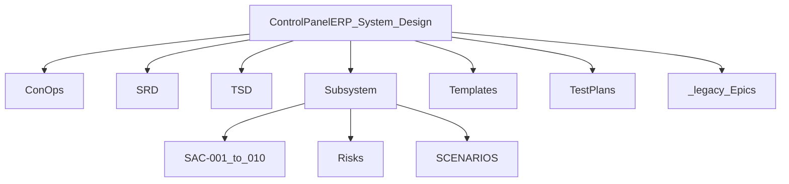

# Document tree (three levels)

Top-down map of `docs/System_Design/`.



```text
System_Design/
├── README.md
├── DOCUMENT_TREE.md
├── ConOps/ControlPanelERP_ConOps.md
├── SRD/ControlPanelERP_SRD.md
├── TSD/ControlPanelERP_TSD.md
├── TSD/Pattern_Selection.md
├── TSD/Monorepo_Layout.md
├── Subsystem/ (SAC-*, Risks, SCENARIOS, …)
├── Templates/
├── TestPlans/
│   └── OPS-001…007, E-01/
└── _legacy/Epic-01 … Epic-07/
```

**Pack home:** [README.md](./README.md)
