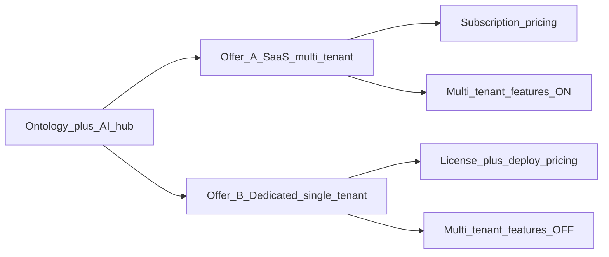

# Product packaging — SaaS multi-tenant vs dedicated single-tenant

**Status:** Specified in V-Model (**Open** for implementation / TR)  
**Audience:** product, sales, pricing, SAC-009 deploy, V&V  
**Code:** do **not** implement full multi-tenant SaaS isolation yet — env stub (`DEPLOYMENT_MODE`) only; see [Deployment_Tenancy_Env](../Subsystem/SAC-009/Guides/Deployment_Tenancy_Env.md)

This guide locks **two commercial offers** of the same Ontology + AI product. Difference is mainly **tenancy features + pricing / contract**, not a second product brain.

---

## 1. Two offers (same hub)

| Offer | Commercial shape | Deploy | Multi-tenant features |
|-------|------------------|--------|------------------------|
| **A — SaaS (multi-tenant)** | Hosted subscription; shared control-plane platform | `DEPLOYMENT_MODE=multi_tenant` | **Available** — tenant switch / isolate, platform admin, usage metering (future) |
| **B — Dedicated (single-tenant)** | License + deploy (customer cloud or our dedicated stack) | `DEPLOYMENT_MODE=single_tenant` | **Not available** — no tenant switcher, no other-tenant APIs, no platform multi-shop admin; **pricing** is dedicated SKU |

**Same for both:** ontology hub, allowlisted skills, peer connectors, Schema / Explorer / Vertex / Process, Ontology + AI path, product-owned rebind (`DEPLOYMENT_PROFILE`).

**Different:** tenancy **entitlements**, isolation expectations, **price list / SKU**, who operates the stack.

---

## 2. What “multi-tenant features” means (entitlement)

When Offer A is licensed, the product **MAY** expose (when built and TR-closed):

| Feature family | Intent |
|----------------|--------|
| Tenant context | Resolve / require `X-Tenant-Id` (or session tenant) |
| Isolation | Control-plane data partitioned by tenant (future DB / RLS) |
| Tenant admin | Invite users to a tenant; list tenants for platform ops |
| Metering | Usage per tenant for billing |
| Cross-tenant deny | Actor of tenant A cannot read tenant B |

When Offer B is licensed / deployed:

| Rule | Intent |
|------|--------|
| **Entitlement OFF** | UI and API **MUST NOT** advertise or enable multi-tenant admin, tenant picker, or cross-tenant APIs |
| **One `TENANT_ID`** | Stack is that customer only; header override ignored or rejected |
| **Pricing** | Quotes as **dedicated** (higher unit price, optional support / rebind services) — not SaaS seat pack |

Pricing is a **commercial** concern; engineering enforces **feature availability** via deployment mode + future license/entitlement config — not by forking the monorepo.

---

## 3. V-Model map (no code yet)

| Layer | Artifact |
|-------|----------|
| **ConOps** | § packaging / offers — [ControlPanelOntology_ConOps](../ConOps/ControlPanelOntology_ConOps.md) §12–13 |
| **Market** | [Value_Proposition_and_Market_Fit](../ConOps/Value_Proposition_and_Market_Fit.md) |
| **SRD** | **SRD-TEN-001…004** — [ControlPanelOntology_SRD](../SRD/ControlPanelOntology_SRD.md) · SAC-009 **SRD-DEP-010…012** |
| **TSD / env** | [Deployment_Tenancy_Env](../Subsystem/SAC-009/Guides/Deployment_Tenancy_Env.md) · [Capability_Model](../TSD/Capability_Model.md) |
| **Scenarios** | [OPS-023](../Subsystem/SAC-009/Scenarios/OPS-023.md) dedicated · [OPS-024](../Subsystem/SAC-009/Scenarios/OPS-024.md) SaaS |
| **Test plans** | [TP-OPS-023](../TestPlans/OPS-023/TP-OPS-023.md) · [TP-OPS-024](../TestPlans/OPS-024/TP-OPS-024.md) — **Open** |
| **Risks** | GAP-13 (SaaS isolation runtime) · RISK-04 (rebind services) · RISK-05 (pricing vs entitlement mismatch) |

**Build order (later):** entitlement gate from `DEPLOYMENT_MODE` → row-level tenant on CP data → SaaS admin UI → metering. Do not claim OPS-023/024 closed until TR.

---

## 4. Sales / quote talk track

| Buyer | Say |
|-------|-----|
| Wants **hosted, many shops, subscription** | Offer A — SaaS multi-tenant; multi-tenant features **included** in that SKU |
| Wants **our plant only, private deploy, no other customers on the box** | Offer B — dedicated single-tenant; **same Ontology + AI**, multi-tenant features **not in SKU**; priced as deploy + license (+ rebind services) |
| Asks “is this different software?” | **No** — same hub; **mode + entitlements + price list** differ |

---

## Related

- [RISK-04](../Subsystem/Risks.md) · [RISK-05](../Subsystem/Risks.md)  
- [Wedge_Demo_and_Replication](./Wedge_Demo_and_Replication.md) §5  
- Env stub already in repo: `DEPLOYMENT_MODE` / `TENANT_ID` / `DEPLOYMENT_PROFILE`
