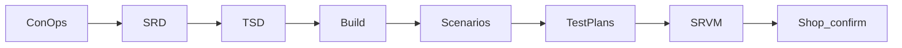
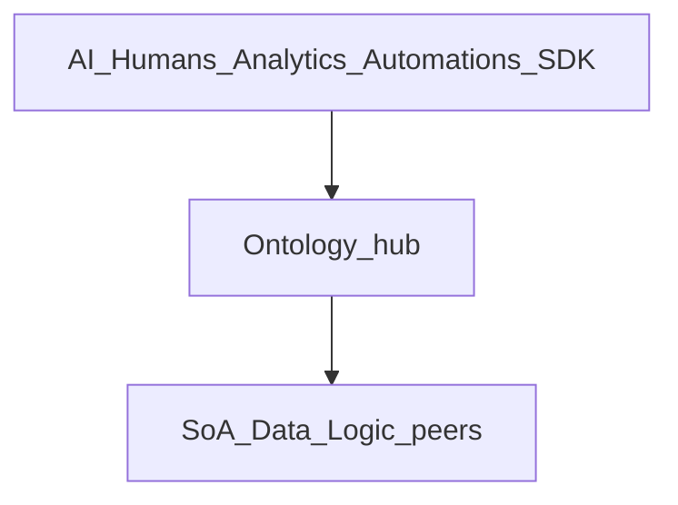

# ControlPanelOntology — System Design Pack

Friendly V-Model docs for **Ontology + AI** on a **Foundry-shaped control plane**: an **ontology hub** with peer edges (systems of action, data, logic), governed actions → allowlisted skills → first-party connectors. We use that **class of practices** — we do **not** clone Palantir Foundry feature-for-feature. External copy: [Messaging_Ontology_and_AI](Guides/Messaging_Ontology_and_AI.md).

**Reference shop:** a small **carbide-tool** manufacturer — full ops map (make, QC, inventory, ship, documents, …). Product scope is **manufacturing end-to-end** and **multi-peer** edges; **Odoo** is the **first live SoA peer** on that reference deployment, not the product boundary.

**Replicable:** the same hub, V-Model, and patterns can be **re-bound** for another company (new entity types, bindings, connectors) without redesigning the control plane. How we build: [Pattern_Selection](TSD/Pattern_Selection.md) + Software Patterns Docs — not ad-hoc architecture.

**Names:** pack/product **ControlPanelOntology** · UI **Map** (legacy label may still say “ERP Map”) · repo may still be ControlPanelERP.

## How we work (V-Model)



```text
ConOps → SRD → TSD → Build
     → Check with scenarios & test plans → Confirm in the real shop
```



Trace rule: **requirement → scenario → test plan** (scenarios stay **Open** until SRVM evidence).

## Documents

| Document | What it answers | Path |
|----------|-----------------|------|
| **ConOps** | Ontology hub ops; external OPS + internal E scenarios | [ConOps/ControlPanelOntology_ConOps.md](ConOps/ControlPanelOntology_ConOps.md) |
| **Ontology pattern** | Foundry reference image + our layer diagram | [ConOps/Ontology_System_Pattern.md](ConOps/Ontology_System_Pattern.md) |
| **SRD** | What the system SHALL do (testable; multi-SoA) | [SRD/ControlPanelOntology_SRD.md](SRD/ControlPanelOntology_SRD.md) |
| **Parent TSD** | How we design and build it | [TSD/ControlPanelOntology_TSD.md](TSD/ControlPanelOntology_TSD.md) |
| **Pattern selection** | Which patterns we use (agent entry: impact / risk / Diff) | [TSD/Pattern_Selection.md](TSD/Pattern_Selection.md) |
| **Capability model** | Robust enough: multi-edge SPI, no twin, product rebind | [TSD/Capability_Model.md](TSD/Capability_Model.md) |
| **Ontology + AI messaging** | Hero, FAQ, say/don’t-say | [Guides/Messaging_Ontology_and_AI.md](Guides/Messaging_Ontology_and_AI.md) |
| **Product packaging** | SaaS vs dedicated SKUs; multi-tenant features ON/OFF | [Guides/Product_Packaging_Tenancy.md](Guides/Product_Packaging_Tenancy.md) |
| **Wedge & demos** | Demo script, replication SOW | [Guides/Wedge_Demo_and_Replication.md](Guides/Wedge_Demo_and_Replication.md) |
| **Component map** | Ontology hub + peer edges picture | [TSD/Component_Map.md](TSD/Component_Map.md) |
| **Monorepo layout** | Apps / packages / Compose shape | [TSD/Monorepo_Layout.md](TSD/Monorepo_Layout.md) |
| **Subsystems (SAC)** | Each major piece of the product | [Subsystem/README.md](Subsystem/README.md) |
| **Risks / gaps** | What’s deferred or only partly done | [Subsystem/Risks.md](Subsystem/Risks.md) |
| **Scenarios** | External OPS-001…022 + internal E-01…08 (**all Open**) | [Subsystem/SCENARIOS.md](Subsystem/SCENARIOS.md) |
| **SRVM** | Requirement → scenario → test evidence | [SRVM/ControlPanelOntology_SRVM.md](SRVM/ControlPanelOntology_SRVM.md) |
| **Test plans** | How we check those stories | [TestPlans/README.md](TestPlans/README.md) |
| **Templates** | Blank forms for new docs | [Templates/README.md](Templates/README.md) |
| **Document tree** | Map of this pack | [DOCUMENT_TREE.md](DOCUMENT_TREE.md) |
| **GitHub** | Project + OPS/E issues (ScaleCC selection) | [controlPanelErpOdoo issues](https://github.com/llanesleonardo/controlPanelErpOdoo/issues) |

## Honest progress

| Side | Status |
|------|--------|
| Left (ConOps / SRD / TSD) | **Draft 0.3–0.4** — hub ConOps + SRD; parent TSD 0.4 + SAC TSDs aligned to OPS-001…022 / E-01…08 |
| Build (apps) | Partial progress on ERP peer wedge + ontology UI — **does not close** scenarios |
| Right (tests / SRVM) | **All Open** until TR evidence |
| Gaps | See [Risks](Subsystem/Risks.md) — progress ≠ scenario closure |

## Living process

Author under ConOps / SRD / TSD and [Subsystem/SAC-*](Subsystem/). Component diagrams: [TSD/Component_Map.md](TSD/Component_Map.md). **This pack is the living process.**

## Sibling docs

- [User Guide](../User_Guide/) — how the shop uses the panel  
- [Software Patterns Docs](../Software%20Patterns%20Docs/) — synced library (**by type**). For agents: start at [Pattern_Selection](TSD/Pattern_Selection.md) (impact / risk / Diff), then one pattern file. **Recognition examples** → [`recognition_examples/`](../Software%20Patterns%20Docs/recognition_examples/); **composition problems** → [`composition_problems/`](../Software%20Patterns%20Docs/composition_problems/) (problems / concerns / exercises; skip exercises for implementation).  
- Runtime / Compose: [SAC-009](Subsystem/SAC-009/README.md)  
