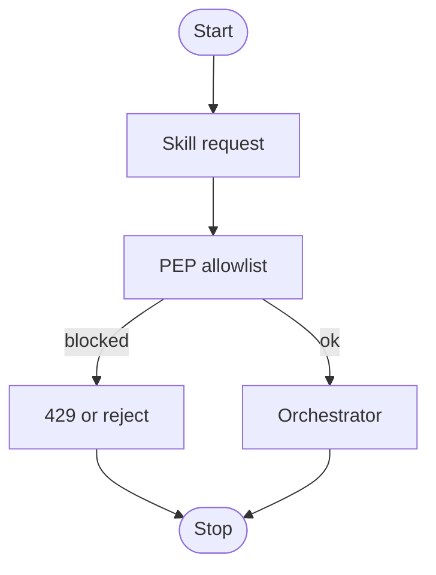

# Flow — OPS-012 allowlist reject

```mermaid
flowchart TD
  Start([Start]) --> Req[Skill request]
  Req --> GW[PEP allowlist]
  GW -->|blocked| Rej[429 or reject]
  GW -->|ok| Orch[Orchestrator]
  Rej --> Stop([Stop])
  Orch --> Stop
```
