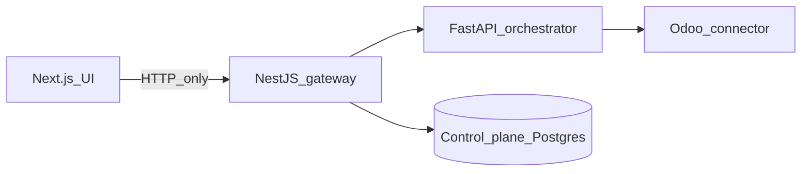

# SAC-001 — Technical Design (TSD)

How the NestJS gateway sits between shop screens and the rest of the control plane — without putting ERP quirks in the UI.

Parent: [ControlPanelERP_TSD](../../TSD/ControlPanelERP_TSD.md) · Patterns: [Pattern_Selection](../../TSD/Pattern_Selection.md) (API Gateway, BFF, Allowlist / PEP, Rate Limiting, Correlation Id).

## Model



1. Browser / future agents → **gateway only**.
2. Gateway applies actor stub, correlation, rate limit, allowlist/policy.
3. Allowlisted skills → orchestrator; tasks/logs/ontology → Postgres + ontology packages.
4. Odoo stays behind the connector (SAC-005).

## Stack

| Piece | Choice |
|-------|--------|
| Runtime | NestJS in `apps/gateway` |
| Packages | Ontology + contracts from `resources/packages/` (image copies into `packages/*`) |
| Downstream | Orchestrator HTTP client; Prisma → control-plane Postgres |
| Auth today | Header stub — **not** session/JWT yet |
| Auth planned | HTTP-only session cookie preferred for browser BFF; JWT optional for non-browser clients |

## Middleware and guards (order of concerns)

| Concern | Where | Behavior |
|---------|--------|----------|
| Correlation + actor | `RequestContextMiddleware` | Read/generate `X-Correlation-Id`; set `X-Actor-Id` or default `dev-operator`; ALS for structured logs |
| Rate limit | `ActorRateLimitGuard` (Nest Throttler) | Tracker `actor:{id}` else `ip:{addr}`; **429** body with clear message |
| Actor (legacy path) | `ActorMiddleware` / same header contract | Same default actor id |

Env (see `.env.example`):

```
RATE_LIMIT_WINDOW_MS=60000
RATE_LIMIT_MAX=100
GATEWAY_JWT_SECRET=   # reserved for later auth
```

Misconfigured zero/negative limits SHOULD fail safe to documented defaults at startup.

## Allowlist source

**Product-owned code**, not operator free text:

| Surface | Source today | On reject |
|---------|--------------|-----------|
| Live Explorer / object list | `LIVE_READ_SKILLS` in gateway ontology service (e.g. `sales.estimate.read`) | Demo / simulate rows + clear message that skill is not allowlisted |
| Skill execute path | Gateway forwards intent/skill codes; only certified codes may touch live ERP via orchestrator + connector | Reject or dry-run / non-live path per skill policy |
| Taxonomy | `@control-panel-erp/contracts` + ontology actions | Unknown codes fail classify / fail closed |

Pattern: **Allowlist + Policy Enforcement Point** at the gateway — UI never invents Odoo RPC.

## Auth stub → real auth

**v1 stub**

- Header: `X-Actor-Id` (UI sends `dev-operator` by default via `apps/web/lib/api.ts`).
- No password login; no role gates on routes yet.

**Planned (control-plane DB, not Odoo)**

| Entity | Fields (sketch) |
|--------|-----------------|
| User | id, email, password_hash, display_name, status, theme_preference?, created_at |
| Role | `admin` \| `manager` \| `operator` \| `viewer` |
| UserRole | user_id, role_id |

Planned routes: `POST /auth/login`, `POST /auth/logout`, `GET /auth/me`, admin `GET/POST/PATCH /users`, `GET /roles`. Admin CRUD, disable, role assign. Unauthorized → 401; missing role → 403 + audit when logging exists.

## Key API surface (gateway)

| Call | Purpose |
|------|---------|
| `GET /health` | Smoke |
| `GET /ontology`, `/ontology/entity-types/:id`, `/ontology/objects` | Catalog + Explorer BFF |
| `POST /intents/classify` | Taxonomy map (no free-form tools) |
| `POST /skills/execute` | Allowlisted skill run |
| `POST /tasks`, approve/reject | Queue BFF (SAC-007) |
| Logs query | Filter by correlation_id |

## Hardening (later)

- Replace stub with session auth; drop trusting raw `X-Actor-Id` from the public internet
- Per-route role guards
- Optional Redis only if multi-replica shared rate-limit buckets are required
- Defense in depth with dry-run + approval (SAC-007) — not instead of allowlist

## Legacy sources

`_legacy/Epic-01/phase-02/task-01-auth-users-roles` · `_legacy/Epic-01/phase-03/task-04-rate-limiting` · `_legacy/Epic-03/phase-01/task-02-rate-limiting`
