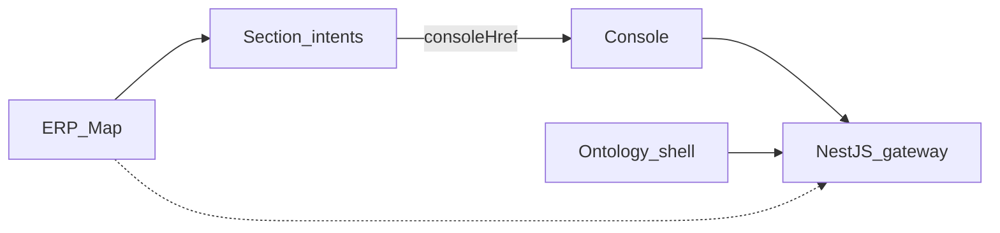

# SAC-002 — Technical Design (TSD)

How Next.js screens help a carbide shop pick intents and run work through the gateway — without ERP quirks in the browser.

Parent: [ControlPanelERP_TSD](../../TSD/ControlPanelERP_TSD.md) · Patterns: [Pattern_Selection](../../TSD/Pattern_Selection.md) (Client-Server, BFF, Observer for fetch/status).

## Model

UI composition stays in `apps/web`. Data plane stays behind SAC-001.

## Stack

| Piece | Choice |
|-------|--------|
| App | Next.js App Router — `apps/web` |
| Shell | `AppShell` — main nav, theme toggle, intents rail on `/sections/*` |
| Section catalog | `apps/web/lib/erp-sections.ts` |
| Intent catalog | `apps/web/lib/section-intents.ts` — `resolveIntentDetail`, `classifyIntentProfile`, `consoleHrefForIntent` |
| API client | `apps/web/lib/api.ts` — gateway base URL + `X-Actor-Id` / correlation |
| Theme | `data-theme` on `<html>`; `localStorage` key `cp-theme`; CSS variables in `globals.css` |

## Routes

| Route | Role |
|-------|------|
| `/` | ERP Map — `ErpAppsGrid` module tiles |
| `/sections/[slug]` | Section workspace + intent detail; dual sidebar |
| `/console` | Request console — classify + create task |
| `/tasks`, `/tasks/[id]` | Task queue UI |
| `/logs` | Structured logs UI |
| `/ontology` | Tab host: Schema / Explorer / Vertex / Process map |
| `/integrations/odoo` | Connector settings UI (SAC-005) |
| `/profile` | Planned with auth |

## ERP Map and section shell

- Home tiles link to `/sections/:slug` for every mapped module.
- On section routes only: **IntentRail** (search label/code/status/difficulty; collapsible). Mobile: intents from top bar.
- Intent rail offset tracks main sidebar collapsed width.
- Section accordion stays open when path starts with `/sections`.
- Guardrail: no Odoo credentials or free-form RPC in map/section UI.

## Intent catalog and profiles

Difficulty classes (deterministic):

| Class | Meaning | Example |
|-------|---------|---------|
| `simple` | Single fetch | `sales.estimate.read` |
| `structured` | Typed mutate | `sales.quotation.create` |
| `diagnostic` | Multi-read + rules | `sales.estimate.find_issues` |
| `nl_compose` | NL → grounded extract → write | `sales.estimate.create_from_text` |

Default call-path sketch (UI copy): `intent` → `POST /skills/execute` (or dry-run) → connector → ERP. Taxonomy codes stay `{domain}.{entity}.{verb}`. Extend catalogs in code / contracts — do not invent codes in the browser.

## Request console

- Fields: intent text / code, domain, execution mode (`dry_run` | `commit`), optional structured payload.
- Actions: Classify → review `intent_code` → Confirm create task.
- Gateway: `POST /intents/classify` (contracts taxonomy), `POST /tasks` (`pending` or `needs_approval` for high-risk commit intents such as stock adjust / invoice post — policy with SAC-007).
- Prefill via query: `consoleHrefForIntent(code)` → `/console?intent_code=&domain=`.

## Ontology UI shell

`/ontology` hosts four tabs; SAC-006 owns catalog semantics and live Explorer. SAC-002 ensures nav entry, layout chrome, and gateway fetches only.

## Theme and profile

| Concern | v1 | Later |
|---------|----|--------|
| Theme | Toggle in shell; `light` \| `dark`; localStorage | Optional `system`; `User.theme_preference` via `PATCH /profile` |
| Profile | Not required for Map/Console | `/profile` — display_name, roles, password change; `GET/PATCH /profile`, `POST /profile/password` |

If profile save fails after auth exists: keep local theme preference and show a non-blocking warning.

## Hardening / UX notes

- Keep black-on-black dark shell consistent with shipped Epic-05 tokens; avoid purple-default AI chrome when extending styles.
- Progressive disclosure: intents rail only on section routes.
- All `gatewayFetch` calls go to NestJS — never to Odoo.

## Legacy sources

`_legacy/Epic-01/phase-02/task-02-profile-page` · `_legacy/Epic-01/phase-02/task-03-dark-light-theme` · `_legacy/Epic-01/phase-03/task-01-request-console` · `_legacy/Epic-03/phase-01/task-03-request-console` · `_legacy/Epic-05/phase-01/task-01-erp-map-and-section-shell` · `_legacy/Epic-05/phase-01/task-02-intent-catalog-and-profiles`
