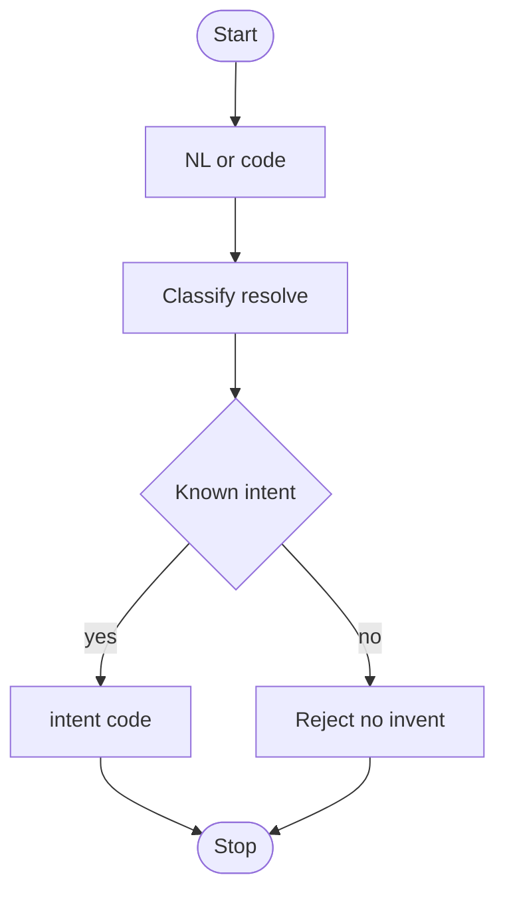

# Flow — OPS-010 taxonomy resolve

```mermaid
flowchart TD
  Start([Start]) --> Text[NL or code]
  Text --> Cls[Classify resolve]
  Cls --> Known{Known intent}
  Known -->|yes| Code[intent code]
  Known -->|no| Fail[Reject no invent]
  Code --> Stop([Stop])
  Fail --> Stop
```
