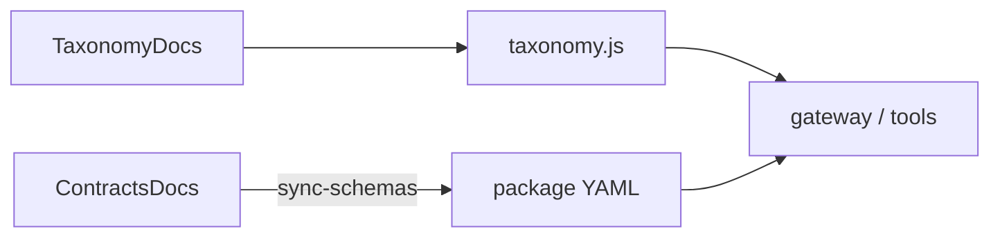

# SAC-003 — Technical Design (TSD)

How we keep one shared dictionary for shop intents and action contracts — without putting ERP quirks in the UI.

## Model

1. **Author** vocabulary and sample YAML under [Authoring/](./Authoring/) (TaxonomyDocs + ContractsDocs).
2. **Sync** ContractsDocs YAML into `resources/packages/contracts`.
3. **Hand-maintain** `taxonomy.js` constants to match TaxonomyDocs (no codegen required for v1).
4. **Consume** via `@control-panel-erp/contracts` from gateway / tools; orchestrator skills key off the same intent codes.

Parent: [ControlPanelERP_TSD](../../TSD/ControlPanelERP_TSD.md) · Patterns: [Pattern_Selection](../../TSD/Pattern_Selection.md) · Layout: [Monorepo_Layout](../../TSD/Monorepo_Layout.md).

## Authoring (canonical)

| Path | Role |
|------|------|
| [Authoring/TaxonomyDocs/](./Authoring/TaxonomyDocs/) | Domains, verbs, states, errors, approval levels, intent shape |
| [Authoring/TaxonomyDocs/vocabulary.md](./Authoring/TaxonomyDocs/vocabulary.md) | Expanded dictionary + skill ↔ task family sketch |
| [Authoring/ContractsDocs/](./Authoring/ContractsDocs/) | Sample YAML — Intent / Task / Skill oriented |
| [Authoring/ContractsDocs/schemas/common.yaml](./Authoring/ContractsDocs/schemas/common.yaml) | ResultState, ErrorClass, Observability, ExecutionMode, AuditEnvelope |
| `sales.yaml` / `inventory.yaml` / `accounting.yaml` | Sample operations |

Contract types (docs): **Intent** (human request → code), **Task** (normalized job), **Skill** (bounded execution), **Audit / Incident** (evidence / remediation).

## Package layout

```
resources/packages/contracts/
  package.json                 # @control-panel-erp/contracts
  README.md
  src/
    index.js                   # re-exports
    taxonomy.js                # DOMAINS, ENTITIES, VERBS, … KNOWN_INTENT_CODES
    loadContract.js            # load by name or intent_code
  schemas/
    common.yaml                # synced from Authoring
  sales.yaml
  inventory.yaml
  accounting.yaml
  scripts/
    sync-schemas.mjs           # copy Authoring → package
  test/
    smoke.mjs
```

Workspace name: `@control-panel-erp/contracts`.

## Taxonomy module (`taxonomy.js`)

Exports (frozen arrays / helpers):

| Export | Purpose |
|--------|---------|
| `DOMAINS`, `ENTITIES`, `VERBS` | Controlled vocabulary |
| `RESULT_STATES`, `ERROR_CLASSES`, `APPROVAL_LEVELS` | Outcome / policy vocabulary |
| `KNOWN_INTENT_CODES` | Published codes (reads + sample writes) |
| `intentCode(domain, entity, verb)` | Build a code string |
| `isKnownIntentCode(code)` | Membership check |

Known codes include sample Authoring ops plus shop reads used by live skills (e.g. `sales.estimate.read`). Adding a new executable op: update TaxonomyDocs → add to `KNOWN_INTENT_CODES` → add/update ContractsDocs → sync → (later) allowlist skill in SAC-004.

## Contract load helper

`loadContract(nameOrIntent)` resolves:

- Short names: `common`, `sales`, `inventory`, `accounting`
- Intent codes mapped today: `sales.order.create` → sales, `inventory.stock.adjust` → inventory, `accounting.invoice.post` → accounting

Uses `js-yaml`. Invalid / unknown names throw a clear error. Smoke test parses all four documents and asserts sample codes exist.

## Sync flow

```bash
# After editing Authoring/ContractsDocs/*.yaml
npm run contracts:sync -w @control-panel-erp/contracts
# or
npm run sync-schemas -w @control-panel-erp/contracts
```

`scripts/sync-schemas.mjs` copies from:

`docs/System_Design/Subsystem/SAC-003/Authoring/ContractsDocs/`

into the package paths above. Taxonomy constants are **not** codegen’d — update `taxonomy.js` by hand when VocabularyDocs change.



## Relation to runtime

| Consumer | Use |
|----------|-----|
| Gateway | Intent classify / allowlist checks against known codes |
| Orchestrator (SAC-004) | Skill allowlists keyed by intent code |
| Ontology (SAC-006) | Actions may point at the same skill codes |
| Connectors (SAC-005) | Map codes → vendor calls behind ACL |

ERP field names and JSON-RPC stay in connectors — not in taxonomy YAML.

## Smoke / CI

```bash
npm test -w @control-panel-erp/contracts
```

Asserts domains include `sales`, known codes include the three sample writes, and YAML loads.

## Legacy sources

`_legacy/Epic-01` phase-01 task-01 taxonomy-vocabulary · task-02 api-contracts-samples · `_legacy/Epic-02` phase-01 task-01 taxonomy-package · task-02 contracts-package
