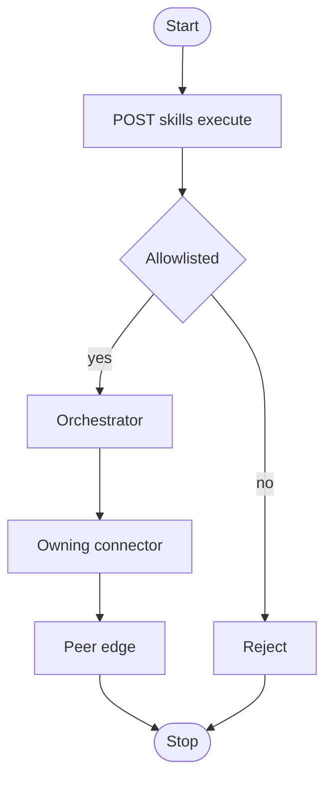

# Flow — OPS-008 skills execute

```mermaid
flowchart TD
  Start([Start]) --> Exec[POST skills execute]
  Exec --> Allow{Allowlisted}
  Allow -->|no| Rej[Reject]
  Allow -->|yes| Orch[Orchestrator]
  Orch --> Cat[Owning connector]
  Cat --> Edge[Peer edge]
  Edge --> Stop([Stop])
  Rej --> Stop
```
