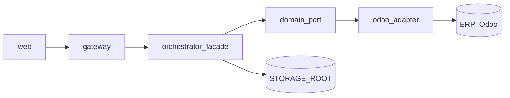

# SAC-004 — Technical Design (TSD)

How the skills engine runs certified actions next to the shop’s ERP without exposing Odoo (or this service) to the browser.

## Model

1. **Gateway** accepts operator/API requests, enforces allowlist/PEP, forwards to orchestrator.
2. **Orchestrator** (`apps/orchestrator`) FastAPI facade: intent → allowlisted skill → port → adapter.
3. **Adapters** talk to Odoo (connector #1) or simulate; map to domain DTOs / evidence.
4. **Evidence** JSON lands under `STORAGE_ROOT`; tasks/logs live in the control-plane DB (SAC-007).

Parent: [ControlPanelERP_TSD](../../TSD/ControlPanelERP_TSD.md) · Patterns: [Pattern_Selection](../../TSD/Pattern_Selection.md) · Vocabulary: [SAC-003](../SAC-003/TSD.md) · Connector: [SAC-005](../SAC-005/README.md).

## Patterns applied

| Pattern | Where |
|---------|--------|
| Facade | `SkillExecutionFacade` — single entry for dry-run / execute |
| Hexagonal | Ports in `app/ports/domain.py`; adapters under `app/adapters/` |
| Anti-Corruption Layer | Odoo models/fields stay in adapters |
| Circuit Breaker + Retry | Shared JSON-RPC helper in Odoo adapter |
| Correlation Identifier | Headers / body → evidence |
| Observability | Structured result + evidence files |

## Stack

| Piece | Choice |
|-------|--------|
| App | FastAPI in `apps/orchestrator` |
| Entry | `app/main.py` — `/health`, `/skills/dry-run`, `/skills/execute` |
| Facade | `app/facade.py` — `ALLOWLIST` + `EXECUTE_ALLOWLIST` |
| Ports | `InventoryPort`, `AccountingPort`, `EstimatePort`, evidence DTOs |
| Adapters | `OdooInventoryAdapter`, `OdooAccountingAdapter`, `OdooEstimateAdapter` |
| Storage | `app/storage.py` — `STORAGE_ROOT/evidence/…` |
| Env | `ERP_MODE` / `ODOO_MODE`, `ODOO_URL`, `ODOO_DB`, credentials, `STORAGE_ROOT` |
| Caller | Gateway `ORCHESTRATOR_URL` (e.g. `http://localhost:8000`) — **not** published to browsers |

## Layout

```
apps/orchestrator/
  README.md
  requirements.txt
  app/
    main.py              # FastAPI routes
    facade.py            # allowlists + skill handlers
    storage.py           # evidence under STORAGE_ROOT
    ports/domain.py      # ports + DTOs
    adapters/odoo_erp.py # Odoo ACL + circuit/retry
```

## Endpoints

| Method | Path | Role |
|--------|------|------|
| GET | `/health` | Status + storage check |
| POST | `/skills/dry-run` | Preview write skills — `{ intent_code, input, correlation_id?, actor_id? }` |
| POST | `/skills/execute` | Run execute-allowlisted skills (MVP read: `sales.estimate.read`) |

Headers: `X-Correlation-Id`, `X-Actor-Id` (fallback if not in body).

Unknown allowlist miss → HTTP 400 with `error_class: validation_error` — no ERP call.

## Skill allowlists (MVP)

### Dry-run (`ALLOWLIST`)

| intent_code | skill_id | Behavior |
|-------------|----------|----------|
| `inventory.stock.adjust` | `inventory.stock.adjust.simulate` | Predict stock delta; **no** stock write |
| `accounting.invoice.post` | `accounting.invoice.post.simulate` | Predict post eligibility; **no** `action_post` |

### Execute (`EXECUTE_ALLOWLIST`)

| intent_code | skill_id | Behavior |
|-------------|----------|----------|
| `sales.estimate.read` | `sales.estimate.read` | Read estimate rows (simulate stubs or live `customer.estimate`) |

Growing the engine = add taxonomy/contract (SAC-003) → register allowlist entry → implement port method → adapter. No free-form skill invention.

## ERP / Odoo mode

```text
ERP_MODE (preferred) or ODOO_MODE → "live" | "simulate" (default)
```

| Mode | Behavior |
|------|----------|
| `simulate` | Adapters return predicted / stub data; useful without live Odoo |
| `live` | JSON-RPC to `ODOO_URL` with DB + credentials |

Circuit: after repeated failures, breaker opens (~3 failures / ~30s cool-down); retries use short backoff (bounded attempts).

## Evidence shape (dry-run)

```json
{
  "ok": true,
  "intent_code": "inventory.stock.adjust",
  "skill_id": "inventory.stock.adjust.simulate",
  "correlation_id": "…",
  "actor_id": "…",
  "predicted_effects": [ … ],
  "warnings": [ … ],
  "mode": "dry_run",
  "adapter": "live|simulate",
  "evidence_path": "…/evidence/{correlation_id}/….json"
}
```

Execute results include columns/rows for table UIs (estimate read) plus the same correlation / adapter fields.

## Call path



Browser → gateway only. Orchestrator → Postgres optional for health/storage; ERP via connector URLs. Compose: orchestrator on internal network ([SAC-009](../SAC-009/TSD.md)).

## Commit / approval boundary

- Task queue approve/reject lives in gateway + SAC-007; Epic-03 approved tasks with `dry_run_only` without calling commit.
- Epic-04 locked: `execution_mode=commit` does **not** call orchestrator commit.
- Live write skills remain future work behind approval + dry-run.

## Connector SPI (skills-related)

First-party catalog: Odoo is `connector_id=odoo`. Each connector declares which skill codes it supports; UI/allowlist should not offer skills without a capable enabled connector ([Epic-06 SPI](../../_legacy/Epic-06/phase-01/task-01-connector-spi-and-catalog/)). Vendor payloads stay in adapters.

## Run (local)

```bash
cd apps/orchestrator
# venv + pip install -r requirements.txt
set STORAGE_ROOT=../../resources/storage/local
set ERP_MODE=simulate
uvicorn app.main:app --reload --port 8000
```

Or `npm run dev:orchestrator` from repo root.

## Legacy sources

`_legacy/Epic-01` phase-04 task-02 dry-run-execution-path · `_legacy/Epic-04` phase-01 task-03 dry-run-path · `_legacy/Epic-05` phase-01 task-03 live-estimate-read · `_legacy/Epic-03` task queue (gateway side; no orchestrator commit) · `_legacy/Epic-06` connector SPI · parent ConOps allowlisted skills / dry-run
