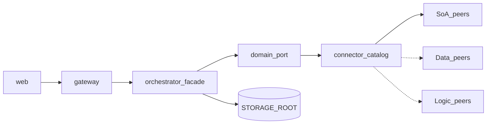

# SAC-004 — Technical Design (TSD)

How the **skills engine** runs certified actions against **any** owning connector peer — ERP SoA first among equals — without exposing vendor RPC to the browser.

Parent: [ControlPanelOntology_TSD](../../TSD/ControlPanelOntology_TSD.md) · Patterns: [Pattern_Selection](../../TSD/Pattern_Selection.md) · Vocabulary: [SAC-003](../SAC-003/TSD.md) · Catalog: [SAC-005](../SAC-005/TSD.md)  
**SRD:** SRD-SEC-001/003, SRD-ONT-005, SRD-EDGE-001/004 · **OPS:** 008, 013, 016 (all Open)

## Model

1. **Gateway** accepts requests, enforces allowlist/PEP, forwards to orchestrator.  
2. **Orchestrator** facade: intent/action → allowlisted skill → port → **catalog-selected** adapter.  
3. **Adapters** talk to SoA / data / logic peers (or simulate); map to domain DTOs + evidence.  
4. **Evidence** under `STORAGE_ROOT`; tasks/logs in control-plane DB (SAC-007).



## Patterns applied

| Pattern | Where |
|---------|--------|
| Facade | `SkillExecutionFacade` — dry-run / execute |
| Hexagonal | Ports in `app/ports/domain.py`; adapters under `app/adapters/` |
| Anti-Corruption Layer | Vendor models/fields stay in adapters |
| Semantic Routing | Ontology action / intent → skill code |
| Circuit Breaker + Retry | Shared helpers per connector |
| Correlation Identifier | Headers / body → evidence (`connector_id` when known) |

## Stack

| Piece | Choice |
|-------|--------|
| App | FastAPI in `apps/orchestrator` |
| Entry | `app/main.py` — `/health`, `/skills/dry-run`, `/skills/execute` |
| Facade | `app/facade.py` — `ALLOWLIST` + `EXECUTE_ALLOWLIST` |
| Ports | Domain ports + DTOs (Estimate, Inventory, …) |
| Adapters | Odoo adapters today; registry ready for other peers |
| Storage | `STORAGE_ROOT/evidence/…` |
| Env | `ERP_MODE` / `ODOO_MODE`, peer URLs, `STORAGE_ROOT` |
| Caller | Gateway `ORCHESTRATOR_URL` — **not** public to browsers |

## Endpoints

| Method | Path | Role |
|--------|------|------|
| GET | `/health` | Status + storage check |
| POST | `/skills/dry-run` | Preview write skills |
| POST | `/skills/execute` | Execute-allowlisted skills |

Unknown allowlist miss → HTTP 400 `validation_error` — **no** edge call.

## Skill allowlists (MVP)

### Dry-run (`ALLOWLIST`)

| intent_code | Behavior |
|-------------|----------|
| `inventory.stock.adjust` | Predict stock delta; no stock write |
| `accounting.invoice.post` | Predict post eligibility; no `action_post` |

### Execute (`EXECUTE_ALLOWLIST`)

| intent_code | Behavior |
|-------------|----------|
| `sales.estimate.read` | Read via ERP SoA peer (simulate or live) |

Growing the engine = taxonomy/contract (SAC-003) → allowlist → port → adapter on the **owning** connector. No free-form skill invention.

## Multi-SoA resolution (OPS-013 / SRD-ONT-005)

| Step | Design |
|------|--------|
| Input | Ontology action or known `intent_code` |
| Skill | From entity YAML / taxonomy |
| Owner | Binding or capability matrix → `connector_id` |
| Gate | Connector enabled + declares skill (else reject / simulate path) |
| Run | Port → that peer’s adapter |
| Evidence | `correlation_id`, `actor_id`, `connector_id`, `adapter: live\|simulate` |

Do **not** hard-code “always Odoo” in the facade once a second SoA exists.

## Logic-source skills (OPS-016 / SRD-EDGE-004)

| Rule | Design |
|------|--------|
| Path | Ontology action → allowlisted skill → `kind=logic` connector |
| Forbidden | Free-form model/optimizer calls from NL or UI |
| Provenance | Evidence `adapter` / `connector_id` distinguishes logic vs SoA |
| Status | Design locked; runtime stub until first logic adapter ships (scenario stays Open) |

## ERP / Odoo mode (peer #1)

```text
ERP_MODE (preferred) or ODOO_MODE → "live" | "simulate" (default)
```

Circuit: after repeated failures, breaker opens; short backoff retries.

## Evidence shape (dry-run)

Include `intent_code`, `skill_id`, `correlation_id`, `actor_id`, `predicted_effects`, `warnings`, `mode`, `adapter`, `connector_id` (when resolved), `evidence_path`.

## Commit / approval boundary

- Approve/reject: SAC-007.  
- `execution_mode=commit` does not call live mutate until explicitly unlocked.  
- Automations (OPS-018) must hit the same facade + allowlist.

## Run (local)

```bash
cd apps/orchestrator
set STORAGE_ROOT=../../resources/storage/local
set ERP_MODE=simulate
uvicorn app.main:app --reload --port 8000
```

## Related

- [OPS-008](./Scenarios/OPS-008.md) · [OPS-013](./Scenarios/OPS-013.md) · [OPS-016](./Scenarios/OPS-016.md)  
- [SAC-005](../SAC-005/TSD.md) · [SAC-007](../SAC-007/TSD.md)  
